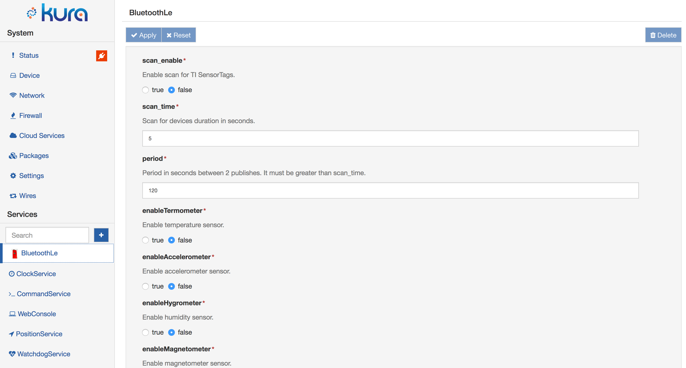

# Application Management

## Package Installation

After developing your application and generating a deployment package that contains the bundles to be deployed (refer to the Development section for more information), you may install it on the gateway using the **Packages** option in the **System** area of the Kura Gateway Administration Console as shown below.

<figure markdown>
  
  <figcaption>The package installation section of the UI</figcaption>
</figure>

Upon a successful installation, the new component appears in the Services list (shown as the _BluetoothLE_ example in these screen captures). Its configuration may be modified according to the defined parameters as shown the _BluetoothLe_ display that follows.

## Installation from Eclipse Marketplace™

The application and components in the [Eclipse Marketplace™](https://marketplace.eclipse.org/taxonomy/term/4397%2C4396/title) can be easily installed in Kura dragging the _Install_ button directly to the gray area in the **Packages** tab, as shown below.

## Package Signature

Once the selected application deployment package (dp) file is installed, it will be listed in the **Packages** page and detailed with the name of the deployment package, the version and the signature status.
The value of the signature field can be **true** if all the bundles contained in the deployment package are digitally signed, or **false** if at least one of the bundles is not signed.

