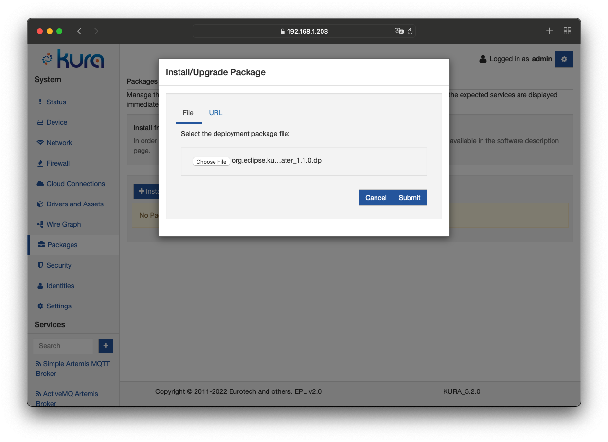
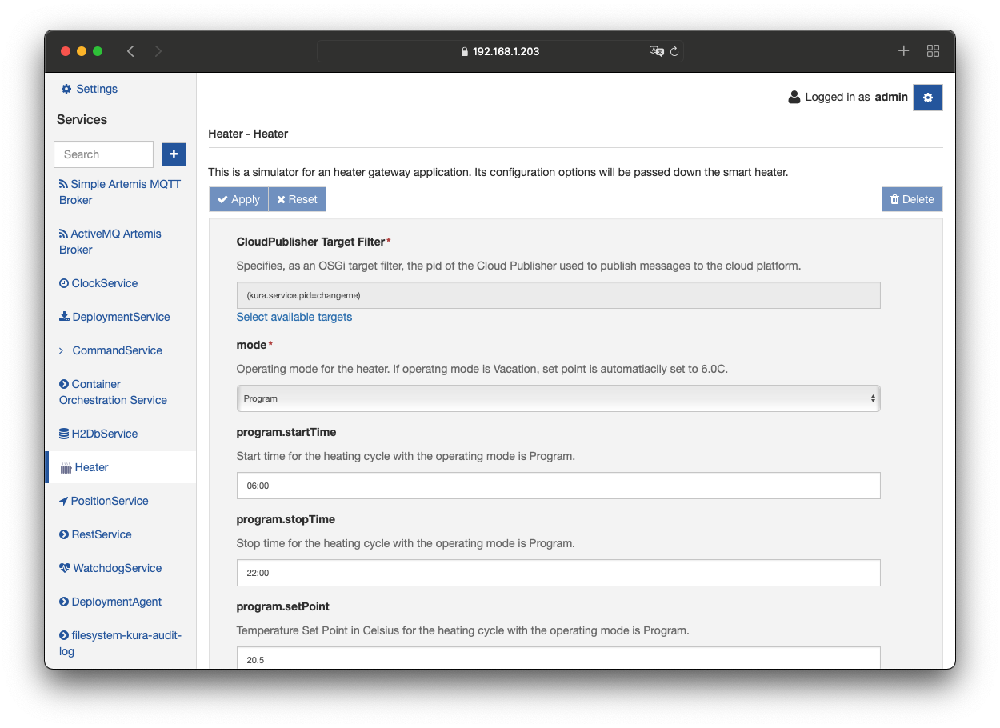
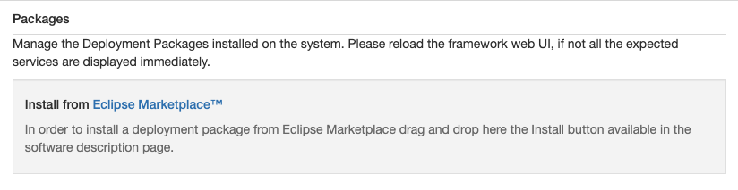
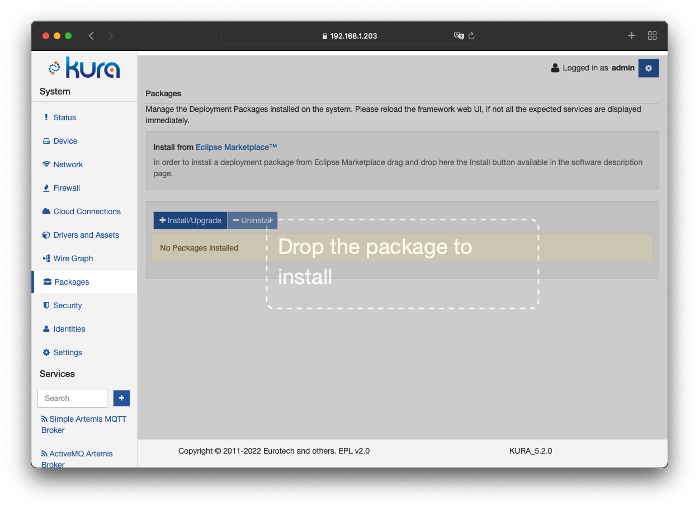
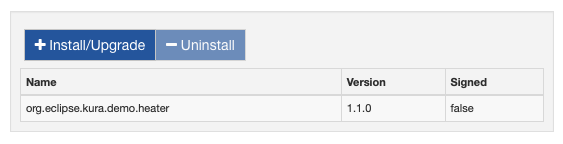

# Application Management

## Package Installation

After developing your application and generating a deployment package that contains the bundles to be deployed (refer to the Development section for more information), you may install it on the gateway using the **Packages** option in the **System** area of the Kura Gateway Administration Console as shown below.



Upon a successful installation, the new component appears in the Services list (shown as the _Heater_ example in these screen captures). Its configuration may be modified according to the defined parameters as shown the _Heater_ display that follows.



## Eclipse Kura Marketplace

Kura allows the installation and update of running applications via the Eclipse Kura Marketplace.
The **Packages** page has, in the top part of the page a section dedicated to the Eclipse Kura Marketplace.

<figure markdown>
  { style="border-radius: 7px;"}
  <figcaption></figcaption>
</figure>

Dragging an application reference taken from the Eclipse Kura Marketplace to the specific area of the Kura Web Administrative Console will instruct Kura to download and install the corresponding package, as seen below:



!!! warning
    If the installation from the Eclipse Marketplace fails, it can be for the lack of the correct certificates. In this case, import the certificate in the _SSLKeystore_ from the _Certificate List_ tab under the _Security_ section. For more details about the procedure see [here](../../gateway-configuration/keys-and-certificates/).

    If the bundle is an official add-on for Eclipse Kura, the following certificate has to be imported:

    ```
-----BEGIN CERTIFICATE-----
MIIHxzCCBq+gAwIBAgIQCCxCSNb4iszmNPNCflUcGTANBgkqhkiG9w0BAQsFADBP
MQswCQYDVQQGEwJVUzEVMBMGA1UEChMMRGlnaUNlcnQgSW5jMSkwJwYDVQQDEyBE
aWdpQ2VydCBUTFMgUlNBIFNIQTI1NiAyMDIwIENBMTAeFw0yMzA5MTEwMDAwMDBa
Fw0yNDEwMTEyMzU5NTlaMG8xCzAJBgNVBAYTAkNBMRAwDgYDVQQIEwdPbnRhcmlv
MQ8wDQYDVQQHEwZPdHRhd2ExJTAjBgNVBAoTHEVjbGlwc2Uub3JnIEZvdW5kYXRp
b24sIEluYy4xFjAUBgNVBAMMDSouZWNsaXBzZS5vcmcwggIiMA0GCSqGSIb3DQEB
AQUAA4ICDwAwggIKAoICAQC5hXH2cQoOQlXs5cQ5itZ1Dzct9R+bqr2HaF+imlgo
xJ+Vw1ukfQPpSbmSO17A0hLgpSJyVgoPlpOKkg6LGTz8/2qB7DWHdQbg2p0IGQhr
dm4oJN2qknnGNl/YYkjz2QJswr1M98raydmq0hqJi0M3q9JSO64O3wOMNduvNG+O
rCBol7cbxLr7NNoFxZncZ9giP7QF0XYS6nA8dtIyXU3SARRSPn6y9OX1ttltveck
41ocaU8ORiTF7i89t649XAbtsvxUWM+qVnvlMxpaXqbhnrXMQ/pV2yfdU/qiFQth
+RqFgBYoX5roxvmjB14+2qlymn236N4KOGhvfr+Fp8C8Fv6N6wFyKZctXewQ6IsA
3zDvJmF3QaCz6h88lg+IqbRjX5MOjhSkE7XDNKb+xAw5pYzkn9LP+QJLf0iYJw2D
Z/X+InVPiZ5UdXyXWypN3q0W5vlz/TmWuVZv76/azZ3anoSPiKh+F3si1xZVEMZQ
IkqsgUfq69M4KvHrdi4nGEOfdBHxjos9ul1AsJR57hrhIchsESthUK04e7d2LYOB
hHAr0uJNdwFsFD2EBR25ogN83bZ8NaDrrdK2P6sV+hWWK+MY1qRuRub7/fYuR4AU
82toms9p1usjuyMmuIGEpLwk7jZe6XITcbXQEXDA8JKSZrZ/mOA4yTfIGR/gXXB7
wQIDAQABo4IDfTCCA3kwHwYDVR0jBBgwFoAUt2ui6qiqhIx56rTaD5iyxZV2ufQw
HQYDVR0OBBYEFO8gL5LNWmSgCqbujR1qH0bUfrIrMCUGA1UdEQQeMByCDSouZWNs
aXBzZS5vcmeCC2VjbGlwc2Uub3JnMD4GA1UdIAQ3MDUwMwYGZ4EMAQICMCkwJwYI
KwYBBQUHAgEWG2h0dHA6Ly93d3cuZGlnaWNlcnQuY29tL0NQUzAOBgNVHQ8BAf8E
BAMCBaAwHQYDVR0lBBYwFAYIKwYBBQUHAwIGCCsGAQUFBwMBMIGPBgNVHR8EgYcw
gYQwQKA+oDyGOmh0dHA6Ly9jcmwzLmRpZ2ljZXJ0LmNvbS9EaWdpQ2VydFRMU1JT
QVNIQTI1NjIwMjBDQTEtNC5jcmwwQKA+oDyGOmh0dHA6Ly9jcmw0LmRpZ2ljZXJ0
LmNvbS9EaWdpQ2VydFRMU1JTQVNIQTI1NjIwMjBDQTEtNC5jcmwwfwYIKwYBBQUH
AQEEczBxMCQGCCsGAQUFBzABhhhodHRwOi8vb2NzcC5kaWdpY2VydC5jb20wSQYI
KwYBBQUHMAKGPWh0dHA6Ly9jYWNlcnRzLmRpZ2ljZXJ0LmNvbS9EaWdpQ2VydFRM
U1JTQVNIQTI1NjIwMjBDQTEtMS5jcnQwDAYDVR0TAQH/BAIwADCCAX4GCisGAQQB
1nkCBAIEggFuBIIBagFoAHYAdv+IPwq2+5VRwmHM9Ye6NLSkzbsp3GhCCp/mZ0xa
OnQAAAGKhcgXYgAABAMARzBFAiEApQsk19PxbsLa452EPaPCXe7SAtpbm5RHnrwj
yKAjWx0CICli5A3XAGwmg7IEy4lVA5YBt+mhvlegWkXrKt+oc/CoAHUASLDja9qm
RzQP5WoC+p0w6xxSActW3SyB2bu/qznYhHMAAAGKhcgXWQAABAMARjBEAiAvx7lc
MyKS6bbnsjbzYOLzJbcS2aAjCzQz4mFiuFA59AIgbt+rpE40/RO0JnFyLP9fsbUf
pUj16ZYinOLorqDk9r0AdwDatr9rP7W2Ip+bwrtca+hwkXFsu1GEhTS9pD0wSNf7
qwAAAYqFyBc3AAAEAwBIMEYCIQDCrdQYGYA7BlsT5gXZmkutN15gDQDjlfJBxIRb
Z0FAAgIhAIr0eNFvkpec6VJ5pPrNklFt78XP0NjEOJxjrCFTLKVdMA0GCSqGSIb3
DQEBCwUAA4IBAQCvENXlAGP311/gV5rMD2frsK+hlcs/4wjRKUS+nwp3RLTRd3w4
cZLHcsw9qCxeniuHsc/Wa6myr0kKdRc4V6movLq9vMdSjT9dDOZWtZgFaadB0+z2
A/Jsq1/AFFWqWisF64627j/Wf7RwuasxM0dnkAl3m9Hli5xKPgjbovXiH/dCeMvS
MTxD1p3ewIYITzV+1Q5FoFuGyIyuh1Kzo7A41xKPe+XfWHqt+hKL8MWkJ9ACD2b0
ZDlD2OaX7K+vI8aWprmwVdpp3deuUoHgBqa1PkHPRmP0bFbamBdB4H6goRX5+DEy
cTW2rRm8jFiLm1kf0/iOL7/ddw0yZQAUMthU
-----END CERTIFICATE-----
    ```

    that has the following description:

    ```
    Common Name: *.eclipse.org
    Subject Alternative Names: *.eclipse.org, eclipse.org
    Organization: Eclipse.org Foundation, Inc.
    Locality: Ottawa
    State: Ontario
    Country: CA
    Valid From: September 10, 2023
    Valid To: October 11, 2024
    Issuer: DigiCert TLS RSA SHA256 2020 CA1, DigiCert Inc Write review of DigiCert
    Key Size: 4096 bit
    Serial Number: 082c4248d6f88acce634f3427e551c19
    ```
    
    If the bundle is not an official one and it is not hosted by Eclipse, retrieve the certificate with this command:
    ```
    openssl s_client -showcerts -connect <download_link>:443
    ```
    
    and import it in the _SSLKeystore_.

## Package Signature

Once the selected application deployment package (dp) file is installed, it will be listed in the **Packages** page and detailed with the name of the deployment package, the version and the signature status.
The value of the signature field can be **true** if all the bundles contained in the deployment package are digitally signed, or **false** if at least one of the bundles is not signed.

<figure markdown>
  { style="border-radius: 7px;"}
  <figcaption></figcaption>
</figure>
