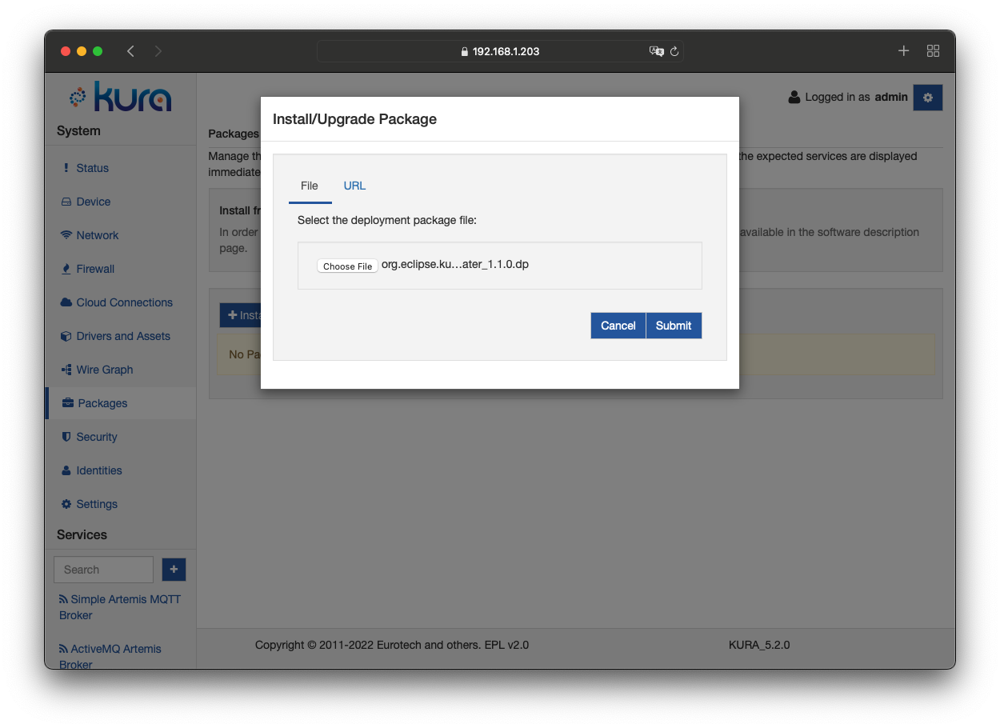
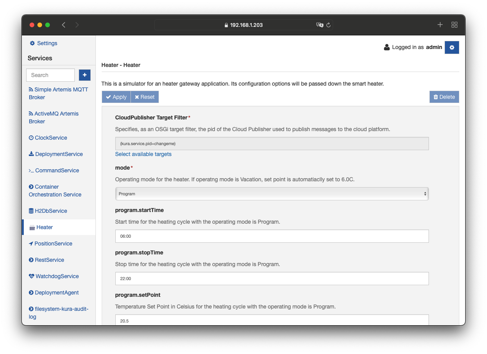
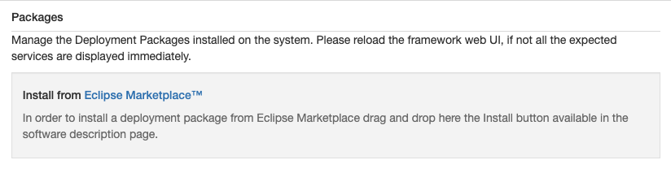
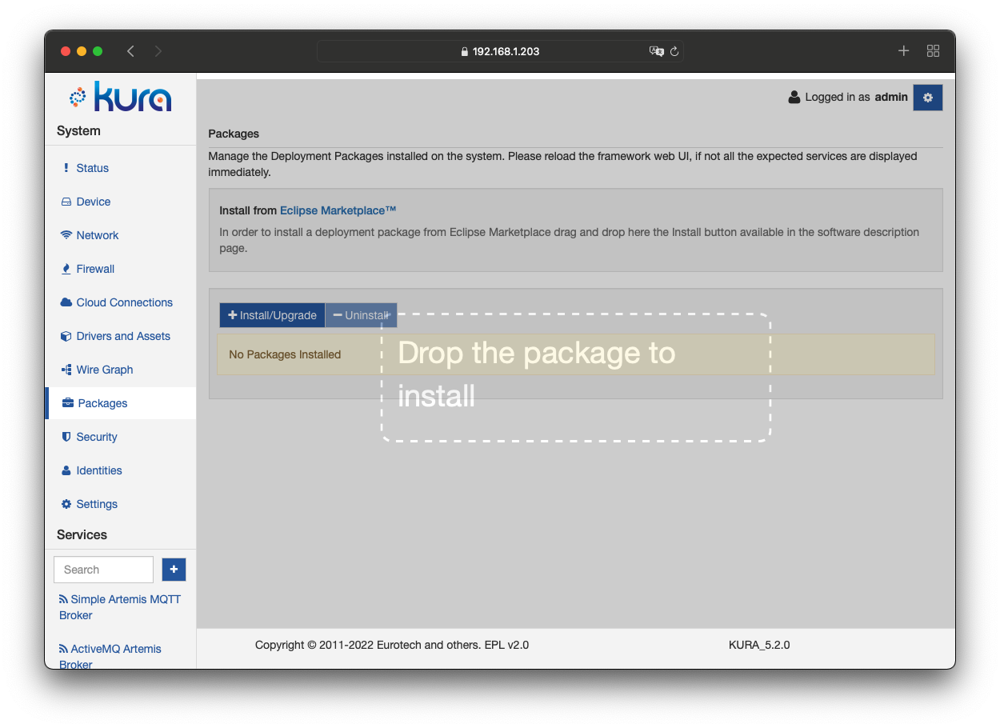
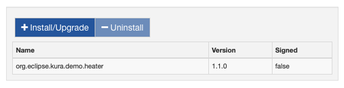

# Application Management

## Package Installation

After developing your application and generating a deployment package that contains the bundles to be deployed (refer to the Development section for more information), you may install it on the gateway using the **Packages** option in the **System** area of the Kura Gateway Administration Console as shown below.



Upon a successful installation, the new component appears in the Services list (shown as the _Heater_ example in these screen captures). Its configuration may be modified according to the defined parameters as shown the _Heater_ display that follows.



## Eclipse Kura Marketplace

Kura allows the installation and update of running applications via the Eclipse Kura Marketplace.
The **Packages** page has, in the top part of the page a section dedicated to the Eclipse Kura Marketplace.

<figure markdown>
  { style="border-radius: 7px;"}
  <figcaption></figcaption>
</figure>

Dragging an application reference taken from the Eclipse Kura Marketplace to the specific area of the Kura Web Administrative Console will instruct Kura to download and install the corresponding package, as seen below:



!!! warning
    If the installation from the Eclipse Marketplace fails, it can be for the lack of the correct certificates. In this case, import the certificate in the _SSLKeystore_ from the _Certificate List_ tab under the _Security_ section. For more details about the procedure see [here](../../gateway-configuration/keys-and-certificates/).

    If the bundle is an official add-on for Eclipse Kura, the following certificate has to be imported:

    ```
    -----BEGIN CERTIFICATE-----
    MIIH6jCCBtKgAwIBAgIQBp8g2RmQqWopIhBVvm6hNzANBgkqhkiG9w0BAQsFADBZ
    MQswCQYDVQQGEwJVUzEVMBMGA1UEChMMRGlnaUNlcnQgSW5jMTMwMQYDVQQDEypE
    aWdpQ2VydCBHbG9iYWwgRzIgVExTIFJTQSBTSEEyNTYgMjAyMCBDQTEwHhcNMjUw
    MTA2MDAwMDAwWhcNMjYwMjA2MjM1OTU5WjBvMQswCQYDVQQGEwJDQTEQMA4GA1UE
    CBMHT250YXJpbzEPMA0GA1UEBxMGT3R0YXdhMSUwIwYDVQQKExxFY2xpcHNlLm9y
    ZyBGb3VuZGF0aW9uLCBJbmMuMRYwFAYDVQQDDA0qLmVjbGlwc2Uub3JnMIICIjAN
    BgkqhkiG9w0BAQEFAAOCAg8AMIICCgKCAgEAuYVx9nEKDkJV7OXEOYrWdQ83LfUf
    m6q9h2hfoppYKMSflcNbpH0D6Um5kjtewNIS4KUiclYKD5aTipIOixk8/P9qgew1
    h3UG4NqdCBkIa3ZuKCTdqpJ5xjZf2GJI89kCbMK9TPfK2snZqtIaiYtDN6vSUjuu
    Dt8DjDXbrzRvjqwgaJe3G8S6+zTaBcWZ3GfYIj+0BdF2EupwPHbSMl1N0gEUUj5+
    svTl9bbZbb3nJONaHGlPDkYkxe4vPbeuPVwG7bL8VFjPqlZ75TMaWl6m4Z61zEP6
    Vdsn3VP6ohULYfkahYAWKF+a6Mb5owdePtqpcpp9t+jeCjhob36/hafAvBb+jesB
    cimXLV3sEOiLAN8w7yZhd0Ggs+ofPJYPiKm0Y1+TDo4UpBO1wzSm/sQMOaWM5J/S
    z/kCS39ImCcNg2f1/iJ1T4meVHV8l1sqTd6tFub5c/05lrlWb++v2s2d2p6Ej4io
    fhd7ItcWVRDGUCJKrIFH6uvTOCrx63YuJxhDn3QR8Y6LPbpdQLCUee4a4SHIbBEr
    YVCtOHu3di2DgYRwK9LiTXcBbBQ9hAUduaIDfN22fDWg663Stj+rFfoVlivjGNak
    bkbm+/32LkeAFPNraJrPadbrI7sjJriBhKS8JO42XulyE3G10BFwwPCSkma2f5jg
    OMk3yBkf4F1we8ECAwEAAaOCA5YwggOSMB8GA1UdIwQYMBaAFHSFgMBmx9833s+9
    KTeqAx2+7c0XMB0GA1UdDgQWBBTvIC+SzVpkoAqm7o0dah9G1H6yKzAlBgNVHREE
    HjAcgg0qLmVjbGlwc2Uub3JnggtlY2xpcHNlLm9yZzA+BgNVHSAENzA1MDMGBmeB
    DAECAjApMCcGCCsGAQUFBwIBFhtodHRwOi8vd3d3LmRpZ2ljZXJ0LmNvbS9DUFMw
    DgYDVR0PAQH/BAQDAgWgMB0GA1UdJQQWMBQGCCsGAQUFBwMBBggrBgEFBQcDAjCB
    nwYDVR0fBIGXMIGUMEigRqBEhkJodHRwOi8vY3JsMy5kaWdpY2VydC5jb20vRGln
    aUNlcnRHbG9iYWxHMlRMU1JTQVNIQTI1NjIwMjBDQTEtMS5jcmwwSKBGoESGQmh0
    dHA6Ly9jcmw0LmRpZ2ljZXJ0LmNvbS9EaWdpQ2VydEdsb2JhbEcyVExTUlNBU0hB
    MjU2MjAyMENBMS0xLmNybDCBhwYIKwYBBQUHAQEEezB5MCQGCCsGAQUFBzABhhho
    dHRwOi8vb2NzcC5kaWdpY2VydC5jb20wUQYIKwYBBQUHMAKGRWh0dHA6Ly9jYWNl
    cnRzLmRpZ2ljZXJ0LmNvbS9EaWdpQ2VydEdsb2JhbEcyVExTUlNBU0hBMjU2MjAy
    MENBMS0xLmNydDAMBgNVHRMBAf8EAjAAMIIBfgYKKwYBBAHWeQIEAgSCAW4EggFq
    AWgAdgCWl2S/VViXrfdDh2g3CEJ36fA61fak8zZuRqQ/D8qpxgAAAZQ8VmdXAAAE
    AwBHMEUCIEjGIApaqyxaJCXFzfmoRCDtc3bi4LekwSNSy/fCcR89AiEA4p0OwFU3
    NLo7PqjJy6LGl7tT6qd/u3pYFjYW9aKWAx8AdQBkEcRspBLsp4kcogIuALyrTygH
    1B41J6vq/tUDyX3N8AAAAZQ8VmcuAAAEAwBGMEQCIGsmqufiy5VGTVTosCfBvKp9
    htdP5q8ZJxvMaiiaY77wAiB21hWqcE+IOounNKuCH62LP8f76ZLWFjVTKFYLBfoG
    uQB3AEmcm2neHXzs/DbezYdkprhbrwqHgBnRVVL76esp3fjDAAABlDxWZz8AAAQD
    AEgwRgIhAJAG+s2SCBWJYVokJj1lRxI8Mc4Zj3ZrBgwJ7ULJ29VgAiEAv6MUuomx
    c6mBxror+N0G3ZPmrehAzZMbThIr6mfan6MwDQYJKoZIhvcNAQELBQADggEBABJH
    DKDHC/btZRzk9RSK50YLB4kBLkgBdmprDcQVBk9QaSOVNwYmCvU6SZPw5ZLDB5sy
    Za4Pv5abBtFRWXqeUW07hwgCJw1N6EVcDd+Mw2SCr/vWVerXI3/UFsgwx8FUty+W
    AXlUEFbRkO2FBZeQCn6VWdo0Yf/lIdEvZ3OGlQbQRKyrmgOKuu3rG4l+a9NvXUMz
    bphjHiINvToLFbL6Iytx/IIViA1jkEMautKD7mblGCDn9b3SAnj9BJlKPN+qZhPB
    /aeB7FIqO/rz+gLqfB/iCbLfdhtNUYKGmnO+orAwYR38GCKjNPnpk8mUvtcmmxQC
    Y/ogS0BUGhUpFiggLVM=
    -----END CERTIFICATE-----
    ```

    that has the following description:

    ```
    Common Name: *.eclipse.org
    Subject Alternative Names: *.eclipse.org, eclipse.org
    Organization: Eclipse.org Foundation, Inc.
    Locality: Ottawa
    State: Ontario
    Country: CA
    Valid From: January 06, 2025
    Valid To: February 06, 2026
    Issuer: DigiCert Global G2 TLS RSA SHA256 2020 CA1, DigiCert Inc Write review of DigiCert
    Key Size: 4096 bit
    Serial Number 069f20d91990a96a29221055be6ea137
    ```
    
    If the bundle is not an official one and it is not hosted by Eclipse, retrieve the certificate with this command:
    ```
    openssl s_client -showcerts -connect <download_link>:443
    ```
    
    and import it in the _SSLKeystore_.

## Package Signature

Once the selected application deployment package (dp) file is installed, it will be listed in the **Packages** page and detailed with the name of the deployment package, the version and the signature status.
The value of the signature field can be **true** if all the bundles contained in the deployment package are digitally signed, or **false** if at least one of the bundles is not signed.

<figure markdown>
  { style="border-radius: 7px;"}
  <figcaption></figcaption>
</figure>
