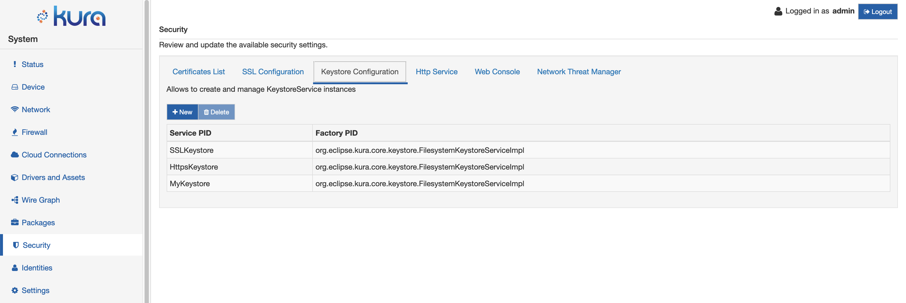
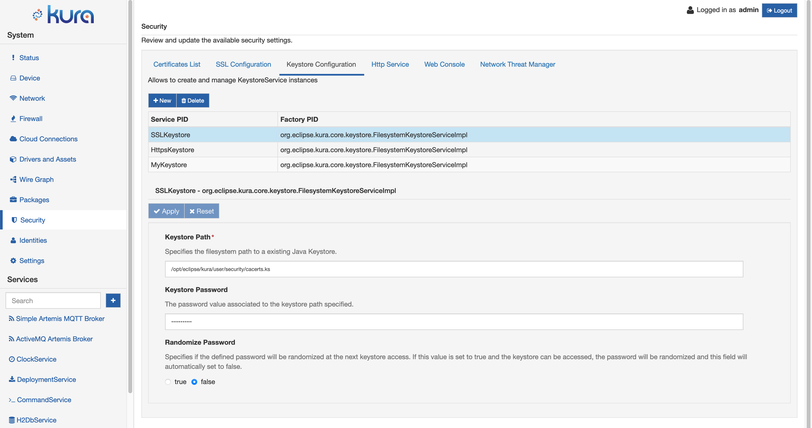

# Keystores Management

The framework manages different types of cryptographic keys and certificates.
In order to simplify the interaction with those objects, Kura provides a KeystoreService API and a specific section in the Web UI that lists all the available KeystoreService instances.

From the Security section, a user with Security permissions can access the Keystore Configuration section.
A list of all the framework managed keystores will be available to the user with the Service PID that will be used by other components to reference the selected keystore.
Associated to the Service PID, the UI shows the Factory PID that identifies the specific KeystoreService API implementation that is providing the service to the framework.

{ style="border-radius: 7px;"}

In order to modify the configuration of a specific keystore service instance, the user can select one of the available rows, obtaining the corresponding keystore service configuration.

{ style="border-radius: 7px;"}

The following KeystoreService factories are available:

## FilesystemKeystoreServiceImpl

The `org.eclipse.kura.core.keystore.FilesystemKeystoreServiceImpl` factory provides a KeystoreService implementation that stores the private keys and certificates as a file. The user can customise the following options:
- **Keystore Path**: identifies the path in the filesystem. If the keystore file does not exists, a new file will be created. The value cannot be empty.
- **Keystore Password**: the corresponding keystore password
- **Randomize Password**: a boolean flag that allows the user to specify if the keystore password needs to be randomised at the next framework boot. If set **true**, the framework will try to access the identified keystore and randomise the password. The new password will be persisted in the framework snapshot. Once successfully randomised, the flag will be automatically set to false by the framework.

## PKCS11KeystoreServiceImpl

The `org.eclipse.kura.core.keystore.PKCS11KeystoreServiceImpl` factory provides a KeystoreService implementation that allows to access a PKCS11 token through the SunPKCS11 implementation.

At the moment this type of KeystoreService provides read only access to the underlying token, operations such as adding or removing entries will fail.

It is possible to use the entries provided by a `PKCS11KeystoreServiceImpl` for SSL authentication.

The available configuration options closely match the parameters provided by the SunPKCS11 implementation, see the [official documentation](https://docs.oracle.com/javase/8/docs/technotes/guides/security/p11guide.html) for more details.

In particular, the official documentation contains a [section](https://docs.oracle.com/javase/8/docs/technotes/guides/security/p11guide.html#KeyStoreRestrictions) that explains how the PKCS11 objects are mapped to Java KeyStore entries.

The only required parameter is the **PKCS11 Implementation Library Path** parameter. It is usually also necessary to specify the token user pin as the **Pin** parameter.

The configuration parameters are mapped to the SunPKCS11 provider parameters in the following way:

|**Kura Parameter**|**SunPKCS11 Parameter**|**Notes**|
|-|-|-|
|**Slot**|slot||
|**Slot List Index**|slotListIndex||
|**Enabled Mechanisms**|enabledMechanisms|The curly braces must be omitted|
|**Disabled Mechanisms**|disabledMechanisms|The curly braces must be omitted.|
|**Attributes**|attributes|The value of this field will be appended to the provider configuration.|

