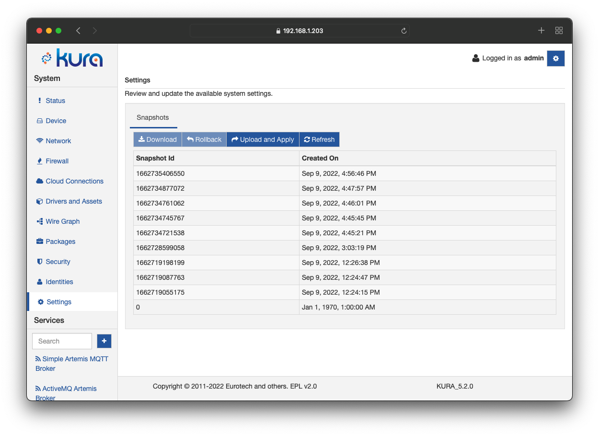
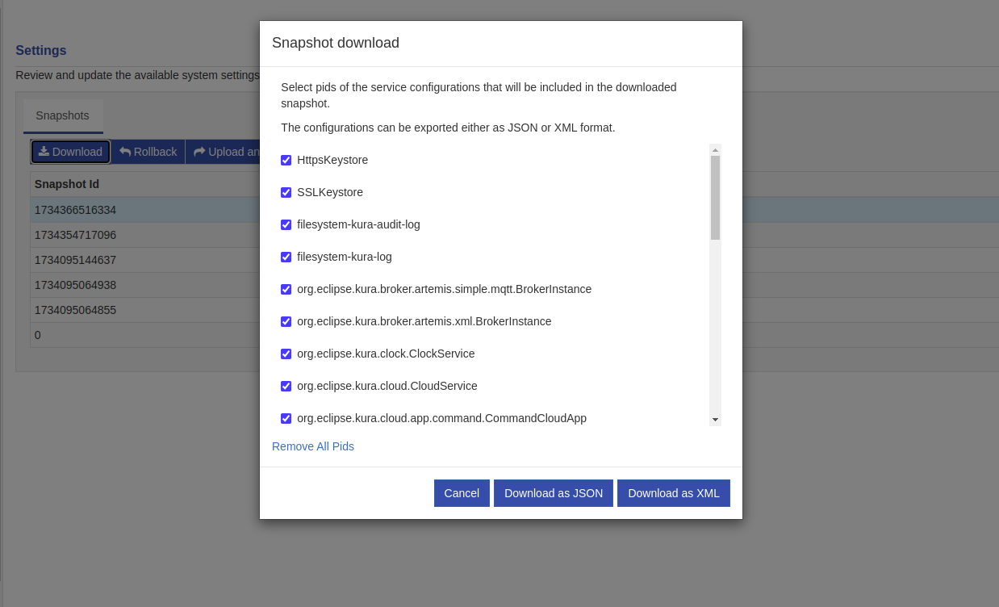
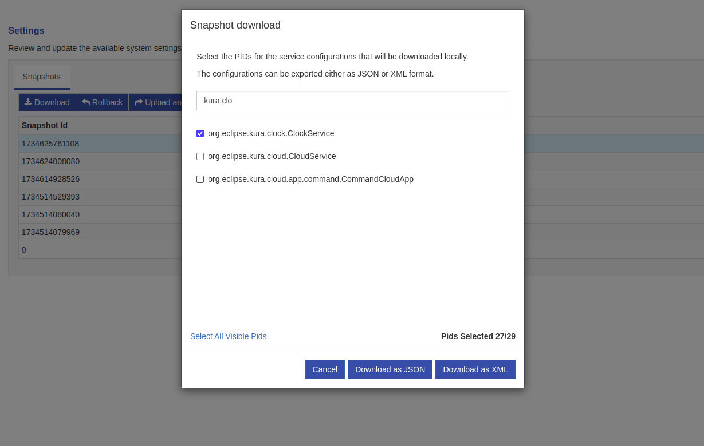
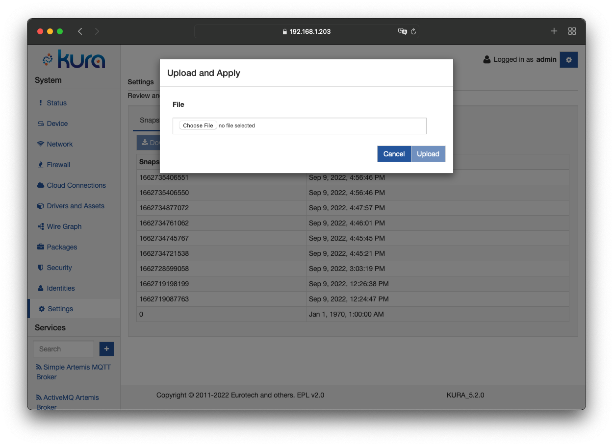
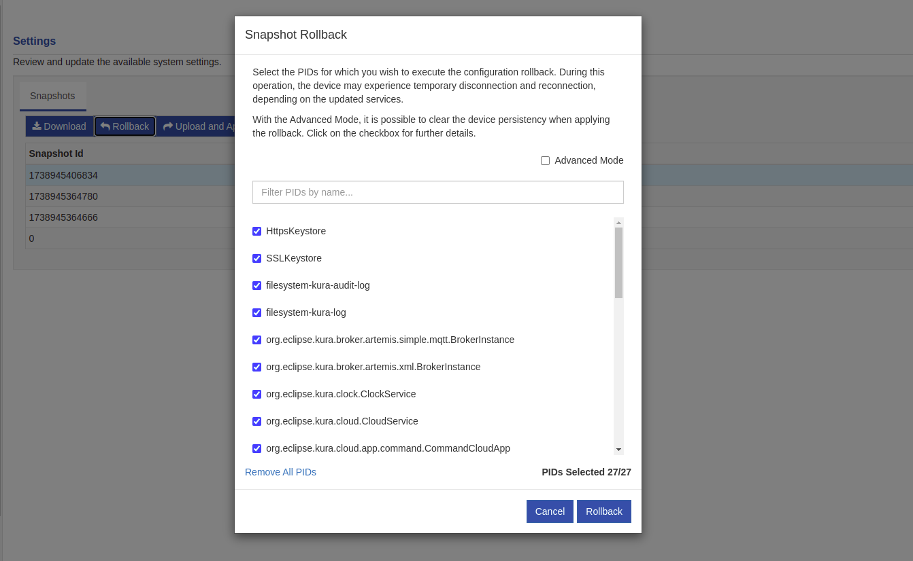
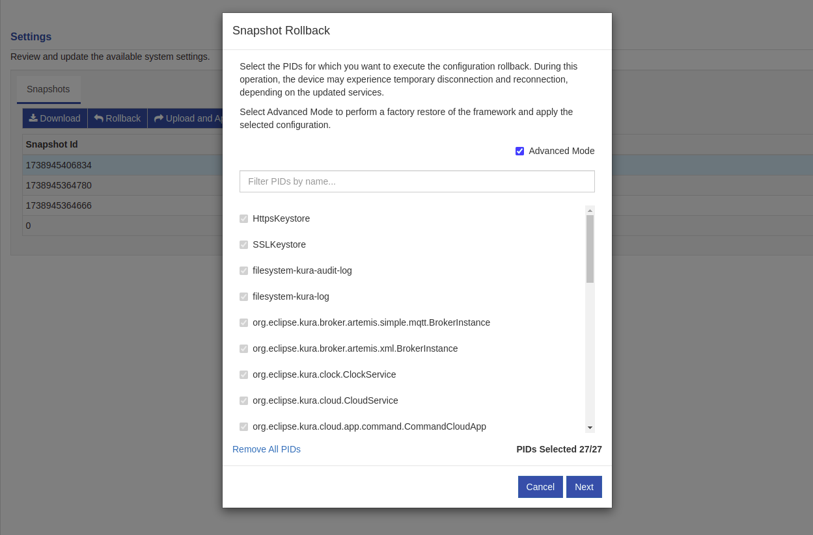
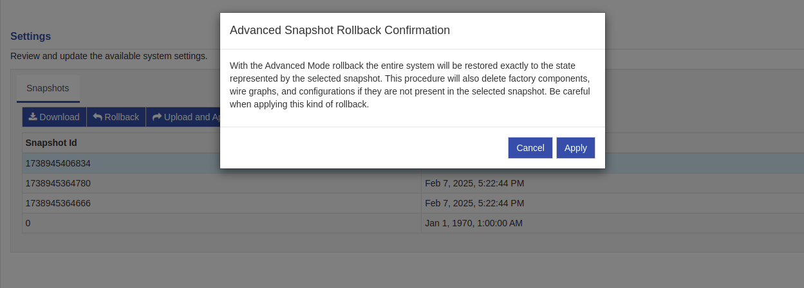

# Snapshot Management

The overall configuration of Kura is stored in an XML file called a snapshot. This file includes all of the parameters for every service running in Kura. The original configuration file is named **snapshot_0.xml**. This section describes how snapshots may be used.

Each time a configuration change is made to one of the Kura components, a new XML file is created using the naming convention **snapshot_[time as a long integer].xml**. The nine most recent snapshots are saved, as well as the original snapshot 0.

## How to Access Snapshots
To display snapshots using the [Gateway Administration Console](../gateway-configuration/gateway-administration-console.md), select **Settings** from the **System** area, and then click on the **Snapshots** tab. The following three operations are available: **Download**, **Upload and Apply**, and **Rollback**.

## How to Use Snapshots

### Download

The **Download** option provides the ability to save a snapshot file onto your computer. This file may then be edited, uploaded back to the device, or transferred to another equivalent device.

Starting from Kura 5.1, the snapshot can be downloaded in two formats:

* **XML**: The original XML snapshot format.
* **JSON**: The JSON format used by the [Configuration v2 REST APIs and CONF-V2 request handler](../references/rest-apis/rest-configuration-service-v2.md). For example the downloaded snapshot can be used as is as a body for the [PUT/configurableComponents/configurations/_update](../references/rest-apis/rest-configuration-service-v2.md) request. The `takeSnapshot` parameter specified by the CONF-V2 request is missing from the downloaded JSON file, if that parameter is not specified, a new snapshot will be created by default.

Starting with Kura 6.0, it is possible to download _a partial_ version of the snapshot. This allows the user to download a subset of the entire Kura configuration.

Pressing the **Download** button will trigger a dialog that allows choosing the desired configurations and format.

In the snapshot download popup, a list of checkboxes is shown, representing the list of all the service configurations that can be downloaded. By default, all configurations (represented by the component PIDs) are selected. The user can remove from the selection the configurations he's not interested in, by deselecting the related PIDs checkboxes. Only the selected component configurations will be then downloaded.

The snapshots can be downloaded in XML or JSON format.

A search box is available for the user to simplify the process of PID selection for the configurations available in the selected snapshot. As an example, in the screenshot below, it can be seen the filtering in progress as the user writes its filtering keyword

### Upload and Apply

The **Upload and Apply** option  provides the ability to import an XML file from your computer and upload it onto the device. This function updates every service in Kura with the parameters defined in the XML file.

!!! warning
    Carefully select the file to be uploaded. An incorrect file may crash Kura and make it unresponsive.

### Rollback

The **Rollback** option provides the ability to restore the system to a previous configuration.

Starting with Kura 6.0, this process can be performed in two ways: the default one consists in the restoration of the configuration of one or more services to a previous state, mantaining the persistency of the system. The second is an *Advanced* rollback process, that is performed **without** the framework persistency: in this case the entire system will be restored exactly to the state represented by the selected snapshot, cleaning all configurations not present in the latter.

#### Snapshot Rollback

Pressing the **Rollback** button, the default rollback process will start: a dialog will be shown, similar to the one in the *Download* section, that allows choosing the desired configurations.

In the snapshot rollback popup, a list of checkboxes is shown, representing the list of all the service configurations that can be restored. By default, all configurations (represented by the component PIDs) are selected. The user can remove from the selection the configurations he's not interested in, by deselecting the related PIDs checkboxes. Only the selected component configurations will be then rollbacked to the configuration present in the snapshot.

As per the Download popup, a search box is available for the user to simplify the process of PID selection for the configurations available in the selected snapshot.

Pressing the **Rollback** button, the Snapshot Rollback process will start, following the rules below:

- if a service **is present in the selected snapshot**, and it's **PID was selected**, its configuration will be overwritten by the one present in the selected snapshot
- if a service **is present in the selected snapshot**, and it's **PID was not selected**, nothing will happen on its configuration
- if a service **is not present in the selected snapshot**, nothing will happen on its configuration
- if a **factory component it's not already present** in the system, **but available and selected on the snapshot**, the component will be created with the configuration present in the selected snapshot
- if a **factory component it's not already present** in the system, **and it's not available nor selected on the snapshot**, nothing will happen
- if a **factory component is already present** in the system, **but it's not available nor selected on the snapshot**, nothing will happen on its configuration
- if a **factory component is already present** in the system, **and it's available and selected on the snapshot**, the component configuration will be overwritten with the one in the selected snapshot

!!! warning
    Carefully select the snapshot and its PIDs to be rollbacked. Changing the configuration of some services could make Kura unresponsive or not reachable

#### Advanced Snapshot Rollback

The second rollback way is called **Advanced Snapshot Rollback**: this process was the default one before Kura 6.0.0, and consists in the factory restoration of the framework and application of the selected configuration.

When checking the *Advanced Mode* box on top of the Snapshot Rollback popup, all the PIDs will be selected, and the *Rollback* button on the bottom will switch to *Next*: by pressing this button an alert message will be shown, explaining in details what is going to happen.

Pressing the **Apply** button, the rollback process will start. The framework will be restored exactly to the state represented by the selected snapshot, following the rules below:

- if a service **is present in the selected snapshot**, its configuration will be overwritten by the configuration on the snapshot
- if a service **is not present in the selected snapshot**, its configuration will be restored to its default configuration
- if a **factory component is not already present** in the system, **but it's available on the snapshot**, the component will be created with the configuration present in the selected snapshot
- if a **factory component is already present** in the system, **but it's not available on the selected snapshot**, the component will be removed
- if a **factory component is already present** in the system, **and it's available on the selected snapshot**, the component configuration will be overwritten with the one in the selected snapshot

!!! warning
    Carefully select the snapshot to be rollbacked. Changing the configuration of the system could make Kura unresponsive or not reachable

