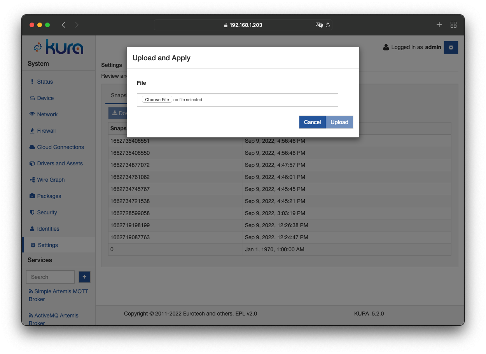

# Snapshot Management

The overall configuration of Kura is stored in an XML file called a snapshot. This file includes all of the parameters for every service running in Kura. The original configuration file is named **snapshot_0.xml**. This section describes how snapshots may be used.

Each time a configuration change is made to one of the Kura components, a new XML file is created using the naming convention **snapshot_[time as a long integer].xml**. The nine most recent snapshots are saved, as well as the original snapshot 0.

## How to Access Snapshots
To display snapshots using the [Gateway Administration Console](../gateway-configuration/gateway-administration-console.md), select **Settings** from the **System** area, and then click on the **Snapshots** tab. The following three operations are available: **Download**, **Upload and Apply**, and **Rollback**.

## How to Use Snapshots

### Download

The **Download** option provides the ability to save a snapshot file onto your computer. This file may then be edited, uploaded back to the device, or transferred to another equivalent device.

Starting from Kura 5.1, the snapshot can be downloaded in two formats:

* **XML**: The original XML snapshot format.
* **JSON**: The JSON format used by the [Configuration v2 REST APIs and CONF-V2 request handler](../references/rest-apis/rest-configuration-service-v2.md). For example the downloaded snapshot can be used as is as a body for the [PUT/configurableComponents/configurations/_update](../references/rest-apis/rest-configuration-service-v2.md) request. The `takeSnapshot` parameter specified by the CONF-V2 request is missing from the downloaded JSON file, if that parameter is not specified, a new snapshot will be created by default.

Pressing the **Download** button will trigger a dialog that allows choosing the desired format.

### Upload and Apply

The **Upload and Apply** option  provides the ability to import an XML file from your computer and upload it onto the device. This function updates every service in Kura with the parameters defined in the XML file.

!!! warning
    Carefully select the file to be uploaded. An incorrect file may crash Kura and make it unresponsive.

### Rollback

The **Rollback** option provides the ability to restore the system to a previous configuration.

