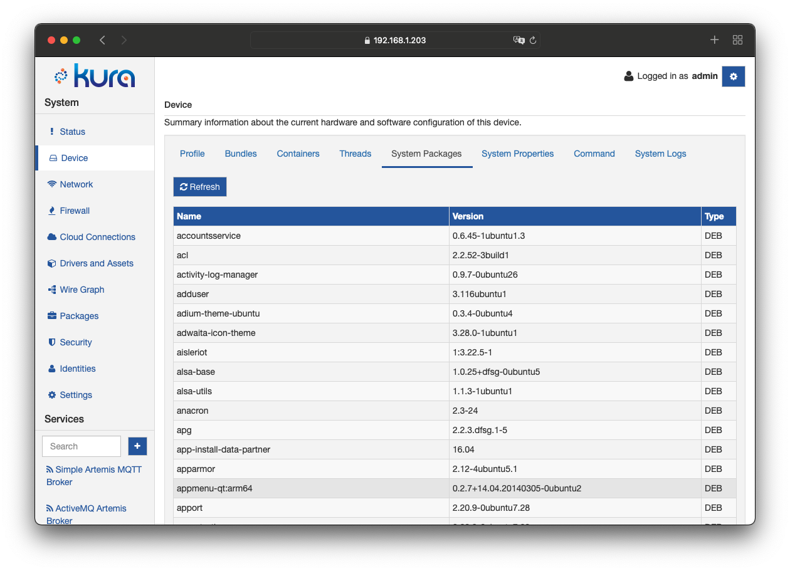

The Framework has the capability to report locally and to the associated cloud platform the list of currently installed components and their associated properties.

This feature allows, locally and remotely, the system administrator to know which components are installed into the target device and the associated versions.
The feature is particularly important for a system administrator because allows to identify vulnerable components and allows immediate actions in response.

From the local Kura Web UI, the list of system components is available in the **System Packages** tab of the **Device** section.
Once selected, the user will get the list of all the system installed components.

The component's inventory list is available also via REST APIs and, with the same contract, from the cloud.
The Mqtt contract defined for this component is available [here](mqtt-namespace#remote-gateway-inventory-via-mqtt)
