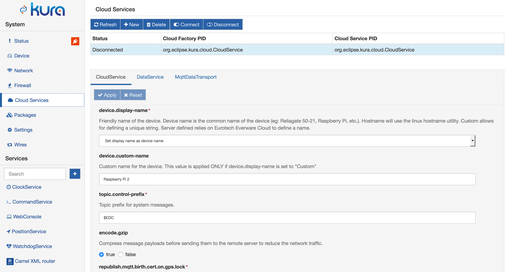
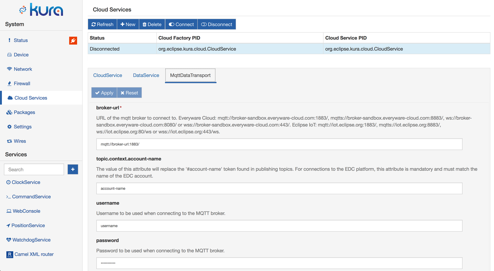

# Built-in Cloud Services

Eclipse Kura provides by default a set of services used to connect to a cloud platform. The following sections describe the services and how to configure them.

The `CloudService` API is deprecated since Kura 4.0.
The functionalities provided by `CloudService` are now provided by the `CloudEndpoint` and `CloudConnectionManager` service interfaces.
See the [section](../overview/) describing the Kura 4.0 cloud connection model for more details.

The `DataService` and `MqttDataTrasport` APIs are not deprecated in Kura 4.0.

## CloudService

The CloudService provides an easy-to-use API layer for the M2M application to communicate with a remote server. It operates as a decorator for the DataService, providing add-on features over the management of the transport layer.

In addition to simple publish/subscribe, the CloudService API simplifies the implementation of more complex interaction flows like request/response or remote resource management. The CloudService abstracts the developers from the complexity of the transport protocol and payload format used in the communication.

The CloudService allows a single connection to a remote server to be shared across more than one application in the gateway providing the necessary topic partitioning. Its functions include:

- Adds application topic prefixes to allow for a single remote server connection to be shared across applications.

- Defines a payload data model and provides default encoding/decoding serializers.

- Publishes life-cycle messages when the device and applications start and stop.

To use this service, select the **CloudServices** option located in the **System** area and select the **CloudService** tab as shown in the screen capture below.

{ style="border-radius: 7px;"}

The CloudService provides the following configuration parameters:

- `device.display-name` - defines the device display name given by the system. (Required field.)
- `device.custom-name` - defines the custom device display name if the _device.display-name_ parameter is set to "Custom".
- `topic.control-prefix` - defines the topic prefix for system messages.
- `encode.gzip` - defines if the message payloads are sent compressed.
- `republish.mqtt.birth.cert.on.gps.lock` - when set to true, forces a republish of the MQTT Birth Certificate when a GPS correct position lock is received. The device is then registered with its real coordinates. (Required field.)
- `republish.mqtt.birth.cert.on.modem.detect` - when set to true, forces a republish of the MQTT Birth Certificate when the service receives a modem detection event. (Required field.)
- `enable.default.subscriptions` - when set to true, the gateway will not be remotely manageable.
- `payload.encoding` - Specify the message payload encoding. The possible options are _Kura Protobuf_ and _Simple JSON_.

The default CloudService implementations publishes the following [lifecycle messages](https://github.com/eclipse/kura/blob/develop/kura/org.eclipse.kura.core.cloud/src/main/java/org/eclipse/kura/core/cloud/LifecycleMessage.java):

1. [BIRTH message](https://github.com/eclipse/kura/blob/develop/kura/org.eclipse.kura.api/src/main/java/org/eclipse/kura/message/KuraBirthPayload.java): sent immediately when device is connected to the cloud platform. The BIRTH message is published with priority 0 and QoS 1;
2. [DISCONNECT message](https://github.com/eclipse/kura/blob/develop/kura/org.eclipse.kura.api/src/main/java/org/eclipse/kura/message/KuraDisconnectPayload.java): sent immediately before device is disconnected from the cloud platform. The DISCONNECT message is published with priority 0 and QoS 0;
3. delayed [BIRTH message](https://github.com/eclipse/kura/blob/develop/kura/org.eclipse.kura.api/src/main/java/org/eclipse/kura/message/KuraBirthPayload.java): sent when new cloud application handler becomes available, a DP is installed or removed, GPS position is locked (can be disabled), or when modem status changes (can be disabled). These messages are cached for 30 seconds before sending. If no other message of such type arrives the message is sent; otherwise the BIRTH is cached and the timeout restarts. This is to avoid sending multiple messages when the framework starts. The message is published with priority 0 and QoS 1;

## MqttDataTransport

The MqttDataTransport service provides the ability to connect to a remote broker, publish messages, subscribe to topics, receive messages on the subscribed topics, and disconnect from the remote message broker. To use this service, select the **MqttDataTransport** option located in the **System** area and select the **CloudService** tab as shown in the screen capture below.

{ style="border-radius: 7px;"}

The MqttDataTransport service provides the following configuration parameters:

- `broker-url` - defines the URL of the MQTT broker to connect to. (Required field.)
- `topic.context.account-name` - defines the name of the account to which the device belongs.
- `username` and **password** - define the username and password that have been assigned to the device by the account administrator (generally username is account-name_broker). (Required field.)
- `client-id` - defines the identifier of the MQTT client representing the device when connecting to the MQTT broker. If left empty, it is automatically determined by the client software as the MAC address of the main network interface (in general numbers and uppercase letters without ':'). This identifier has to be unique within your account.
- `keep-alive` - defines the "keep alive" interval measured in seconds. It specifies the maximum amount of time that should pass without communication between the client and the server. The client will ensure that at least one message travels across the network within each keep alive period. In the absence of a data-related message during this time period, the client will send a very small MQTT "ping" message that the server will acknowledge. The keep alive interval enables the client to detect when the server is no longer available without having to wait for the long TCP/IP timeout. (Required field.)
- `timeout` - sets the timeout used for all interactions with the MQTT broker. (Required field.)
- `clean-session` - controls the behavior of both the client and the server at the time of connect and disconnect. When this parameter is set to true, the state information is discarded at connect and disconnect; when set to false, the state information is maintained. (Required field.)
- `lwt` parameters - define the MQTT "Last Will and Testament" (LWT) settings for the client. In the event that the client unexpectedly loses its connection to the server, the server publishes the LWT message _(lwt.payload)_ to the LWT topic on behalf of the client. This allows other clients (subscribed to the LWT topic) to be made aware that the client has disconnected. LWT parameters that may be configured include:
  - `lwt.topic`
  - `lwt.payload`
  - `lwt.qos`
  - `lwt.retain`
- `in-flight.persistence` - defines the storage type where in-flight messages are persisted across reconnections. They may be stored in memory, or in a file on the disk. (Required field.)
- `protocol-version` - defines the MQTT Protocol version to be used. This value may be 3.1 or 3.1.1.
- `ssl` parameters - defines the SSL configuration. SSL parameters that may be configured include:
  - `ssl.hostname.verification`
  - `ssl.default.cipherSuites`
  - `ssl.certificate.alias`
