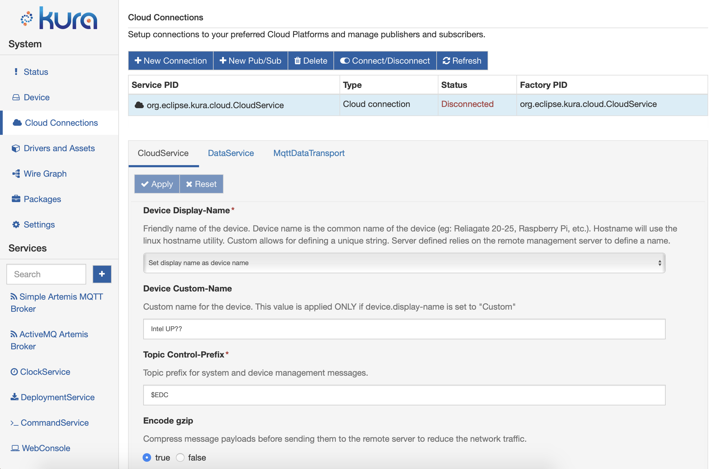
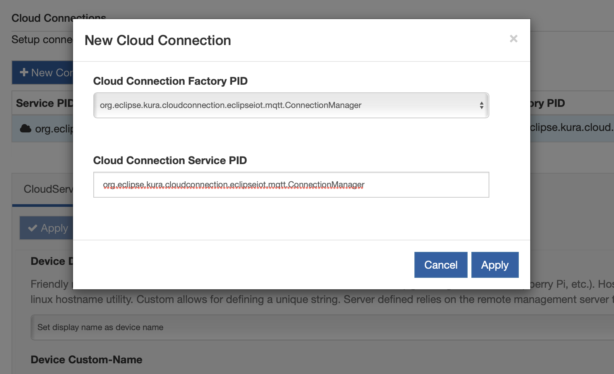
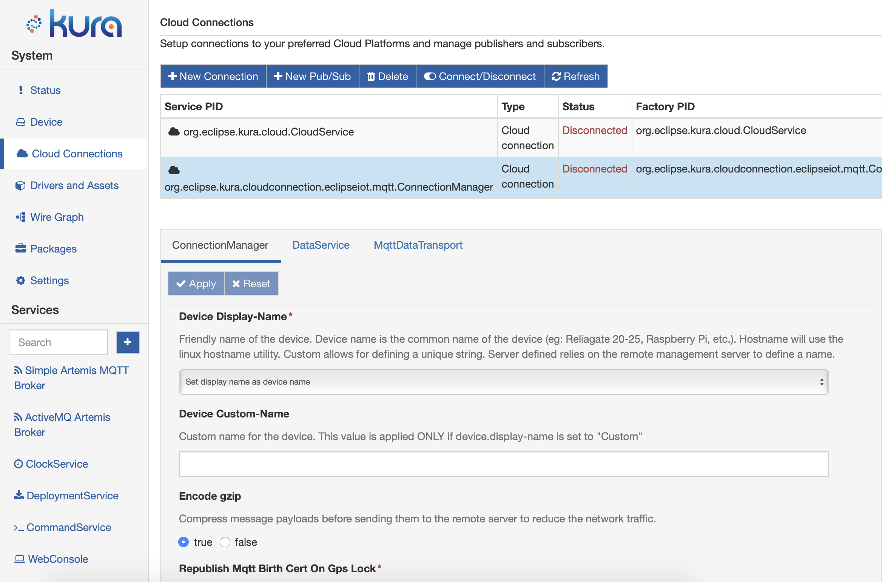
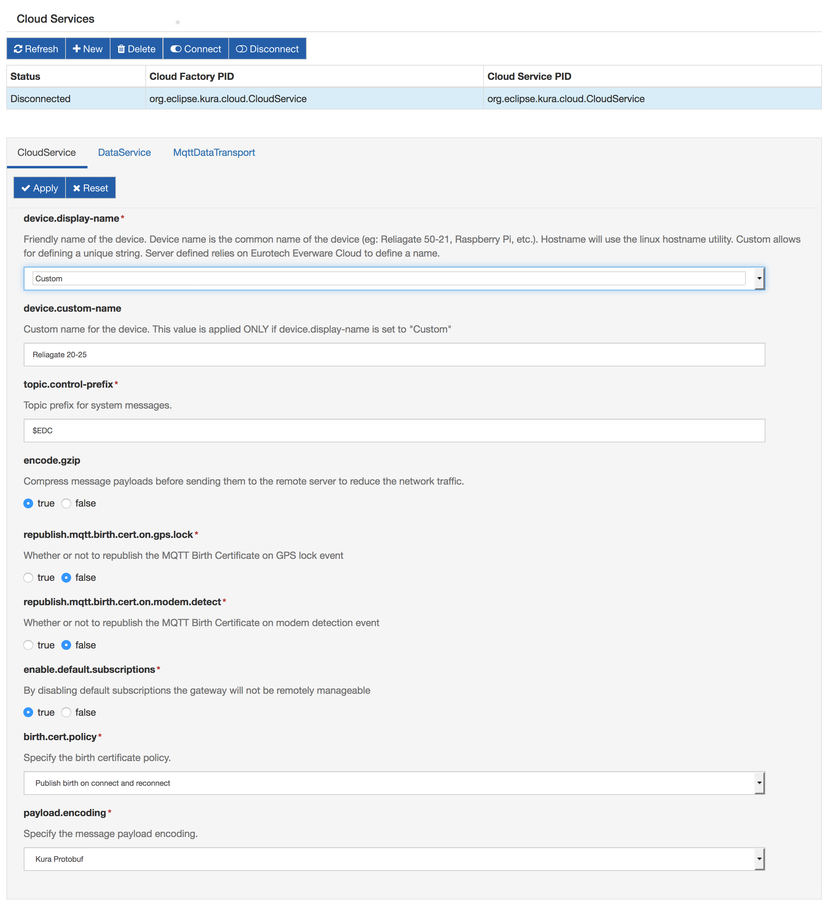
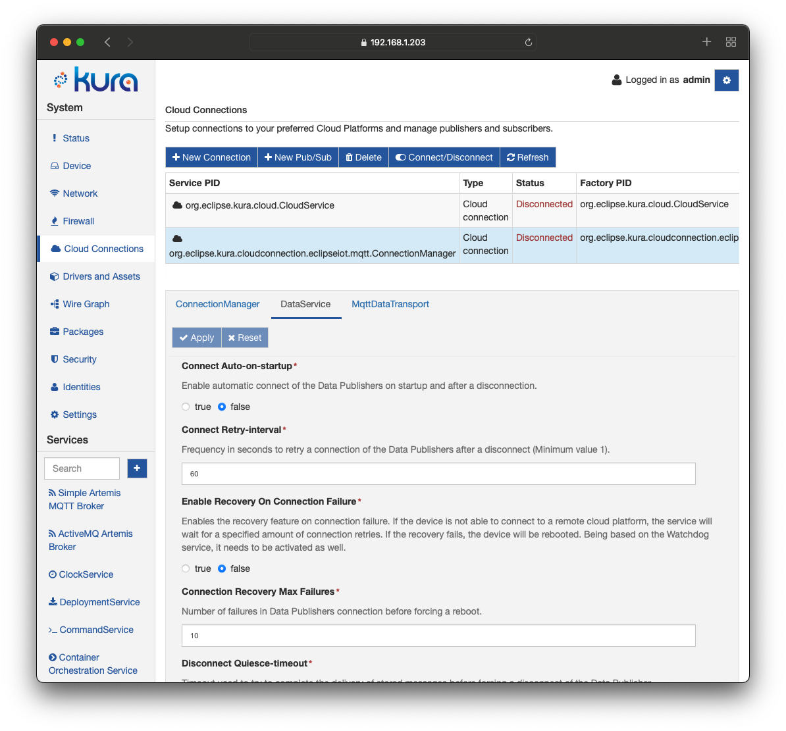
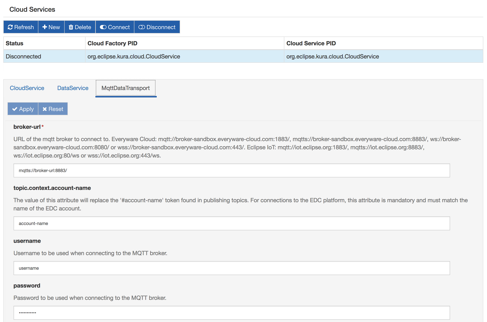

# Eclipse Hono&trade; platform

Eclipse Hono™ provides remote service interfaces for connecting large numbers of IoT devices to a back end and interacting with them in a uniform way regardless of the device communication protocol. More information can be found [here](https://www.eclipse.org/hono/). This document outlines how to connect to Eclipse Hono using the Kura Gateway Administrative Console.

## Using the Kura Gateway Administrative Console

The Kura Gateway Administrative Console exposes all services necessary for connecting to Eclipse Hono.
First of all, in the **Cloud Connections** section, a new Hono-enabled connection needs to be setup.

From the Cloud Connections section,

the user needs to create a new connection:

<figure markdown>
  { style="border-radius: 5px;" }
  <figcaption></figcaption>
</figure>

by specifying a valid PID:

<figure markdown>
  { style="border-radius: 5px;" }
  <figcaption></figcaption>
</figure>

The result should be like the one depicted in the following image:

The reference links listed below outline each service involved in the cloud connection. It is recommended that each section be reviewed.

- [CloudService](#cloudservice)
- [DataService](#dataservice)
- [MqttDataTransport](#mqttdatatransport)

### CloudService

The default settings for the CloudService are typically adequate for connecting to a Hono instance. The screen capture shown below displays the default settings for the CloudService. For details about each setting, please refer to [CloudService](#cloudservice).

### DataService

The majority of default settings in the DataService can be left unchanged. A screen capture of the DataService configuration is shown below. For complete details about the DataService configuration parameters, please refer to [DataService](#dataservice).

In order for Kura to connect to Eclipse Hono on startup, the *connect.auto-on-startup* option must be set to *true.* If this value is changed from false to true, Kura will immediately begin the connection process. It is recommended that the CloudService and MqttDataTransport are configured before setting the *connect.auto-on-startup* option to true.

!!! note
    Changing the value of *connect.auto-on-startup* from `true` to `false` **will not** disconnect the client from the broker. This setting simply implies that Kura will not automatically connect on the next start of Kura.

### MqttDataTransport

While the majority of default settings in the MqttDataTransport can be left unchanged, the following parameters must be modified:

- **broker-url** - defines the MQTT broker URL that was provided when the Eurotech Everyware Cloud account was established. In the MqttDataTransport configuration screen capture shown below, the *broker-url* is `mqtt://broker-url:1883`
- **topic.context.account-name** - defines the account name of the account to which the device is attempting to connect. In the MqttDataTransport configuration screen capture shown below, the *account name* is `account-name`
- **username** - identifies the user to be used when creating the connection. In the MqttDataTransport configuration screen capture shown below, the *username* is `username`.

For complete details about the MqttDataTransport configuration parameters, please refer to [MqttDataTransport](#mqttdatatransport).

## Connect/Disconnect

The status panel can be used to manually connect or disconnect the client while Kura is running. The main button toolbar has a connect and disconnect button that may be used to control connectivity.

!!! note
    Connecting or disconnecting the client via the status panel has no impact on Kura automatically connecting at startup. This capability is only controlled via the *connect.auto-on-startup* DataService setting.
