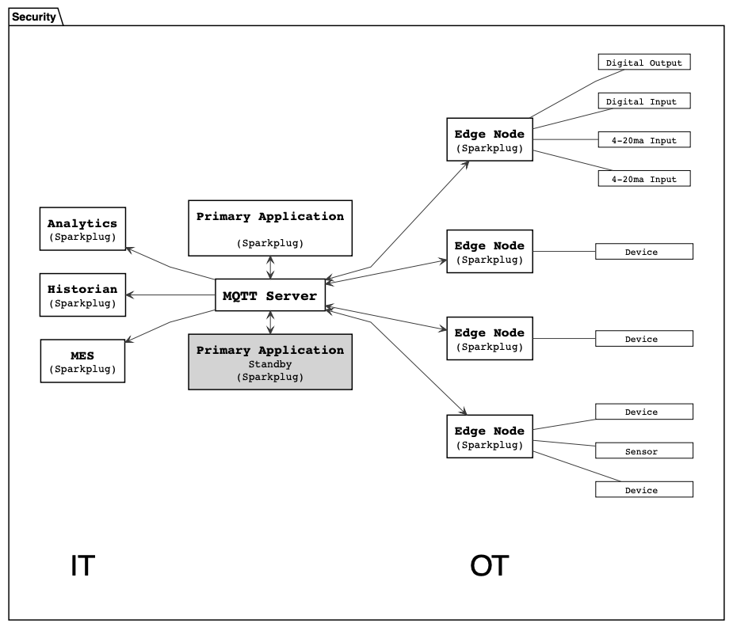
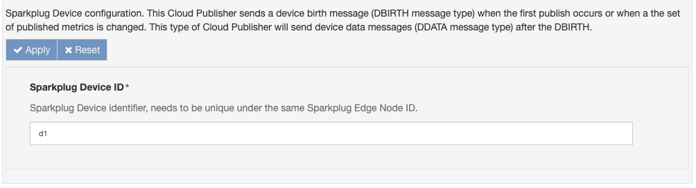
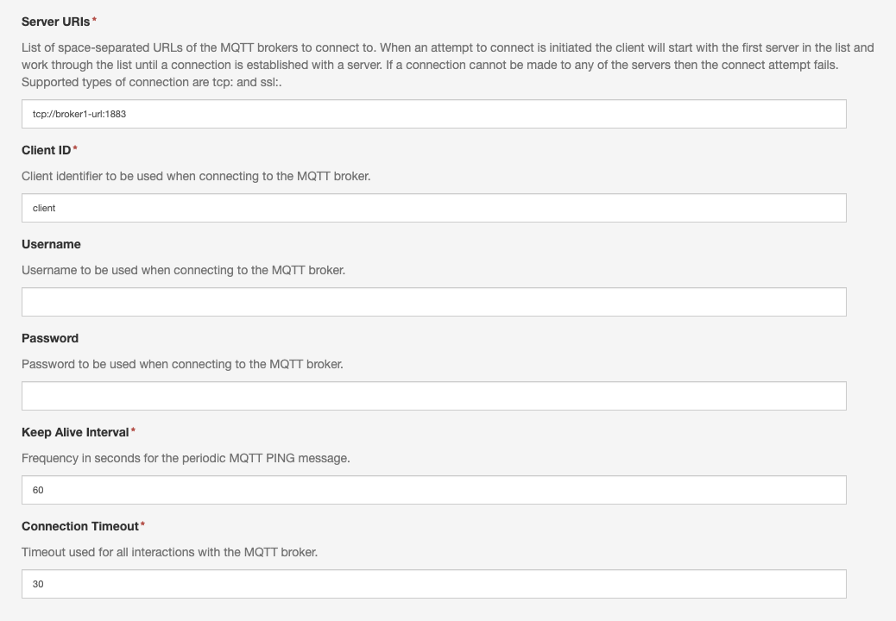

# Eclipse Sparkplug&reg; Cloud Connector

The `org.eclipse.kura.cloudconnection.sparkplug.mqtt.provider` package provides a Eclipse Kura Cloud Connection that implements the [Eclipse Sparkplug&reg; v3.0.0 specification](https://sparkplug.eclipse.org/specification/version/3.0/documents/sparkplug-specification-3.0.0.pdf).


## Introduction to Eclipse Sparkplug

!!! quote "from [Eclipse Sparkplug](https://sparkplug.eclipse.org/about/faq/)"
    *Sparkplug is an open software specification that provides MQTT clients the framework to seamlessly integrate data from their applications, sensors, devices, and gateways within the MQTT Infrastructure. It is specifically designed for use in Industrial Internet of Things (IIoT) architectures to ensure a high level of reliability and interoperability.*

The specification aims fulfill the following 3 goals:

1. Define a common MQTT topic namespace.
2. Define a common MQTT state management.
3. Define a common MQTT payload.

To achieve that, the Eclipse Sparkplug specification defines an architecture (see picture below) and 4 main actors:

- **Device**: a collection of related data points, which may represent a physical device (like a PLC, a set of sensors, etc.) and that notify the value or quality change of their data points. In this cloud connection, a *Device* is represented by the attached **Cloud Publishers**.
- **Edge Node**: the gateway that is responsible of the interaction with the MQTT broker and that estabilished sessions with the data-consuming *Host Applications*. This **Cloud Connection** assumes the role of *Edge Node*.
- **MQTT Server**: a MQTT server that supports the v3.1.1 (or v5.0) version of the protocol.
- **Host Application**: the data-consuming application that subscribes to the MQTT messages generated by the Edge Nodes. A *Primary Host Application* is responsible of controlling and monitoring Edge Nodes, which can be configured to modify their behavior based on the state of the *Primary Host Application* (for example, the application goes offline). You can imagine the Primary Host Application for Eclipse Kura being Eclipse Kapua.

<figure markdown>
  
  <figcaption>Image from https://sparkplug.eclipse.org/specification/version/3.0/documents/sparkplug-specification-3.0.0.pdf</figcaption>
</figure>

The main principles upon which the Specification is based on can be summarized as follows:

1. *PubSub Protocol*: this is the main topology upon which the architecture is developed.
2. *Report by Exception (RBE)*: messages need to be sent by the Edge Node only when values at the edge change, and the message should contain only the value/metrics that changed. There is no need for continuos polling; although it is higly discouraged, it is not mandatory to have Edge Nodes apply the RBE.
3. *Continuos Session Awareness*: Host Applications are aware of the state of the Edge Nodes, and Edge Nodes are aware of the state of the Host Applications. This continuos session awareness is achieved by the means of birth and death certificates and state messages (continue the reading to find out more) and is the key to allow reporting by exception.
4. *Birth and Death certificates*: these messages represent the state of Edge Nodes and Devices (online/offline + data that will be reported). The birth messages are always the first ones that are sent from the Edge Node, and the delivery of death certificates is ensured through the [MQTT Will message](https://www.hivemq.com/blog/mqtt-essentials-part-9-last-will-and-testament/), even if the connection is lost ungracefully. The birth messages always contain all the metrics that the Device or Edge Node will ever report on. If a new metric is added or a metric gets removed, then a new session needs to be estabilished.
5. *Connection Persistence*: with the mechanisms above, the connection does not need to be persistent. For example, an Edge Node that disconnects gracefully with a MQTT DISCONNECT packet will not be seen as "dead" from the host application because no death certificate has been triggered (Will messages are sent only on failures). Hence, the Edge Node can implement a logic where it remains connected only during the timeframe needed for sending the new data.
    
    !!! warning
        This Cloud Connection maintains a persistent connection to the MQTT server.

### Eclipse Sparkplug Topic Namespace

All clients using the specification must adhere to the following topic namespace:

```
namespace/group_id/message_type/edge_node_id/[device_id]
```

where:

- `namespace`: defines the structure of the remaining elements and the encoding for the payload. With Sparkplug v3.0.0 the namespace to utilize is `spBv1.0`.
- `group_id`: some Edge Nodes can be related to each other identifying a group (for example, Edge Nodes in a given plant). This element is the identifier for the group.
- `message_type`: defines how to interpret and handle the payload. It encapsulates the semantic of the message and can be one of the following elements:
    - `NBIRTH`/`NDEATH`: Edge Node birth and death certificates.
    - `DBIRTH`/`DDEATH`: Device birth and death certificates.
    - `NDATA`/`DDATA`: message containing data reported by the Edge Node or Device.
    - `NCMD`/`DMCD`: message containing commands for the Edge Node or Device.
    - `STATE`: message from the Primary Host Application indicating the state (offline/online) of the main consumer.
- `edge_node_id`: the identifier for the Edge Node.
- `device_id` (optional): the identifier for the Device. Must be unique under the same `edge_node_id` and must be always present on messages belonging to Devices (D- type messages).

The combination of `group_id` and `edge_node_id` must be unique and is called **Edge Node Descriptor**.

!!! tip
    It is advised to have `group_id`, `edge_node_id`, and `device_id` as small but as descriptive as possible, for better efficiency.

### Operational Behavior

This introduction will focus more on the Edge Node and Device, as they are of more interest for this Cloud Connection.

#### Session Management

The session estabilishment procedure ensures the Edge Node to be subscribed to command-type messages for receiveing commands from the Host Application.

An Edge Node can (optionally, but incouraged) specify to be aware of a primary host application state and, in such case, it needs to subscribe to the relative STATE messages. The Edge Node will send the birth certificate (and thus completing the session init procedure) only after receiving the STATE message denoting the Primary Host Application is online. After connection, if the Edge Node receives a STATE message denoting the Primary Host Application is offline, it must restart the session estabilishment procedure.

On connection, the Edge Node sets a [MQTT Will message](https://www.hivemq.com/blog/mqtt-essentials-part-9-last-will-and-testament/) containing a NDEATH certificate. Doing so, if the MQTT broker does not receive any communication within the **Keep Alive** period (client lost connection), it will send the Edge Node NDEATH certificate on all subscribers. A birth/death sequence number `bdSeq` is maintained in the Edge Node to match NBIRTH with NDEATH messages in the Host Application. Each `bdSeq` in the NDEATH message is matched with the corresponding `bdSeq` of the previous NBIRTH message. This allows the Host Application tracking the state of the Edge Nodes and mark not up-to-date metrics as **STALE**.

A Device can send a device DBIRTH message after a Edge Node NBIRTH has been sent. The DBIRTH message contains all the metrics that the device will ever report on. If a new metric is added or an existing one removed, then the Device session needs to be re-estabilished. If the Edge Node looses the connection to some of its Devices, then it needs to send a Device DDEATH certificate on his behalf. The data-consuming Host Application will then mark that particular Device as offline and mark its metrics as STALE. Once the session is estabilished, the Device can publish the changed metrics using the DDATA message type.

#### Multiple MQTT Server Topologies

A Primary Host Application must publish its STATE message every time it connects to the MQTT broker. This ensures the Edge Nodes to be aware of its status as long as they remain connected to the MQTT server.

At any point in time, an Edge Node can be connected to at most one MQTT server. If multiple MQTT servers are defined each time the Edge Node receives an offline STATE message from its Primary Host Application it needs to terminate the session and estabilish a new one with the next MQTT broker.

### Further Resources

- [Eclipse Sparkplug v3.0.0 specification](https://sparkplug.eclipse.org/specification/version/3.0/documents/sparkplug-specification-3.0.0.pdf)
- [HiveMQ Sparkplug guides collection](https://www.hivemq.com/mqtt/mqtt-sparkplug-essentials/)
- [Eclipse Sparkplug FAQ](https://sparkplug.eclipse.org/about/faq/)


## Cloud Connection Configuration

### Cloud Endpoint Layer Configuration

The cloud endpoint layer allows to attach [`CloudPublisher`](https://github.com/eclipse/kura/blob/develop/kura/org.eclipse.kura.api/src/main/java/org/eclipse/kura/cloudconnection/publisher/CloudPublisher.java)s and [`CloudSubscriber`](https://github.com/eclipse/kura/blob/develop/kura/org.eclipse.kura.api/src/main/java/org/eclipse/kura/cloudconnection/subscriber/CloudSubscriber.java)s to publish/subscribe messages on Sparkplug topics.

#### Sparkplug Device

Each [`CloudPublisher`](https://github.com/eclipse/kura/blob/develop/kura/org.eclipse.kura.api/src/main/java/org/eclipse/kura/cloudconnection/publisher/CloudPublisher.java) attached to this cloud connection acts as a **Sparkplug Device**. The configuration for it is shown in the picture below.



The parameter specified as `device.id` will dictate the Sparkplug device identifier used to publish messages from this cloud publisher. A device `DBIRTH` message is sent from this publisher when the first publish occurs or when a the set of published metrics is changed. Subsequent publishings will be done on the Sparkplug topic to publish device data (`DDATA` message type).

The Sparkplug Device implemented by this publisher **does not implement** the following standard optional specifications:

- [`tck-id-operational-behavior-device-ddeath`](https://github.com/eclipse-sparkplug/sparkplug/blob/2f1320982deb473d942e55f6432bf07aac0166db/specification/src/main/asciidoc/chapters/Sparkplug_5_Operational_Behavior.adoc#device-session-termination): Device death messages (`DDEATH` message type) since the usual way to publish data from the Wire Graph using a WireAsset attached to a CloudPublisher has no implementation for reporting error states (see [`WireAsset.onWireReceive`](https://github.com/eclipse/kura/blob/d53ec833b7438a70a0e3a79406f4c8aed52e94f0/kura/org.eclipse.kura.wire.component.provider/src/main/java/org/eclipse/kura/internal/wire/asset/WireAsset.java#L247))
- [`tck-id-payloads-alias-uniqueness`](https://github.com/eclipse-sparkplug/sparkplug/blob/2f1320982deb473d942e55f6432bf07aac0166db/specification/src/main/asciidoc/chapters/Sparkplug_6_Payloads.adoc#metric): Sparkplug aliases for metrics
- [`tck-id-message-flow-device-dcmd-subscribe`](https://github.com/eclipse-sparkplug/sparkplug/blob/3.x/specification/src/main/asciidoc/chapters/Sparkplug_5_Operational_Behavior.adoc#device-session-establishment): writing to outputs, hence it will not subscribe to device command messages (`DCMD` message type)

##### Sparkplug Device Payload

The payload of the sent `DDATA` message will be encoded using the [Sparkplug Protobuf definition](https://github.com/eclipse/tahu/blob/3.x/sparkplug_b/sparkplug_b.proto) converting the [`KuraPayload`](https://github.com/eclipse/kura/blob/develop/kura/org.eclipse.kura.api/src/main/java/org/eclipse/kura/message/KuraPayload.java) into [Sparkplug payload](https://github.com/eclipse-sparkplug/sparkplug/blob/3.x/specification/src/main/asciidoc/chapters/Sparkplug_6_Payloads.adoc#payload) as follows:

- Metrics from [`KuraPayload.metric()`](https://github.com/eclipse/kura/blob/d53ec833b7438a70a0e3a79406f4c8aed52e94f0/kura/org.eclipse.kura.api/src/main/java/org/eclipse/kura/message/KuraPayload.java#L116) become [Sparkplug metrics](https://github.com/eclipse-sparkplug/sparkplug/blob/3.x/specification/src/main/asciidoc/chapters/Sparkplug_6_Payloads.adoc#metric). Only the **name**, **timestamp**, **datatype** and **value** components are added. The timestamp is set to the publishing instant. The datatype is inferred from the Java type as follows:

    | Java Type | Sparkplug Type |
    | - | - |
    | `Boolean` | `DataType.Boolean` |
    | `byte[]` | `DataType.Bytes` |
    | `Double` | `DataType.Double` |
    | `Float` | `DataType.Float` |
    | `Byte` | `DataType.Int8` |
    | `Short` | `DataType.Int16` |
    | `Integer` | `DataType.Int32` |
    | `Long` | `DataType.Int64` |
    | `String` | `DataType.String` |
    | `Date` | `DataType.DateTime` |
    | `BigInteger` | `DataType.UInt64` |

    All other Java types will cause the application to throw an Exception.

- [`KuraPayload.getBody()`](https://github.com/eclipse/kura/blob/d53ec833b7438a70a0e3a79406f4c8aed52e94f0/kura/org.eclipse.kura.api/src/main/java/org/eclipse/kura/message/KuraPayload.java#L120), if non null, will be copied into the **body** of the [Sparkplug payload](https://github.com/eclipse-sparkplug/sparkplug/blob/3.x/specification/src/main/asciidoc/chapters/Sparkplug_6_Payloads.adoc#payload)

- [`KuraPayload.getPosition()`](https://github.com/eclipse/kura/blob/d53ec833b7438a70a0e3a79406f4c8aed52e94f0/kura/org.eclipse.kura.api/src/main/java/org/eclipse/kura/message/KuraPayload.java#L84), if non  null, will be used to create the following metrics from the [`KuraPosition`](https://github.com/eclipse/kura/blob/develop/kura/org.eclipse.kura.api/src/main/java/org/eclipse/kura/message/KuraPosition.java#L28) object (with the corresponding Sparkplug data types):

    - **kura.position.altitude**: `DataType.Double`
    - **kura.position.heading**: `DataType.Double`
    - **kura.position.latitude**: `DataType.Double`
    - **kura.position.longitude**: `DataType.Double`
    - **kura.position.precision**: `DataType.Double`
    - **kura.position.satellites**: `DataType.Int32`
    - **kura.position.status** `DataType.Int32`
    - **kura.position.speed**: `DataType.Double`
    - **kura.position.timestamp**: `DataType.DateTime`

- [`KuraPayload.getTimestamp()`](https://github.com/eclipse/kura/blob/d53ec833b7438a70a0e3a79406f4c8aed52e94f0/kura/org.eclipse.kura.api/src/main/java/org/eclipse/kura/message/KuraPayload.java#L76), if non null, will be used as the timestamp metric of the Sparkplug payload

### Data Service Layer Configuration

The `DataService` layer used in this component is the `org.eclipse.kura.data.DataService` implementation. Please refer to the [Data Service Configuraion](../gateway-configuration/data-service-configuration.md) page for further details.

### Data Transport Layer Configuration

The Sparkplug Data Transport layer bridges the incoming requests to the underlying [Eclipse Paho MQTT v3.1.1](https://eclipse.dev/paho/files/javadoc/index.html) client following the Sparkplug specification. In particular, the Data Transport Layer ensures the following.

- **[Edge Node Sparkplug Session Estabilishment](https://github.com/eclipse-sparkplug/sparkplug/blob/3.x/specification/src/main/asciidoc/chapters/Sparkplug_5_Operational_Behavior.adoc#edge-node-session-establishment)**: the *Edge Node* (this Cloud Connection) estabilishes a new Sparkplug session upon connection. An optional **Primary Host Application ID** can be specified (see picture below) to make the Cloud Connection wait until the Primary Host Application is online before publishing NBIRTH and DBIRTH messages.
- **[Edge Node Sparkplug Session Termination](https://github.com/eclipse-sparkplug/sparkplug/blob/3.x/specification/src/main/asciidoc/chapters/Sparkplug_5_Operational_Behavior.adoc#edge-node-session-termination)**: upon disconnection, the *Edge Node* follows the required specification statements. In particular, multiple space-separated **Server URIs** can be specified in the component's configuration (see picture below). When a **Primary Host Application ID** is defined and it receives a STATE message denoting that the configured primary application is offline, then reconnection attempts are made cycling through the **Server URIs** list. When the last server fails to connect, then the traversal is restarted from the start of the list.
- **[Edge Node NCMD handler](https://github.com/eclipse-sparkplug/sparkplug/blob/3.x/specification/src/main/asciidoc/chapters/Sparkplug_5_Operational_Behavior.adoc#commands)**: upon reception of a valid NCMD message, the Transport layer checks if it contains a **Node Control/Rebirth** metric, and, if set to `true`, restarts the session estabilishment procedure without sending an MQTT CONNECT packet (client connection is not closed, only BIRTH messages are re-sent).



The Sparkplug Data Transport layer is configured to wait for a random period of time between 0sec and 5sec before each connection attempt. This is to ensure that, on large deployments, the target MQTT servers and Host Applications will dilute session estabilishment requests by some margin. This behavior is not part of the Sparkplug specification.


## Sparkplug Implementation Details

### Edge Node

- The NBIRTH message sent by this cloud connection will not contain any metrics, except for the mandatory ones required by the specification.
- This cloud connection does not send any NDATA messages in its default implementation.
