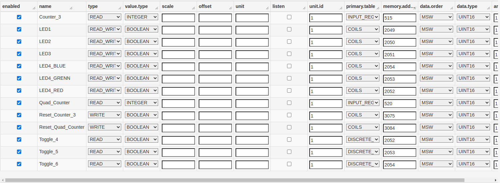

# Asset implementation

An **Asset** is a logical representation of a field device, described by a list of **Channels**. The Asset uses a specific Driver instance to communicate with the underlying device and it models a generic device resource as a **Channel**. A register in a PLC or a GATT Characteristic in a Bluetooth device are examples of Channels. In this way, each Asset has multiple Channels for reading and writing data from/to an Industrial Device.

Assets can be used as Wire Components to access the resources referenced by the defined channels inside a Wire Graph, see the [Assets as Wire Components](../kura-wires/assets-as-wire-components.md) guide for more details. 

## Channel Example

To further describe the concept of Channel and Asset, the following table shows a set of PLC register addresses as provided in a typical PLC documentation.

Name               | Entity          | Address |
-------------------|-----------------|---------|
LED1               | COILS           | 2049    |
LED2               | COILS           | 2050    |
LED3               | COILS           | 2051    |
LED4 RED           | COILS           | 2052    |
LED4 GREEN         | COILS           | 2053    |
LED4 BLUE          | COILS           | 2054    |
Counter 3          | INPUT REGISTERS | 515     |
Quad Counter       | INPUT REGISTERS | 520     |
Toggle 4           | DISCRETE INPUTS | 2052    |
Toggle 5           | DISCRETE INPUTS | 2053    |
Toggle 6           | DISCRETE INPUTS | 2054    |
Reset Counter 3    | COILS           | 3075    |
Reset Quad Counter | COILS           | 3084    |

The corresponding Channels definition in the Asset is as follows:

As shown in the previous image, the Channel definition in an Asset results easily mappable to what available in a generic PLC documentation. 

Once defined the Channels in an Asset, a simple Java application that leverages the Asset API can easily communicate with the Field device by simply referring to the specific Channel of interest.

## Channel Definition

- **enabled**: each channel can be separately enabled using this flag.
- **name**: unique user-friendly name for a channel
- **type**: represents the type of operation supported. Possible values are: _READ_, _WRITE_, _READ/WRITE_
- **value.type**: represents the data type that will be used when creating the Wire Envelope for the connected components.
- **scale**: an optional scaling factor to be applied only to the numeric values retrieved from the field. It is represented as a double and if the value.type is, for example, an integer, the scaling factor multiplier will be casted to integer before multiplying it to the retrieved value.
- **offset**: an optional offset value that will be added only to the numeric values retrieved from the field. It is a double in the asset definition, and will be casted to the value.type of the retrieved value before being applied.
- **unit**: an optional string value that will be added to the asset channel read to represent the unit of measure associated to that specific channel.
- **listen**: if supported by the associated driver, allows to receive notifications by the driver on events. This flag currently has effect only inside Kura Wires.

### Driver specific parameters

The parameters that are not included in list of driver independent parameters above are driver specific. These parameters are used to identify the resource addressed by the channel.

Driver specific parameters are described in the driver documentation.

## Other Asset Configurations

- **asset.desc**: a user friendly description of the asset
- **emit.all.channels**: specifies whether the values of all READ or READ_WRITE channels should be emitted in case of a channel event. If set to true, the values for all channels will be read and emitted, if set to false, only the value for the channel related to the event will be emitted.
- **timestamp.mode**: if set to PER_CHANNEL, the component will emit a driver-generated timestamp per channel property. If set to SINGLE_ASSET_GENERATED, the component will emit a single timestamp per request, generated by the Asset itself before emitting the envelope. If set to SINGLE_DRIVER_GENERATED_MAX or SINGLE_DRIVER_GENERATED_MIN, the component will emit a single driver generated timestamp being respectively the max (most recent) or min (oldest) among the timestamps of the channels.
- **emit.errors**: Specifies whether errors should be included or not in the emitted envelope. Default is false.
- **emit.on.change**: If set to true, this component will include a channel value in the output emitted in Kura Wires only if it is different than the one from the previous read operation or event. Channel errors will always be emitted if **emit.errors** is set to true.
- **emit.empty.envelopes**: If set to false, this component will not emit empty envelopes. This property can be useful if combined with **emit.on.change**.

## Channels download

The creation of the channels is a process that could be very time and effort consuming. For this reason, once the user has created the desired channels, it is possible to download the entire list from the web UI, by clicking the `Download Channels` button:

The list is downloaded in csv format and is represented in the form of a table, whose columns represent the entries for the options in the channel definition, while each row is equivalent to a specific channel. For example, the resulting csv file retrieved from downloading the list of channels in the image above is:

The resulting table is composed by some static, pre-defined options (the ones mentioned in Channel Definition section above, from `enabled` to `listen`) that are the same for each component and the ones introduced by the specific bundle under analisys. In this case, the modbus driver introduces these driver-specific options:

- unit.id
- primary.table
- memory.address
- data.order
- data.type
- array.data.length

The download tool is extremely useful in all those situations where the user wants to quickly load a long list of channels at once: for example, it can easily clone the same list in multiple assets, export it to another device, or simply save it locally to always have a copy of the channels ready.

## CSV upload

The `Upload Channels` button allows the user to load a local csv file to create the channel list in one shot: the uploading file must implement the same table-structure described in the "Channels download" section above, so with each rows representing a channels, and each column one entry of the channel's options.

Once the user clicks on the button, will be shown a pop-up in which there are a button to locate the file in the user's filesystem and two checkboxes to allow the uploading phase customization. After clicking on `Upload`, if the process is succesful, the new channels list will be shown, and the user is just asked to click on the `Apply` button to save the asset variation.

### Force import empty string policy

The `Force import empty string policy` checkbox forces the parsing of all empty values present in the csv as empty strings, for all those channel's options that are typed to String and "not required" by the metatype.

So, this box must be checked when the user wants that all *empty values from the csv* are considered as *empty strings* (`""`) when parsed to driver-specific channel option, defined by the metatype as **String type** and **not required**. So, those values that are `null` in the csv, will be set as `""` in the channel options. The user must be cautious, because the framework supposes that it's consciously leaving empty values in the csv.

Otherwise, if the box is unchecked, all the csv empty values will be considered as `null` strings and parsed to the default value set in the metatype of the driver.

If, for example, the user downloads the channels list following the steps described in the precious section, it could upload the same csv file into an other asset, or another device, to get the exactly same asset configuration.

### Replace current channels

The `Replace current channels` must be checked when the user wants to replace **all** the channels currently present in the asset, with the ones that will be created by the csv uploading.