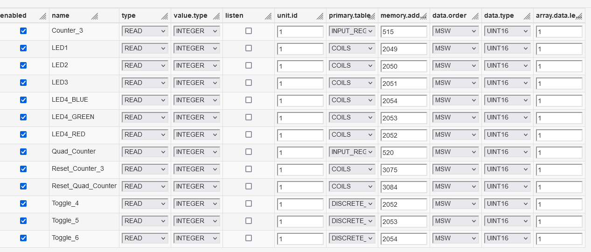
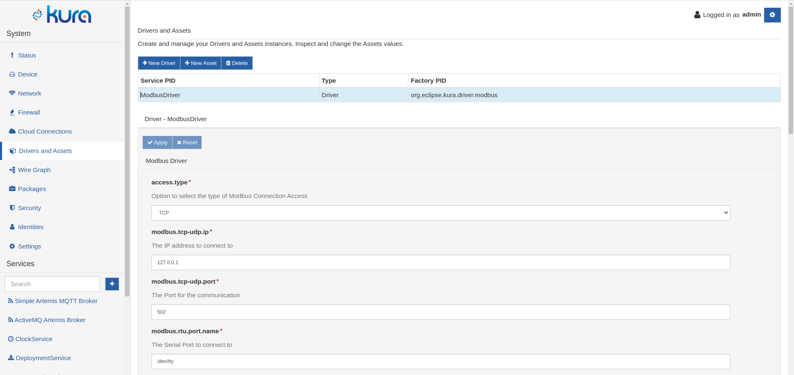
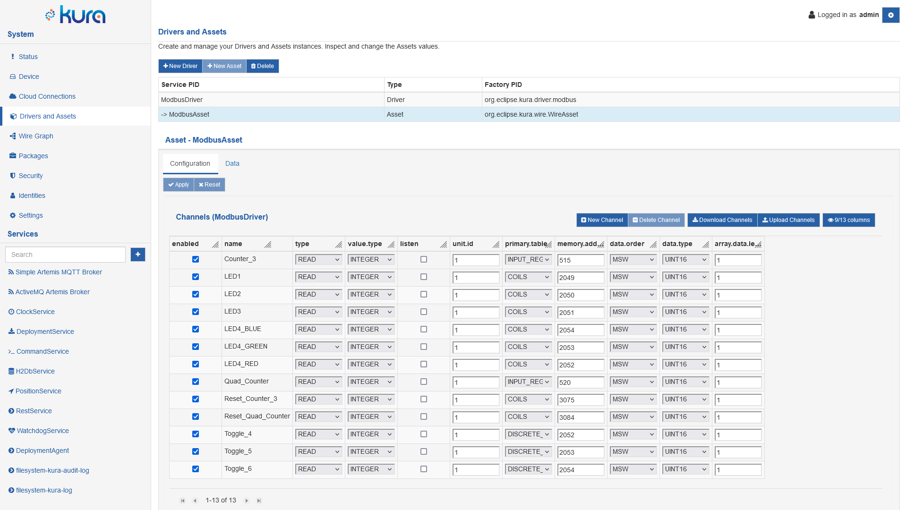
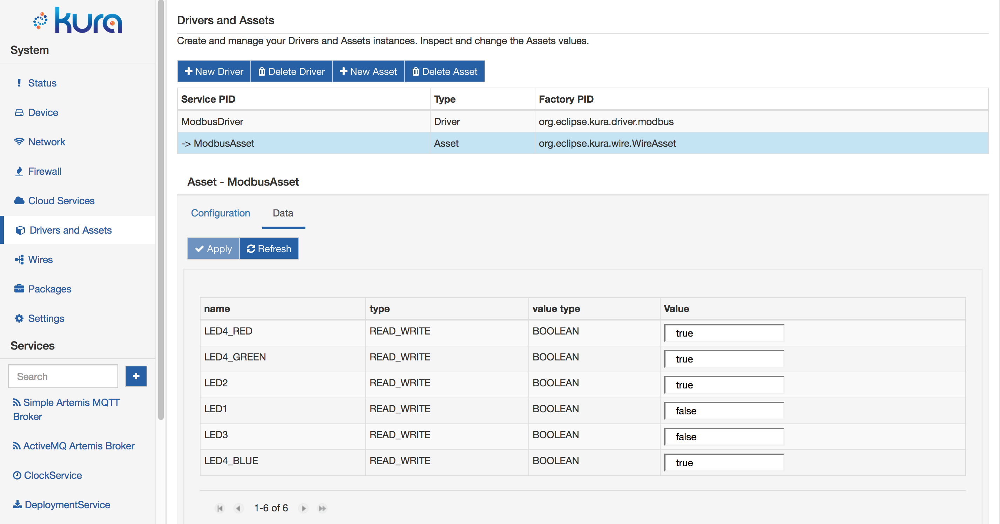

# Drivers, Assets and Channels

Eclipse Kura introduces a model based on the concepts of **Drivers** and **Assets** to simplify the communication with the field devices attached to a gateway.

A **Driver** encapsulates the communication protocol and its configuration parameters, dealing with the low-level characteristics of the field protocol. It opens, closes and performs the communication with the end field device. It also exposes field protocol specific information that can be used by upper levels of abstraction to simplify the interaction with the end devices.

An **Asset** is a logical representation of a field device, described by a list of **Channels**. The Asset uses a specific Driver instance to communicate with the underlying device and it models a generic device resource as a **Channel**. A register in a PLC or a GATT Characteristic in a Bluetooth device are examples of Channels. In this way, each Asset has multiple Channels for reading and writing data from/to an Industrial Device.

## Channel Example
To further describe the concept of Channel and Asset, the following table shows a set of PLC register addresses as provided in a typical PLC documentation.

Name               | Entity          | Address |
-------------------|-----------------|---------|
LED1               | COILS           | 2049    |
LED2               | COILS           | 2050    |
LED3               | COILS           | 2051    |
LED4_RED           | COILS           | 2052    |
LED4_GREEN         | COILS           | 2053    |
LED4_BLUE          | COILS           | 2054    |
Counter_3          | INPUT REGISTERS | 515     |
Quad_Counter       | INPUT REGISTERS | 520     |
Toggle_4           | DISCRETE INPUTS | 2052    |
Toggle_5           | DISCRETE INPUTS | 2053    |
Toggle_6           | DISCRETE INPUTS | 2054    |
Reset_Counter_3    | COILS           | 3075    |
Reset_Quad_Counter | COILS           | 3084    |

The corresponding Channels definition in the Asset is as follows:

{ style="border-radius: 7px;" }

As shown in the previous image, the Channel definition in an Asset results easily mappable to what available in a generic PLC documentation. 

Once defined the Channels in an Asset, a simple Java application that leverages the Asset API can easily communicate with the Field device by simply referring to the specific Channel of interest.

## Drivers and Assets in Kura Administrative UI
Kura provides a specific section of the UI to allow users to manage the different instances of Drivers and Assets.
Using the Kura Web UI the user can instantiate and manage Drivers

{ style="border-radius: 7px;" }

but also can manage Assets instances based on existing drivers. By default the following columns are hidden: **scale**, **offset**, **scaleoffset.type**, **unit**. You can manage the visible columns with the related button in the  button bar.

{ style="border-radius: 7px;" }

The user interface allows also to perform specific reads on the configured Assets' channels clicking on the Data tab for the selected Asset.

{ style="border-radius: 7px;" }
