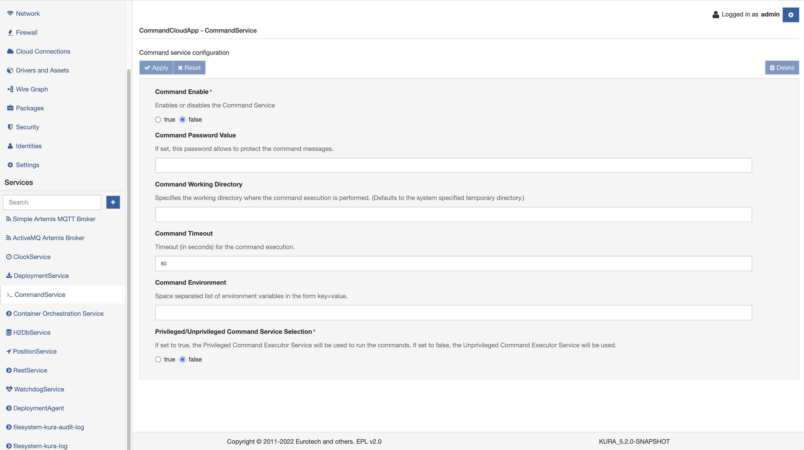

# Command Service

The Command Service provides methods for running system commands from the Kura web console or from Kapua. In the Kura web console, the service is available clicking on the **Command** tab under the **Device** section, while for the cloud platform please refer to the official documentation.

To run a command simply fill the **Execute** field with the command and click the **Execute** button. The service also provides the ability for a script to execute using the **File** option of the **Command** tab in the Kura web console or the Kapua Cloud Console. This script must be compressed into a zip file with the eventual, associated resource files.

Once the file is selected and **Execute** is clicked, the zip file is sent embedded in an MQTT message on the device. The Command Service in the device stores the file in /tmp, unzips it, and tries to execute a shell script if one is present in the file. Note that in this case, the Execute parameter cannot be empty; a simple command, such as `ls -l /tmp`, may be entered.

!!! warning
    When decompressed, the script loses its executable attribute. To fix this problem, if you plan to execute a script, the command entered into the **Execute** line must trigger the execution:
    ** bash [name of the script] **.

The configuration of the service is in the **CommandService** tab located in the **Services** area as shown in the screen capture below.

The Command Service provides the following configuration parameters:

- **Command Enable**: sets whether this service is enabled or disabled in the cloud platform (Required field).

- **Command Password Value**: sets a password to protect this service.

- **Command Working Directory**: specifies the working directory where the command execution is performed.

- **Command Timeout**: sets the timeout (in seconds) for the command execution.

- **Command Environment**: supplies a space-separated list of environment variables in the format key=value.

- **Privileged/Unprivileged Command Service Selection**: sets the modality of the command service. When set to privileged, the commands are run using the (privileged) user that started Kura, tipically *kurad* or *root*. When set to unprivileged, a standard user will run the commands.

When a command execution is requested in the cloud platform, it sends an MQTT control message to the device requesting that the command be executed. On the device, the Command Service opens a temporary shell in the _command.working.directory,_ sets the _command.environment_ variables (if any), and waits  _command.timeout_ seconds to get command response.
