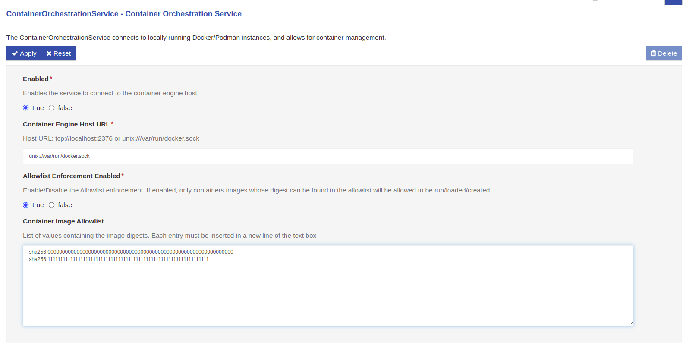

# Kura Container Image Authenticity and Allowlist Enforcement feature

Containerized applications are becoming increasingly popular in the software ecosystem as a way to deploy and distrubute applications. As a result, ensuring the security of software supply chains has become a critical concern. Implementing best practices, such as signing and verifying images to mitigate man-in-the-middle (MITM) attacks and validating their authenticity and freshness, play a pivotal role in safeguarding the integrity of the software supply chain.

To ensure the authenticity and integrity of the code within the container images, binding the image to a specific entity or organization via signature verification is crucial and increasingly common.

The purpose of this document is to provide a high-level understanding of the Kura container authenticity and allowlist enforcement feature introduced with **Kura version 5.5.0**.

## High-level flow

The Kura container authenticity and allowlist enforcement feature is designed to address container authenticity concerns by providing a mechanism to perform the signature verification of container images and restricting which container images can be deployed on the Kura platform.

This is achieved by implementing the following flow:

{ width="600" }

Description of the flow:

- **Monitoring**: Kura monitors the container engine events. When a "container start" event is triggered it intercepts the information regarding the image used to spin up the container and starts performing the check.
- **Allowlist** Firstly it checks if the digest of the image used to run the container can be found in the Kura allowlist. If so, the container is allowed to run. If not, Kura proceeds with the image signature verification.
- **Signature verification**: If no trust anchor (i.e. a public key or a X509 certificate depending on the signature mechanism) is available for the verification process to happen, the container is not allowed to run. If one is available, the image signature is verified and the allowlist is updated accordingly.

This flow applies to both containers managed by Kura itself and containers ran directly by the user via CLI and allows for a fine-grained control over the container images that can be deployed on the Kura platform.

- **Unmanaged containers**: Kura allows the user to define a list of container images that can be deployed on the platform. This is done by adding the image digests to the allowlist. When a container is started, Kura checks if the image digest is in the allowlist and, if so, allows the container to run. This is meant to be used by users who, for any reason, need to run a container _outside_ the Kura framework but still want the safety guarantees provided by pinning the images to a specific digest.
- **Managed containers**: Kura also allows the user, for containers ran by Kura itself, to provide a trust anchor to be used for the signature verification process. This allows the user to use a _mutable_ tag when specifying the container image, without giving up the required authenticity checks. Onche the image is verified its digest is stored within the Kura allowlist allowing it to be ran both from Kura and the CLI without the need for an internet connection. When a new image is published the user can simply trigger the pull and the verification process will update the digest automatically.

Note that the user can still directly provide an image digest when running a Kura-managed container, bypassing the signature verification process. This is meant to be used when the user is sure about the image authenticity and does not want to go through the verification process or the image was not signed.

## Unmanaged containers

Regarding those containers not managaed from Kura, the Container Orchestration service provides a security feature which dictates the containers allowed to run on the system. This feature can be enabled or disabled through the `Allowlist Enforcement Enabled` option.

This mechanism leverages the concept of _digest_, which is a unique and immutable identifier for a container image: it is therefore an excellent mean to identify the image from which a container was created.

Given the above, Kura allows the user to provide a list of container image digests in the `Container Image Allowlist` field, in the form of newline-separated strings: when a container is started on the host system (whether it is launched by Kura or by a terminal CLI), Kura retrieves the image from which the container was created, extracts the digest and verifies that it is present in the allowlist provided during service configuration.

If the image digest is present, the container is allowed to proceed without interference, otherwise it is immediately stopped and deleted from the host system.

A similar behaviour is performed at Kura startup or when the enforcement is enabled at runtime: if there are already containers on the device (whether they are started or stopped) and the enforcement is activated, Kura extracts the digests from the containers and compares them with those in the allowlist. Again, containers that have been created from images whose digests are in the allowlist will be left intact, otherwise they will be stopped and deleted from the descriptors list.

The verification is performed by intersecting the list of digests extracted by the containers and the one provided in the configuration: in this way, an empty intersection will result in a failing verification, while a non-empty one means that the image digests is equal to one of the allowlist entries.

### Example scenario

A user wants to leverage the container enforcement in order to let only docker containers started from an image named `foo_image` to be run on the device. To do this, they should enable the Container Enforcement by setting the `Allowlist Enforcement Enabled` to `true`, and fill the `Container Image Allowlist` field with the digest of the `foo_image` docker image (i.e.`sha256:0000000000000000000000000000000000000000000000000000000000000000` in the example below).

#### Startup of the Enforcement Feature

Let's suppose that on the device there are already two containers running, one created from the `foo_image` an one from an image named `unwanted_image` with digest `sha256:9999999999999999999999999999999999999999999999999999999999999999`. Once the enforcement starts with the configuration previously described, it extracts the digests of both containers and checks if they're included in the provided allowlist: in this case, the container originating from the `foo_image` will be allowed to run, while the one created from the `unwanted_image` will be stopped and deleted, because its digest is not included in the allowlist.

The same happens also in case the containers are stopped: if the digests is verified, they'll be left in the descriptors list in the Stopped state, otherwise they'll be deleted.

#### Running Container After Enforcement Feature Startup

After the starting phase just described, Kura will continuously monitor the activity of the docker engine. Whenever a container is started on the device, it will check the image digest from which the container was created, comparing it to the ones inside the allowlist: if the container is created from the `foo_image` docker image, it will be allowed to start, otherwise it will be stopped and deleted. If the user wants to add more than one allowed image, for example one named `wanted_image` with digest `sha256:1111111111111111111111111111111111111111111111111111111111111111`), it just needs to add it to the newline-separated list.

## Managed containers and Container Signature verification

As explained in the previous section, Managed Containers (i.e. `org.eclipse.kura.container.provider.ContainerInstance`s) support Container Signature validation. To do so we introduced a new API: the [`ContainerSignatureValidationService`](https://github.com/eclipse/kura/blob/develop/kura/org.eclipse.kura.api/src/main/java/org/eclipse/kura/container/signature/ContainerSignatureValidationService.java).

Currently there's three main mechanism for container signature verification:

- [Docker Content Trust (DCT)](https://docs.docker.com/engine/security/trust/) a.k.a. Notary V1
- [Notation](https://notaryproject.dev/) a.k.a. Notary V2
- [Sigstore's Cosign](https://docs.sigstore.dev/signing/quickstart/)

This newly introduced service allows Kura to have multiple different Services implementing this interface and thus support all major signature mechanisms. A reference implementation for the `ContainerSignatureValidationService` is the `DummyContainerSignatureValidationService` available [in Kura `examples` folder](https://github.com/eclipse/kura/blob/develop/kura/examples/org.eclipse.kura.example.container.signature.validation/src/org/eclipse/kura/example/container/signature/validation/DummyContainerSignatureValidationService.java) for anyone wanting to implement an alternative `ContainerSignatureValidationService`.

When a `ContainerSignatureValidationService` is installed on Kura, it gets automatically registered among the available validators and will be used to perform the signature validation. Under the hood, the `ContainerInstance` has a list of the available `ContainerSignatureValidationService` providers that, upon receiving a configuration update, it interrogates to check whether the requested container image is authentic using the provided **Trust Anchor**.

- If even _only one_ service reports the signature as valid, the image signature is considered valid.
- If none of the available services reports the signature as valid, the image signature is considered _not valid_.

This means that Kura doesn't need to prompt the user for selecting the correct `ContainerSignatureValidationService` when performing the check.

Once the image signature is validated, the image digest is stored in the Kura snapshot and added to the `ContainerOrchestratorService` allowlist (see section above). A container whose image digest is available in the allowlist won't be validated again, therefore after the initial check, the internet connection is no longer required for it work.

### Enforcement flow

#### Container Image Enforcement Digest

The [Container Instance configuration](./container-orchestration-provider-usage.md#configuring-the-container) contains an option called *Container Image Enforcement Digest*, that allows to add a specific digest to the enforcement allowlist. When this is specified, only the matching image is allowed to execute. The framework will strictly enforce the policy to the containers running, in order to match a 1:1 relationship between running containers and defined container instances. 

Whenever Kura executes a *digest-scan* on the running containers, the digests provided in the Container Instances configurations are added to the Container Orchestration Allowlist: in this way, the authorized images will be not only the ones identified by the Allowlist digests, but also the ones specified through the *Container Image Enforcement Digest* options.

Everytime the enforcement feature performs a check on its startup or when a new container is started, it will consider as authorized all the digests included in the Container Orchestration Allowlist and those provided by the enabled Container Instances in Kura through the *Container Image Enforcement Digest* option.

So the authorization schemas presented in the [previous section](#unmanaged-containers) are updated like:

As you can see, the *ContainerInstance2* digest is not included in the final allowlist, because it is disabled: so, if a container with digest *DIGEST Y* is started while the enforcement is enabled, it will then be stopped and deleted, because its digest is not included in the allowlist, due to the absence of the disabled *ContainerInstance2*.

Finally, everytime a ContainerInstance is disabled, deleted or updated, the enforcement feature will perform a check on all the running containers. This is done because the enforcement allowlist may no longer include the previously provided digest or the latter may have been replaced with a new one: there may therefore be containers that were previously allowed, But now they are no longer and must be stopped and deleted.

!!! warning

    The digests provided through Container Instances allow running also container started by the CLI (only if respecting the digest match just described). Keep in mind that if the ContainerInstance is disabled (or its digest option changed) the enforcement feature will stop and delete also the *cli-based* containers that are no longer matching the provided digest.

    Be careful, then, to rely only on the digests set in the ContainerInstances options. If you think you need to run containers from the CLI, it is preferable to use the allowlist of the Container Orchestration Service.

#### Container Signature verification

If the *Container Image Enforcement Digest* option is not provided, Kura will proceed with the Signature Verification: this process tries to extract the digest of the image from which the container was generated. If this procudere completes correctly with a successful result, the digest will be added to the allowlist and written in the snapshot, to collect its value.

The final authorization schemas is then:

In the upper flow, the `Container Instance 3` doesn't provide a digest, but a trust anchor is given: in this case the Container Signature Verification is started. If the ends as expected, a digest will be added to the Enforcement Allowlist (`DIGEST Z` in the image). If an user starts a container (from CLI or Kura is the same) whose digest is exactly `DIGEST Z`, it will then be allowed to run.

But, as presented in the bottom flow, if the Container Signature Verification fails, no digest will then be included in the Enforcement Allowlist from `Container Instance 3`: in this situation, if an user tries to start the same container with `DIGEST Z`, it will be stopped and deleted, due to the absence of the exactly same digest derived from the container instance.