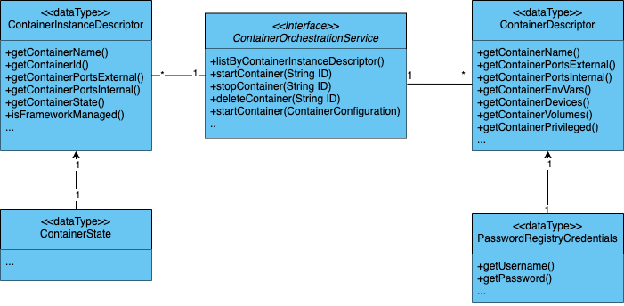

# Container Orchestration Provider APIs

## Java API

### ContainerOrchestrationService

The ContainerOrchestrationService is used to directly communicate with the running container engine. It exposes methods for listing, creating, and stopping containers. This class utilizes an instantiated ContainerConfiguration object as a parameter for container creation.

### ContainerConfiguration

The ContainerConfiguration class, allows you to define a container to create. Using the embedded builder class, one can define many container-related parameters such as name, image, ports and volume mounts.

### ContainerInstanceDescriptor
The ContainerInstanceDescriptor class is used to describe a container that has already been created. This class contains runtime information such as the ID of the container.

### ContainerState

The ContainerState is a class that exposes an enum of container states tracked by the framework.

### PasswordRegistryCredentials

The PasswordRegistryCredentials class stores password credentials when provisioning a container to pull from an alternative password-protected registry.

### PasswordRegistryCredentials

The PasswordRegistryCredentials class stores password credentials when provisioning a container to pull from an alternative password-protected registry.

!!! note
    The Container Orchestration Provider exports an MQTT-Namespace API. This API can be used to manage containers via MQTT requests from external applications. Please visit the [Remote Gateway Inventory via MQTT](mqtt-namespace#remote-gateway-inventory-via-mqtt) documentation for more information.