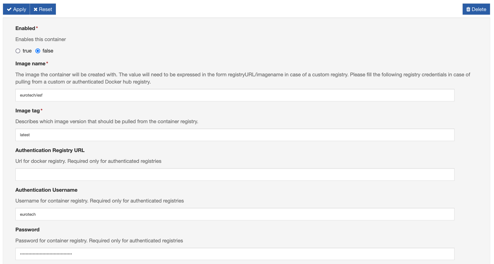
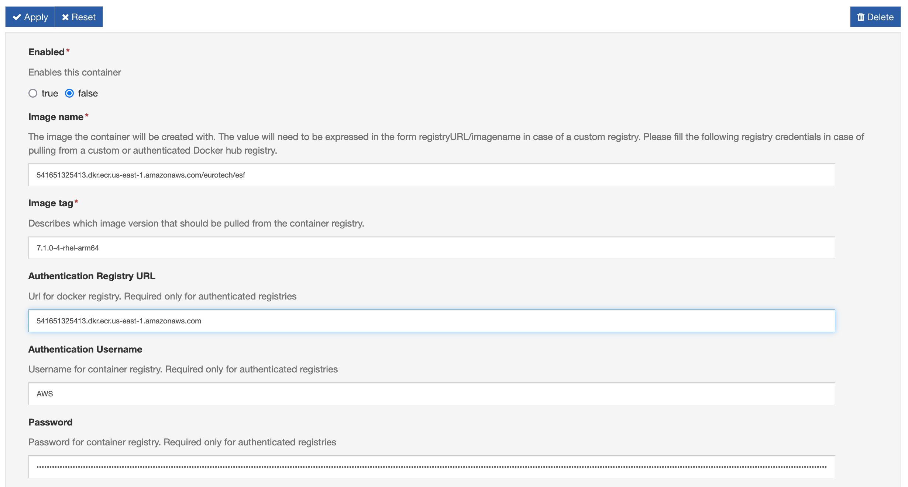

# Container Orchestration Provider Authenticated Registries

The Container Orchestrator provider allows the user to pull images from private and password-protected registries. The following document will provide examples of how to connect to some popular registries.

!!! note
    These guides make the following two assumptions.
    
    1. That you have already configured the Container Orchestrator and have a container instance already created. Please see the [usage](./container-orchestration-provider-usage.md) doc, to learn the basics of the orchestrator.
    2. That the image you are trying to pull supports the architecture of the gateway.


## Private Docker-Hub Registries

### Preparation:

- have a Docker Hub account (its credentials), and a private image ready to pull. 

### Procedure:

1. Populate the image name field. The username containing the private image must be placed before the image name separated by a forward slash. This is demonstrated below:
   - **Image Name: ** ```<Docker-Hub username>/<image name>``` for example```eclipse/kura```.

2. Populate the credential fields: 
- **Authentication Registry URL:** This field should be left blank.
- **Authentication Username:** Your Docker Hub username.
- **Password:** Your Docker Hub password.




## Amazon Web Services - Elastic Container Registries (AWS-ECR)

### Preparation:
- Have access to an Amazon ECR instance.
- Have the [AWS-CLI](https://aws.amazon.com/cli/) tool installed and appropriately configured on your computer. 
- Have access to your AWS ECR web console.

### Procedure:

1. Sign in to your amazon web console, navigate to ECR and identify which container you will like to pull onto the gateway. Copy the URI of the container. This URI will reveal the information required for the following steps. Here is how to decode the URI ```<identifier>.dkr.ecr.<ecr-region>.amazonaws.com/<directory>/<image name>:<image tag>```.

2. Generating an AWS-ECR access password. Open a terminal window on the machine with aws-cli installed and enter the following command ```aws ecr get-login-password --region <ecr-region>```. Your ECR region can be found by inspecting the container URI string copied in the previous step. This command will return a long string which will be used as the repo password in the gateway.

3. Populating information on the gateway. 
   - **Image Name: ** enter the full URI without the tag.```<identifier>.dkr.ecr.<ecr-region>.amazonaws.com/<directory>/<image name>```
   - **Image Tag:** enter only the image tag found at the end of the URI  ```<image tag>```
   - **Authentication Registry URL:** Paste only the part of the URI before the image name   ```<identifier>.dkr.ecr.<ecr-region>.amazonaws.com/<directory>/```
   - **Authentication Username:** will be ```AWS```
   - **Password:** will be the string created in step two.

A fully configured container set to pull AWS will look like the following.

