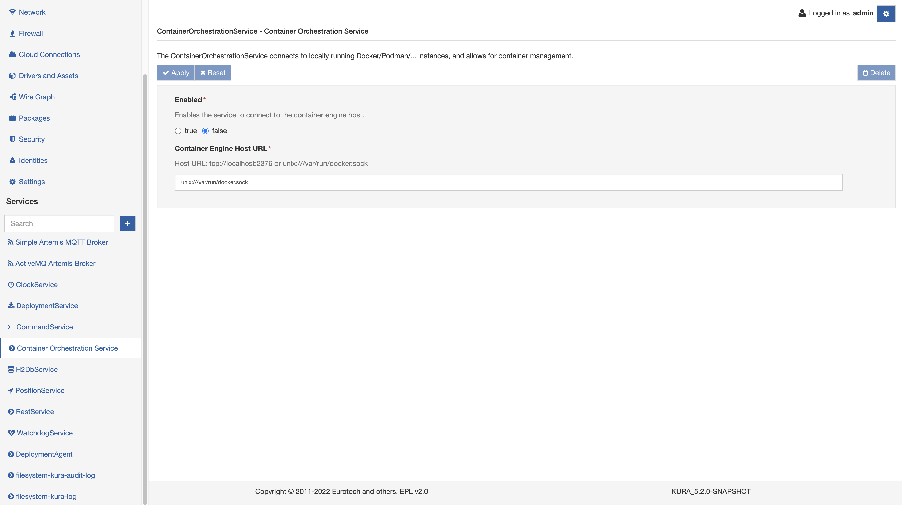
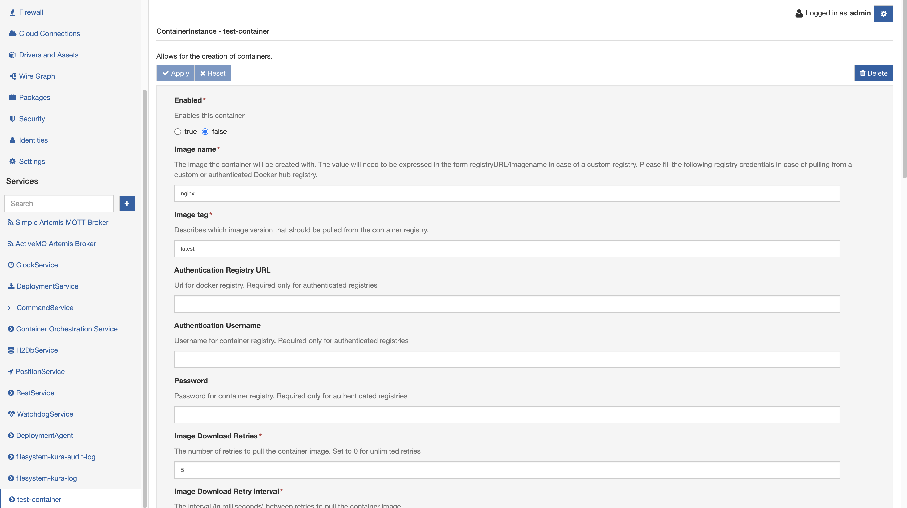

# Container Orchestration Provider Usage


## Before Starting

For this bundle to function appropriately, the gateway must have a supported container engine installed and running. Currently, the only officially supported engine is Docker.


## Starting the Service

To use this service select the **ContainerOrchestrationService** option located in the **Services** area. The ContainerOrchestrationService provides the following parameters:

- **Enabled**--activates the service when set to true
- **Container Engine Host URL**--provides a string that tells the service where to find the container engine (best left to the default value).
- **Allowlist Enforcement Enabled**--activates the container enforcement of the service, which let only the allowed containers to run
- **Container Image Allowlist Content**--the comma-separated list of conainer's digests allowed to be run




## Creating your first container.

To create a container, select the `+` icon (Create a new component) under **services**. A popup dialogue box will appear. In the field **Factory** select **org.eclipse.kura.container.provider.ContainerInstance** from the drop-down. Then, use the **Name** field to specify a name for the container.

!!! note
    The name specified in the 'Name' field will also be the name of the container when it is spun up by the orchestrator.

After pressing submit, a new component will be added under the **services** tab, with the name that was selected in the dialogue. Select this component to finish configuring the container.


## Configuring the container

To begin configuring the container, look under **Services** and select the item which has the name set in the previous step. Containers may be configured using the following fields:

- **Enabled** - When true, the service will create the defined container. When false the API will not create the container or will destroy the container if already running.
  
- **Image Name** - Describes the image that will be used to create the container. Remember to ensure that the selected image supports the architecture of the host machine, or else the container will not be able to start.
  
- **Image Tag** - Describes the version of the container image that will be used to create the container.

- **Trust Anchor** - Trust anchor used to verify the container image [Signature Verification](./container-orchestration-image-auth.md#container-signature-verification)

- **Verify in transparency log** - Sets the transparency log verification, to be used when a container image signature has been uploaded to the transparency log.

- **Container Image Enforcement Digest** - A string representing the digest for the image that will be allowed to run by this container instance (eg: `sha256:0000000000000000000000000000000000000000000000000000000000000000`). It is used in the [Container Enforcement](./container-orchestration-image-auth.md) service provided by the Container Orchestration Service.

- **Authentication Registry URL** - URL for an alternative registry to pull images from. (If the field is left blank, credentials will be applied to Docker-Hub). Please see the [Authenticated Registries](./container-orchestration-provider-authenticated-registries.md) document for more information about connecting to different popular registries.

- **Authentication Username** - Describes the username to access the container registry entered above.

- **Password** - Describes the password to access the alternative container registry.

- **Image Download Retries** - Describes the number of retries the framework will attempt to pull the image before giving up.

- **Image Download Retry Interval** - Describes the amount of time the framework will wait before attempting to pull the image again.

- **Image Download Timeout** - Describes the amount of time the framework will let the image download before timeout.
  
- **Internal Ports** - This field accepts a comma-separated list of ports that will be internally exposed on the spun-up container. In this field, you can also specify which protocol to run at the port by appending a port with a colon and typing in the name of the network protocol. Example: `80, 443:tcp, 8080:udp`.
  
- **External Ports** - This field accepts a comma-separated list of ports that will be externally exposed on the host machine.
  
- **Privileged Mode** - This flag if enabled will give the container root capabilities to all devices on the host system. Please be aware that setting this flag can be dangerous, and must only be used in exceptional situations.
  
- **Environment Variables (optional)** - This field accepts a comma-separated list of environment variables, which will be set inside the container when spun up.
  
- **Entrypoint Override (optional)** - This field accepts a comma-separated list which is used to override the command used to start a container. Example: ```./test.sh,-v,-d,--human-readable```.

- **Memory (optional)** - This field allows the configuration of the maximum amount of memory the container can use in bytes. The value is a positive integer, optionally followed by a suffix of b, k, m, g, to indicate bytes, kilobytes, megabytes, or gigabytes. The minimum and default values depends by the native container orchestrator. If left empty, the memory assigned to the container will be set to a default value.

- **CPUs (optional)** - This value specifies how many CPUs a container can use. Decimal values are allowed, so if set to 1.5, the container will use at most one and a half cpu resource.

- **GPUs (optional)** - This field configures how many Nvidia GPUs a container can use. Allowed values are `all` or an integer number. If there's no Nvidia GPU installed, leave it empty. The Nvidia Container Toolkit must be installed on the system to correctly configure the service, otherwise the container will not start. If the Nvidia Container Runtime is used, leave the field empty.

- **Volume Mount (optional)** - This field accepts a comma-separated list of system-to-container file mounts. This allows for the container to access files on the host machine.
  
- **Peripheral Device (optional)** - This field accepts a comma-separated list of device paths. This parameter allows devices to be passed through from the host to the container.

- **Runtime (optional)**: Specifies the fully qualified name of an alternate OCI-compatible runtime, which is used to run commands specified by the 'run' instruction. Example: `nvidia` corresponds to `--runtime=nvidia`. Note:  when using the Nvidia Container Runtime, leave the **GPUs** field empty. The GPUs available on the system will be accessible from the container by default.

- **Networking Mode (optional)** - Use this field to specify what networking mode the container will use. Possible Drivers include: bridge, none, container:{container id}, host. Please note that this field is case-sensitive. This field can also be used to connect to any of the networks listed by the cli command ```docker network ls```.

- **Logger Type** - This field provides a drop-down selection of supported container logging drivers.

- **Logger Parameters (optional)** - This field accepts a comma-separated list of logging parameters. More information can be found in the container-engine logger documentation, for instance [here](https://docs.docker.com/config/containers/logging/configure/).

- **Restart Container On Failure** - A boolean that tells the container engine to automatically restart the container when it has failed or shut down.

- **Identity Integration Enabled** - When enabled, Kura automatically creates a temporary identity with the specified permissions and provides the container with authentication credentials to access Kura's REST APIs. See [Container Identity Integration](#container-identity-integration) for more details.

- **Container Permissions (optional)** - A comma-separated list of permission names to grant to the container's temporary identity (e.g., `rest.system,rest.configuration`). This field is only used when **Identity Integration Enabled** is set to true. See [Container Identity Integration](#container-identity-integration) for available permissions and usage examples.

After specifying container parameters, ensure to set **Enabled** to **true** and press **Apply**. The container engine will then pull the respective image, spin up and start the container. If the gateway or the framework is power cycled, and the container and Container Orchestration Service are set to **enabled**, the framework will automatically start the container again upon startup.



## Manage container resources
Memory and CPU settings only take effect if the host system’s kernel has the corresponding cgroup v2 features enabled.
To see which cgroup subsystems are enabled, inspect the `/proc/cgroup` file.
```shell
cat /proc/cgroups
```
You should see output similar to this:
```shell
#subsys_name    hierarchy       num_cgroups     enabled
cpuset  0       97      1
cpu     0       97      1
cpuacct 0       97      1
blkio   0       97      1
devices 0       97      1
freezer 0       97      1
net_cls 0       97      1
perf_event      0       97      1
net_prio        0       97      1
pids    0       97      1
```

**enabled**: Indicates whether the subsystem is enabled (1) or disabled (0) in the kernel.

To enable the subsystem in Raspberry Pi OS, for example, you need to add the following entries to the bootloader options:

 - `cgroup_enable=memory`
 - `cgroup_memory=1`
 - `swapaccount=1`
 - `cgroup_enable=cpuset`
 
 and reboot the system.

For example, on Raspberry Pi 5 with Debian Bookworm 12.2, you can add them to the `/boot/firmware/cmdline.txt` file, whose original content is:
 
```shell
 console=serial0,115200 console=tty1 root=PARTUUID=6312077f-02 rootfstype=ext4 fsck.repair=yes rootwait cfg80211.ieee80211_regdom=IT
```

The result should be a single line with all the existing options plus the new ones.

```shell
 console=serial0,115200 console=tty1 root=PARTUUID=6312077f-02 rootfstype=ext4 fsck.repair=yes rootwait cfg80211.ieee80211_regdom=IT cgroup_enable=memory cgroup_memory=1 swapaccount=1 cgroup_enable=cpuset`
```

!!! warning
    Modifying the bootloader options incorrectly may prevent the system from booting. Please ensure to back up any important data before making changes to these settings.

## Container Identity Integration

The Container Identity Integration feature allows containers to securely authenticate and interact with Kura's REST APIs using temporary credentials. When enabled, Kura automatically provisions a temporary identity and provides password-based credentials to the container, eliminating the need for manual credential configuration.

### Overview

When Identity Integration is enabled for a container instance, Kura performs the following operations:

1. **Creates a Temporary Identity**: A temporary, non-persistent identity is created specifically for the container with a unique name based on the container name (e.g., `container_myapp` for a container named `myapp`).

2. **Assigns Permissions**: The temporary identity is granted the permissions specified in the **Container Permissions** field.

3. **Provides Credentials**: The container receives the following environment variables:
   - `KURA_IDENTITY_NAME`: The temporary identity name for accessing Kura's REST APIs
   - `KURA_IDENTITY_PASSWORD`: The temporary password for accessing Kura's REST APIs
   - `KURA_REST_BASE_URL`: The complete base URL for Kura's REST API endpoints (e.g., `http://172.17.0.1:8080/services` or `https://172.17.0.1:443/services`)

4. **Automatic Cleanup**: When the container stops or is deleted, Kura automatically removes the temporary identity and invalidates its credentials.

### Features

- **Zero Configuration**: Containers automatically receive the correct REST API URL based on the gateway's HTTPS configuration and network mode.
- **Network-Aware**: The REST base URL is automatically adjusted based on the container's networking mode (bridge, host, etc.).
- **Secure**: Credentials are temporary and automatically invalidated when containers stop.
- **Non-Persistent**: Temporary identities exist only in memory and are never persisted to disk.
- **Permission-Based**: Fine-grained access control using Kura's existing permission system.

### Configuration

To enable Identity Integration for a container:

1. Set **Identity Integration Enabled** to `true`
2. Specify the required permissions in **Container Permissions** field (comma-separated)
3. Apply the configuration

To use the temporary credentials with REST APIs, ensure **Basic Authentication Enabled** is set to `true` in the **RestService** configuration.

The framework will create the temporary identity when the container starts and clean it up when the container stops.

### Available Permissions

For a complete list of available permissions, use the [REST Identity API](/references/rest-apis/rest-identity-api-v2/#get-defined-permissions) to query defined permissions in your system.

### Usage Example

#### Example: Container with Read-Only System Access

A monitoring container that needs to read system information but cannot modify configuration:

**Container Configuration:**
- **Identity Integration Enabled**: `true`
- **Container Permissions**: `rest.system`

**Container Code (Python):**
```python
import os
import requests

# Read credentials from environment variables
identity_name = os.environ.get('KURA_IDENTITY_NAME')
identity_password = os.environ.get('KURA_IDENTITY_PASSWORD')
base_url = os.environ.get('KURA_REST_BASE_URL')

# Make authenticated request to get system information
response = requests.get(
    f'{base_url}/system/info',
    auth=(identity_name, identity_password)
)
if response.status_code == 200:
    system_info = response.json()
    print(f"System info: {system_info}")
else:
    print(f"Failed to get system info: {response.status_code}")
```

### Best Practices

1. **Principle of Least Privilege**: Only grant permissions that are absolutely necessary for the container's functionality.

2. **Validate Environment Variables**: Always check that `KURA_IDENTITY_NAME`, `KURA_IDENTITY_PASSWORD`, and `KURA_REST_BASE_URL` are present before making API calls.

3. **Handle Credential Lifecycle**: Be prepared for credentials to become invalid when the container is stopping or restarting.

4. **Error Handling**: Implement proper error handling for API calls, as permissions may be denied if the container doesn't have the required permission.

5. **Network Mode Considerations**: The REST base URL is automatically adjusted based on network mode:
   - **bridge mode** (default): Uses the Docker bridge gateway IP (typically `172.17.0.1`)
   - **host mode**: Uses `localhost`

6. **HTTPS Support**: The REST base URL automatically uses HTTPS if enabled in Kura's HTTP Service configuration.

### Troubleshooting

**Container cannot access Kura APIs:**
- Verify that **Identity Integration Enabled** is set to `true`
- Check that the container has been granted the necessary permissions in **Container Permissions**
- Ensure the container is reading the environment variables correctly
- If Kura firewall is installed and enabled, allow traffic from container networks (for example `docker0` or user-defined Docker bridges) to the Kura REST API port
- Check container logs for authentication errors

**Basic authentication fails:**
- Verify the request includes valid Basic credentials (`KURA_IDENTITY_NAME` / `KURA_IDENTITY_PASSWORD`)
- Check that the temporary identity was created successfully in Kura logs
- Ensure the container is using the correct REST base URL
- Verify **Basic Authentication Enabled** is set to `true` in **RestService**

**Permission denied errors:**
- Verify the permission name is correct (case-sensitive)
- Ensure the permission exists in the system (use the REST Identity API to list defined permissions)
- Check that the permission was correctly added to the **Container Permissions** field

## Stopping the container

!!! warning
    Stopping a container will delete it in an irreversible way. Please be sure to only use stateless containers and/or save their data in external volumes.

To stop the container without deleting the component, set the **Enabled** field to **false**, and then press **Apply**. This will delete the running container, but leave this component available for running the container again in the future. If you want to completely remove the container and component, press the **Delete** button to the top right of the screen, and press **Yes** on the confirmation dialogue.


## Container Management Dashboard

The Container Orchestration service also provides the user with an intuitive container dashboard. This dashboard shows all containers running on a gateway, including containers created with the framework and those created manually through the command-line interface. To utilize this dashboard the `org.eclipse.container.orchestration.provider` (ContainerOrchestrationService) must be enabled, and the dashboard can be opened by navigating to Device > Containers.
