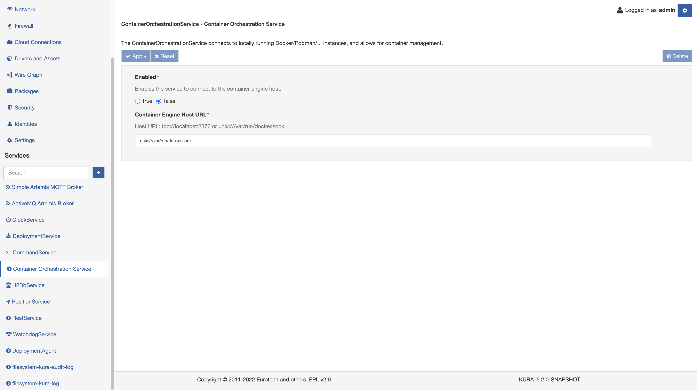
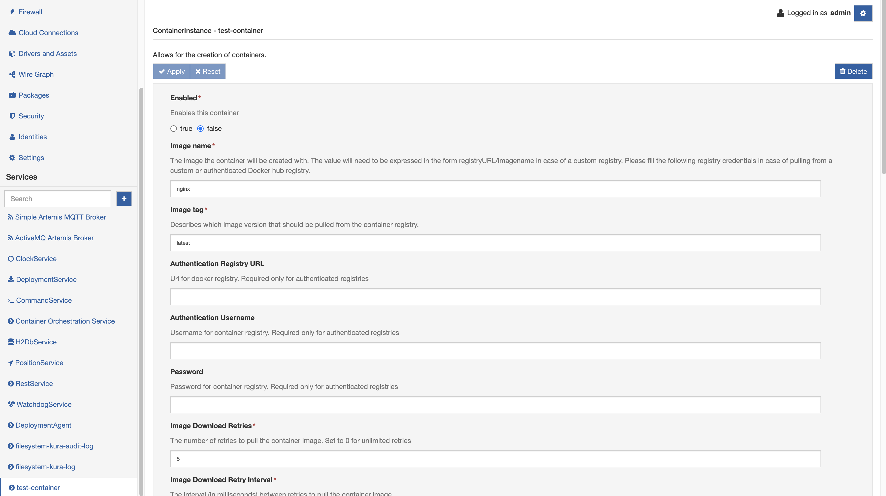

# Container Orchestration Provider Usage


## Before Starting

For this bundle to function appropriately, the gateway must have a supported container engine installed and running. Currently, the only officially supported engine is Docker.


## Starting the Service

To use this service select the **ContainerOrchestrationService** option located in the **Services** area. The ContainerOrchestrationService provides the following parameters:

- **Enabled**--activates the service when set to true
- **Container Engine Host URL**--provides a string that tells the service where to find the container engine (best left to the default value).
- **Allowlist Enforcement Enabled**--activates the container enforcement of the service, which let only the allowed containers to run
- **Container Image Allowlist Content**--the comma-separated list of conainer's digests allowed to be run




## Creating your first container.

To create a container, select the `+` icon (Create a new component) under **services**. A popup dialogue box will appear. In the field **Factory** select **org.eclipse.kura.container.provider.ContainerInstance** from the drop-down. Then, use the **Name** field to specify a name for the container.

!!! note
    The name specified in the 'Name' field will also be the name of the container when it is spun up by the orchestrator.

After pressing submit, a new component will be added under the **services** tab, with the name that was selected in the dialogue. Select this component to finish configuring the container.


## Configuring the container

To begin configuring the container, look under **Services** and select the item which has the name set in the previous step. Containers may be configured using the following fields:

- **Enabled** - When true, the service will create the defined container. When false the API will not create the container or will destroy the container if already running.
  
- **Image Name** - Describes the image that will be used to create the container. Remember to ensure that the selected image supports the architecture of the host machine, or else the container will not be able to start.
  
- **Image Tag** - Describes the version of the container image that will be used to create the container.

- **Trust Anchor** - Trust anchor used to verify the container image [Signature Verification](./container-orchestration-image-auth.md#container-signature-verification)

- **Verify in transparency log** - Sets the transparency log verification, to be used when a container image signature has been uploaded to the transparency log.

- **Container Image Enforcement Digest** - A string representing the digest for the image that will be allowed to run by this container instance (eg: `sha256:0000000000000000000000000000000000000000000000000000000000000000`). It is used in the [Container Enforcement](./container-orchestration-image-auth.md) service provided by the Container Orchestration Service.

- **Authentication Registry URL** - URL for an alternative registry to pull images from. (If the field is left blank, credentials will be applied to Docker-Hub). Please see the [Authenticated Registries](./container-orchestration-provider-authenticated-registries.md) document for more information about connecting to different popular registries.

- **Authentication Username** - Describes the username to access the container registry entered above.

- **Password** - Describes the password to access the alternative container registry.

- **Image Download Retries** - Describes the number of retries the framework will attempt to pull the image before giving up.

- **Image Download Retry Interval** - Describes the amount of time the framework will wait before attempting to pull the image again.

- **Image Download Timeout** - Describes the amount of time the framework will let the image download before timeout.
  
- **Internal Ports** - This field accepts a comma-separated list of ports that will be internally exposed on the spun-up container. In this field, you can also specify which protocol to run at the port by appending a port with a colon and typing in the name of the network protocol. Example: `80, 443:tcp, 8080:udp`.
  
- **External Ports** - This field accepts a comma-separated list of ports that will be externally exposed on the host machine.
  
- **Privileged Mode** - This flag if enabled will give the container root capabilities to all devices on the host system. Please be aware that setting this flag can be dangerous, and must only be used in exceptional situations.
  
- **Environment Variables (optional)** - This field accepts a comma-separated list of environment variables, which will be set inside the container when spun up.
  
- **Entrypoint Override (optional)** - This field accepts a comma-separated list which is used to override the command used to start a container. Example: ```./test.sh,-v,-d,--human-readable```.

- **Memory (optional)** - This field allows the configuration of the maximum amount of memory the container can use in bytes. The value is a positive integer, optionally followed by a suffix of b, k, m, g, to indicate bytes, kilobytes, megabytes, or gigabytes. The minimum and default values depends by the native container orchestrator. If left empty, the memory assigned to the container will be set to a default value.

- **CPUs (optional)** - This value specifies how many CPUs a container can use. Decimal values are allowed, so if set to 1.5, the container will use at most one and a half cpu resource.

- **GPUs (optional)** - This field configures how many Nvidia GPUs a container can use. Allowed values are `all` or an integer number. If there's no Nvidia GPU installed, leave it empty. The Nvidia Container Toolkit must be installed on the system to correctly configure the service, otherwise the container will not start. If the Nvidia Container Runtime is used, leave the field empty.

- **Volume Mount (optional)** - This field accepts a comma-separated list of system-to-container file mounts. This allows for the container to access files on the host machine.
  
- **Peripheral Device (optional)** - This field accepts a comma-separated list of device paths. This parameter allows devices to be passed through from the host to the container.

- **Runtime (optional)**: Specifies the fully qualified name of an alternate OCI-compatible runtime, which is used to run commands specified by the 'run' instruction. Example: `nvidia` corresponds to `--runtime=nvidia`. Note:  when using the Nvidia Container Runtime, leave the **GPUs** field empty. The GPUs available on the system will be accessible from the container by default.

- **Networking Mode (optional)** - Use this field to specify what networking mode the container will use. Possible Drivers include: bridge, none, container:{container id}, host. Please note that this field is case-sensitive. This field can also be used to connect to any of the networks listed by the cli command ```docker network ls```.

- **Logger Type** - This field provides a drop-down selection of supported container logging drivers.

- **Logger Parameters (optional)** - This field accepts a comma-separated list of logging parameters. More information can be found in the container-engine logger documentation, for instance [here](https://docs.docker.com/config/containers/logging/configure/).

- **Restart Container On Failure** - A boolean that tells the container engine to automatically restart the container when it has failed or shut down.

- **Enable Identity Integration** - When enabled, Kura creates a temporary identity with the specified permissions and provides the container with a JWT token pair to access Kura's REST APIs. See [Container Identity Integration](#container-identity-integration) for more details.

- **Container Permissions (optional)** - A comma-separated list of permission names to grant to the container's temporary identity (e.g., `rest.system,rest.configuration`). This field is only used when **Enable Identity Integration** is set to true.

- **Token Issuing Service Target** - OSGi filter selecting the service that issues the container's JWT token pair. This field is only used when **Enable Identity Integration** is set to true.

- **JWT Access Token Duration (Seconds)** and **JWT Refresh Token Duration (Seconds)** - Lifetimes of the JWT token pair provided to the container. These fields are only used when **Enable Identity Integration** is set to true.

After specifying container parameters, ensure to set **Enabled** to **true** and press **Apply**. The container engine will then pull the respective image, spin up and start the container. If the gateway or the framework is power cycled, and the container and Container Orchestration Service are set to **enabled**, the framework will automatically start the container again upon startup.



## Manage container resources
Memory and CPU settings only take effect if the host system’s kernel has the corresponding cgroup v2 features enabled.
To see which cgroup subsystems are enabled, inspect the `/proc/cgroup` file.
```shell
cat /proc/cgroups
```
You should see output similar to this:
```shell
#subsys_name    hierarchy       num_cgroups     enabled
cpuset  0       97      1
cpu     0       97      1
cpuacct 0       97      1
blkio   0       97      1
devices 0       97      1
freezer 0       97      1
net_cls 0       97      1
perf_event      0       97      1
net_prio        0       97      1
pids    0       97      1
```

**enabled**: Indicates whether the subsystem is enabled (1) or disabled (0) in the kernel.

To enable the subsystem in Raspberry Pi OS, for example, you need to add the following entries to the bootloader options:

 - `cgroup_enable=memory`
 - `cgroup_memory=1`
 - `swapaccount=1`
 - `cgroup_enable=cpuset`
 
 and reboot the system.

For example, on Raspberry Pi 5 with Debian Bookworm 12.2, you can add them to the `/boot/firmware/cmdline.txt` file, whose original content is:
 
```shell
 console=serial0,115200 console=tty1 root=PARTUUID=6312077f-02 rootfstype=ext4 fsck.repair=yes rootwait cfg80211.ieee80211_regdom=IT
```

The result should be a single line with all the existing options plus the new ones.

```shell
 console=serial0,115200 console=tty1 root=PARTUUID=6312077f-02 rootfstype=ext4 fsck.repair=yes rootwait cfg80211.ieee80211_regdom=IT cgroup_enable=memory cgroup_memory=1 swapaccount=1 cgroup_enable=cpuset`
```

!!! warning
    Modifying the bootloader options incorrectly may prevent the system from booting. Please ensure to back up any important data before making changes to these settings.

## Container Identity Integration

Container Identity Integration lets a container call Kura's REST APIs without any credential configured by hand. Every time Kura starts the container, it creates a temporary identity with the configured permissions and gives the container a **JWT token pair** issued for that identity. The container must authenticate with the access token and must periodically exchange the refresh token for new pairs. The temporary identity has no password, so no password exists that could leak through environment variables, volumes or `docker inspect`.

A complete, working example (a Python client and its Dockerfile) is available in the kura-apps repository: [`kura-examples/containers/jwt-rest-client`](https://github.com/eclipse-kura/kura-apps/tree/develop/kura-examples/containers/jwt-rest-client).

### Prerequisites

1. A **JWT Issuing Service** and a **JWT Verification Service** configured as described in [JWT Services](jwt-services.md). The verification trust store must contain the certificate of the signing key and, if *Trusted Issuers* is set, it must include the *Issuer* of the issuing service.
2. In the [REST Service](rest-service.md#rest-service-configuration) configuration, **JWT Authentication Enabled** set to `true`. Its **Token Verification Service Target** must select a verification service that accepts the tokens of the issuing service used by the container (see **Token Issuing Service Target** below).
3. A writable in-memory filesystem (tmpfs) at `/dev/shm`, or at the directory set with the `kura.tmpfs.base` system property.

### Configuration

The following container instance parameters control the feature:

- **Enable Identity Integration** - Enables the feature. (Default: `false`)
- **Container Permissions** - Comma-separated list of permissions granted to the temporary identity, for example `rest.system,rest.configuration`. Each name must reference a permission that already exists in the gateway. See [REST Service](rest-service.md).
- **Token Issuing Service Target** - OSGi filter selecting the `TokenIssuingService` that issues the token pair, for example `(kura.service.pid=org.eclipse.kura.core.token.jwt.issuer.JwtIssuingService)`. Its tokens must be accepted by the verification service used by the REST Service.
- **JWT Access Token Duration (Seconds)** - Lifetime of the access token given to the container. (Default: `60`)
- **JWT Refresh Token Duration (Seconds)** - Lifetime of the refresh token given to the container: the container must refresh within this time, otherwise it loses access. The maximum value is `31536000` (one year), the lifetime of the temporary identity. (Default: `900`)

Both durations are silently capped by the *Maximum Token Lifetime* of the issuing service (`3600` seconds by default). They apply only to the pair Kura gives to the container: the pairs obtained by refreshing follow the **JWT Access Token Duration** and **JWT Refresh Token Duration** of the REST Service.

### What Kura does when it starts the container

1. **Creates a temporary identity** named `container_<name>_<suffix>`, where `<name>` is the container name with every character other than letters, digits, `.` and `_` replaced by `_` (`auto` if nothing is left) and `<suffix>` is 8 random hexadecimal characters, for example `container_myapp_3fa94c1d`. The suffix changes at every start, so tokens issued for a previous start can never be used with the new identity. The identity has password authentication disabled, holds the **Container Permissions** and exists in memory only.
2. **Removes any leftover container** with the same name, for example one that survived a Kura restart, so that it is recreated with the new credentials.
3. **At every startup attempt**:
    1. pulls the image, if it is not already available locally;
    2. issues a **new token pair** whose subject (`sub`) is the temporary identity;
    3. writes the pair to `<base>/kura-tokens/<uuid>/kura-jwt.json` on the host tmpfs (`<base>` is `/dev/shm` by default), readable by its owner only (`400`), and mounts it **read-only** into the container at `/run/secrets/kura-jwt.json`. The file of a failed attempt is deleted;
    4. creates and starts the container with the following environment variables:
        - `KURA_IDENTITY_NAME`: the name of the temporary identity;
        - `KURA_JWT_FILE`: the in-container path of the token pair file, always `/run/secrets/kura-jwt.json`;
        - `KURA_REST_BASE_URL`: the base URL of the Kura REST APIs, for example `http://172.17.0.1:8080/services` or `https://172.17.0.1:443/services`.

If the temporary identity cannot be created, the startup is aborted immediately. Any other failure (no issuing service matching the target, token issuing errors, missing tmpfs, image or container errors) fails only the current attempt: Kura retries according to **Image Download Retries** and **Image Download Retry Interval**. When the retries are exhausted, the startup fails and the temporary identity and its file are deleted. The reason is reported in the Kura log.

### Using the token pair in the container

The file referenced by `KURA_JWT_FILE` has the same format as the response of the [JWT refresh endpoint](../references/rest-apis/rest-jwt-token-api-v1.md#tokenpair):

```json
{
  "tokenType": "Bearer",
  "accessToken": "eyJraWQiOi...",
  "accessTokenExpiresInSeconds": 60,
  "refreshToken": "eyJraWQiOi...",
  "refreshTokenExpiresInSeconds": 900
}
```

1. Read the file once, at startup.
2. Call the REST APIs with the header `Authorization: Bearer <accessToken>`.
3. Before the access token expires, call `POST {KURA_REST_BASE_URL}/token/jwt/v1/refresh` with the refresh token as `text/plain` body, no other credentials are needed. Replace both tokens with the returned ones: a refresh token can be used only once.
4. If the refresh fails with `401`, the access is lost for good: Kura does not provide new tokens until the container is created again (see [Behaviour](#behaviour)).

Things to keep in mind:

- **Kura never updates the file.** The refreshed pairs exist only in the memory of the container.
- **Use the `exp` claim of the tokens to schedule the refresh.** The `...ExpiresInSeconds` values of the file are counted from the time Kura issued the pair, not from the time the container started.
- **Refresh even when idle.** A container that makes no request for longer than the refresh token lifetime loses its access.
- **Serialize refreshes.** Two concurrent refreshes with the same refresh token make one of them fail with `401`.
- **Permissions are checked at every request** against the temporary identity, so a request to an API not covered by **Container Permissions** fails with `403` while the tokens remain valid.
- **Treat tokens as credentials**: never log them or put them in URLs.

See [JWT Token V1 REST APIs](../references/rest-apis/rest-jwt-token-api-v1.md#behavior) for the complete behaviour of the token endpoints.

### Behaviour

| Event | Effect on the container access |
| - | - |
| The container does not refresh before the refresh token expires | Access is lost. The container keeps running; disable and enable the instance, change its configuration or restart Kura to get new credentials. |
| Docker restarts the container (**Restart Container On Failure**, or `docker restart`) | The container gets the same file again. If it had already refreshed, the refresh token in the file is used up and access is lost. To survive this, the container can keep its latest pair in a writable volume of its own and prefer it to the file. |
| Kura restarts or container instance configuration changes | The container is recreated with a new temporary identity and a new token pair. The previous tokens are rejected. The previous identity is deleted. |
| Only Token Issuing Service Target changes | The running container is not affected; the new issuing service is used at the next start. |
| The instance is disabled or deleted, or Kura stops | The temporary identity is deleted, so every token issued for it is rejected immediately, and the file is deleted.                                                                                                                                    |
| The container runs for one year without being recreated | The temporary identity expires and access is lost. |
| JWT Authentication Enabled is set to `false` in the REST Service | Bearer tokens and the refresh endpoint are rejected; access is lost while JWT authentication is disabled. |

### Network considerations

The REST base URL is computed by Kura:

- **Protocol and port**: HTTPS and the first HTTPS port if HTTPS is enabled in the HTTP Service configuration, HTTP and the first HTTP port otherwise.
- **bridge mode** (default): the address of the Docker bridge (`docker0`, typically `172.17.0.1`).
- **host mode**: `localhost`.

If the Kura firewall is enabled, allow traffic from the container networks (for example `docker0` or user-defined Docker bridges) to the REST API port. If the REST Service **Allowed Ports** parameter is set, it must include the port of the REST base URL.

## Stopping the container

!!! warning
    Stopping a container will delete it in an irreversible way. Please be sure to only use stateless containers and/or save their data in external volumes.

To stop the container without deleting the component, set the **Enabled** field to **false**, and then press **Apply**. This will delete the running container, but leave this component available for running the container again in the future. If you want to completely remove the container and component, press the **Delete** button to the top right of the screen, and press **Yes** on the confirmation dialogue.


## Container Management Dashboard

The Container Orchestration service also provides the user with an intuitive container dashboard. This dashboard shows all containers running on a gateway, including containers created with the framework and those created manually through the command-line interface. To utilize this dashboard the `org.eclipse.container.orchestration.provider` (ContainerOrchestrationService) must be enabled, and the dashboard can be opened by navigating to Device > Containers.
