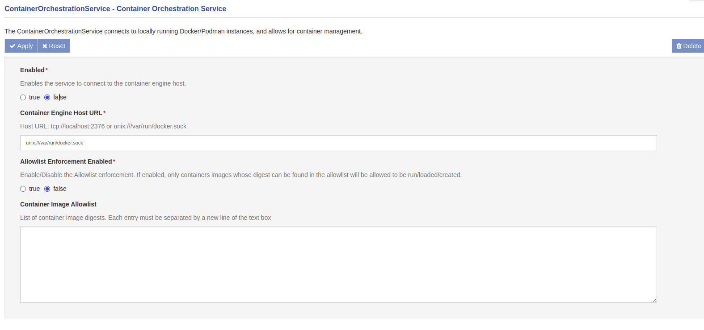
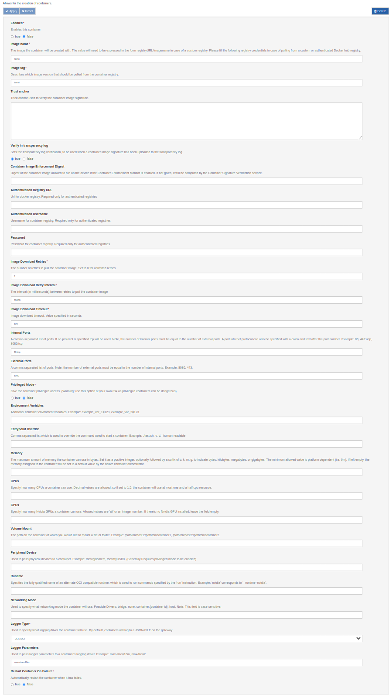
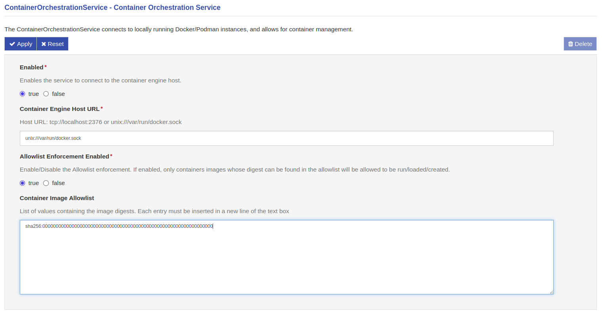

# Container Orchestration Provider Usage


## Before Starting

For this bundle to function appropriately, the gateway must have a supported container engine installed and running. Currently, the only officially supported engine is Docker.


## Starting the Service

To use this service select the **ContainerOrchestrationService** option located in the **Services** area. The ContainerOrchestrationService provides the following parameters:

- **Enabled**--activates the service when set to true
- **Container Engine Host URL**--provides a string that tells the service where to find the container engine (best left to the default value).
- **Allowlist Enforcement Enabled**--activates the container enforcement of the service, which let only the allowed containers to run
- **Container Image Allowlist Content**--the comma-separated list of conainer's digests allowed to be run




## Creating your first container.

To create a container, select the `+` icon (Create a new component) under **services**. A popup dialogue box will appear. In the field **Factory** select **org.eclipse.kura.container.provider.ContainerInstance** from the drop-down. Then, use the **Name** field to specify a name for the container.

!!! note
    The name specified in the 'Name' field will also be the name of the container when it is spun up by the orchestrator.

After pressing submit, a new component will be added under the **services** tab, with the name that was selected in the dialogue. Select this component to finish configuring the container.


## Configuring the container

To begin configuring the container, look under **Services** and select the item which has the name set in the previous step. Containers may be configured using the following fields:

- **Enabled** - When true, the service will create the defined container. When false the API will not create the container or will destroy the container if already running.
  
- **Image Name** - Describes the image that will be used to create the container. Remember to ensure that the selected image supports the architecture of the host machine, or else the container will not be able to start.
  
- **Image Tag** - Describes the version of the container image that will be used to create the container.

- **Authentication Registry URL** - URL for an alternative registry to pull images from. (If the field is left blank, credentials will be applied to Docker-Hub). Please see the [Authenticated Registries](./container-orchestration-provider-authenticated-registries.md) document for more information about connecting to different popular registries.

- **Authentication Username** - Describes the username to access the container registry entered above.

- **Password** - Describes the password to access the alternative container registry.

- **Image Download Retries** - Describes the number of retries the framework will attempt to pull the image before giving up.

- **Image Download Retry Interval** - Describes the amount of time the framework will wait before attempting to pull the image again.

- **Image Download Timeout** - Describes the amount of time the framework will let the image download before timeout.
  
- **Internal Ports** - This field accepts a comma-separated list of ports that will be internally exposed on the spun-up container. In this field, you can also specify which protocol to run at the port by appending a port with a colon and typing in the name of the network protocol. Example: `80, 443:tcp, 8080:udp`.
  
- **External Ports** - This field accepts a comma-separated list of ports that will be externally exposed on the host machine.
  
- **Privileged Mode** - This flag if enabled will give the container root capabilities to all devices on the host system. Please be aware that setting this flag can be dangerous, and must only be used in exceptional situations.
  
- **Environment Variables (optional)** - This field accepts a comma-separated list of environment variables, which will be set inside the container when spun up.
  
- **Entrypoint Override (optional)** - This field accepts a comma-separated list which is used to override the command used to start a container. Example: ```./test.sh,-v,-d,--human-readable```.

- **Memory (optional)** - This field allows the configuration of the maximum amount of memory the container can use in bytes. The value is a positive integer, optionally followed by a suffix of b, k, m, g, to indicate bytes, kilobytes, megabytes, or gigabytes. The minimum and default values depends by the native container orchestrator. If left empty, the memory assigned to the container will be set to a default value.

- **CPUs (optional)** - This value specifies how many CPUs a container can use. Decimal values are allowed, so if set to 1.5, the container will use at most one and a half cpu resource.

- **GPUs (optional)** - This field configures how many Nvidia GPUs a container can use. Allowed values are `all` or an integer number. If there's no Nvidia GPU installed, leave it empty. The Nvidia Container Toolkit must be installed on the system to correctly configure the service, otherwise the container will not start. If the Nvidia Container Runtime is used, leave the field empty.

- **Volume Mount (optional)** - This field accepts a comma-separated list of system-to-container file mounts. This allows for the container to access files on the host machine.
  
- **Peripheral Device (optional)** - This field accepts a comma-separated list of device paths. This parameter allows devices to be passed through from the host to the container.

- **Runtime (optional)**: Specifies the fully qualified name of an alternate OCI-compatible runtime, which is used to run commands specified by the 'run' instruction. Example: `nvidia` corresponds to `--runtime=nvidia`. Note:  when using the Nvidia Container Runtime, leave the **GPUs** field empty. The GPUs available on the system will be accessible from the container by default.

- **Networking Mode (optional)** - Use this field to specify what networking mode the container will use. Possible Drivers include: bridge, none, container:{container id}, host. Please note that this field is case-sensitive. This field can also be used to connect to any of the networks listed by the cli command ```docker network ls```.

- **Logger Type** - This field provides a drop-down selection of supported container logging drivers.

- **Logger Parameters (optional)** - This field accepts a comma-separated list of logging parameters. More information can be found in the container-engine logger documentation, for instance [here](https://docs.docker.com/config/containers/logging/configure/).

- **Restart Container On Failure** - A boolean that tells the container engine to automatically restart the container when it has failed or shut down.

After specifying container parameters, ensure to set **Enabled** to **true** and press **Apply**. The container engine will then pull the respective image, spin up and start the container. If the gateway or the framework is power cycled, and the container and Container Orchestration Service are set to **enabled**, the framework will automatically start the container again upon startup.




## Stopping the container

!!! warning
    Stopping a container will delete it in an irreversible way. Please be sure to only use stateless containers and/or save their data in external volumes.

To stop the container without deleting the component, set the **Enabled** field to **false**, and then press **Apply**. This will delete the running container, but leave this component available for running the container again in the future. If you want to completely remove the container and component, press the **Delete** button to the top right of the screen, and press **Yes** on the confirmation dialogue.


## Container Management Dashboard

The Container Orchestration service also provides the user with an intuitive container dashboard. This dashboard shows all containers running on a gateway, including containers created with the framework and those created manually through the command-line interface. To utilize this dashboard the org.eclipse.container.orchestration.provider (ContainerOrchestrationService) must be enabled, and the dashboard can be opened by navigating to Device > Containers.

## Container Enforcement

The Container Orchestration service also provides a security feature, to decide in advance which containers can be run on the system. This feature can be enabled or disabled through the `Allowlist Enforcement Enabled` option.

This tool starts from the concept of digest, which is a unique and immutable identifier of an image: it is therefore an excellent means to identify from which image a container is created.

For this reason, it is possible to insert in the box `Container Image Allowlist Content` a list of digests separated by a comma, in the form of strings: when a container is booted on the system (whether it is launched by Kura or by a terminal CLI), Kura goes back to the image from which the container started, extracts the digest and verifies that it is present in the list provided during the service configuration.

If present, the container is let to be started without interference, otherwise it is immediatly stopped and removed from the container list.

As example, suppose that an user wants to implement the container enforcement, in order to let only the Kura docker container to be run on the device. To do this, it should enable the Container Enforcement by setting to `true` the `Allowlist Enforcement Enabled`, and filling the box below with the digest of the Kura image (supposed it's the fake one `sha256:cbef93b12dff2b32579c950dedbf3cdfe637adf5558cb1f8307906a94c8a5c6b`)



After applying, whenever a container is started on the device, the enforcement will check the image digest comparing it to the one inside the box: if the continaer is the Kura one, it will be allowed to start, otherwise it will be stopped. If the user wants to add more than one digest (for example another fake one `sha256:089283c269c4947ecfebec55c8a893da6c4c5ef057b3fbd79d0aed398dedc3a4`), it just needs to add it to the comma-separated list.

