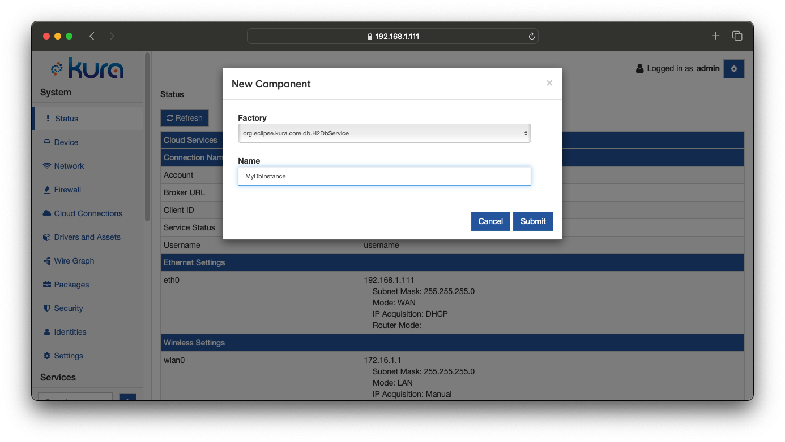
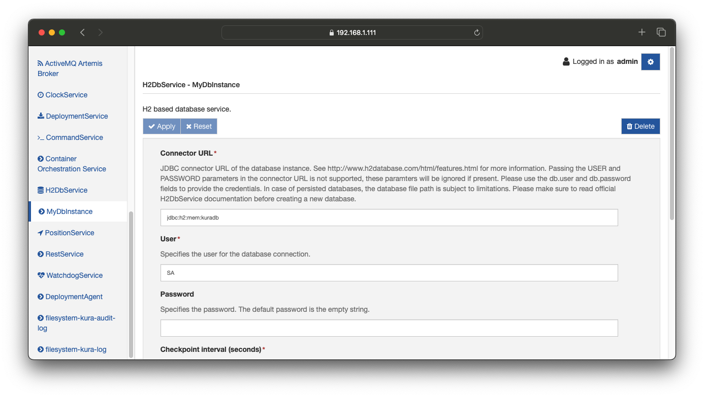
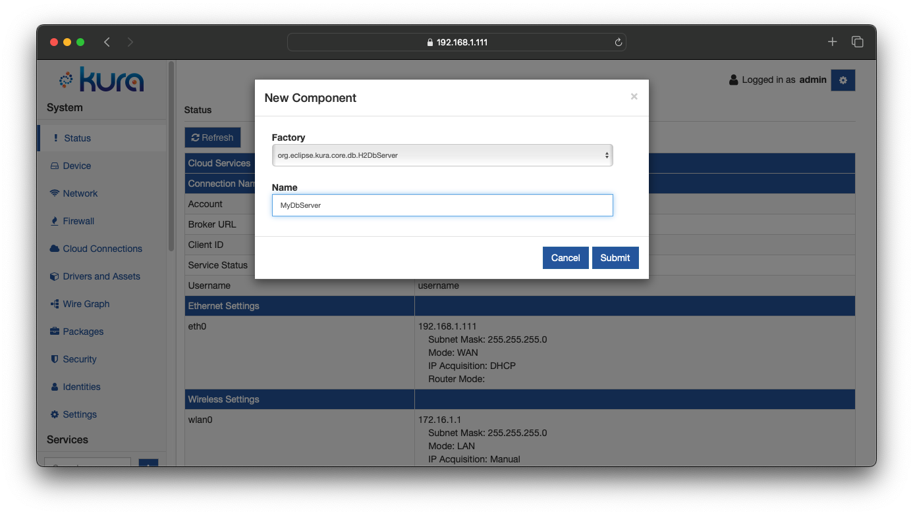
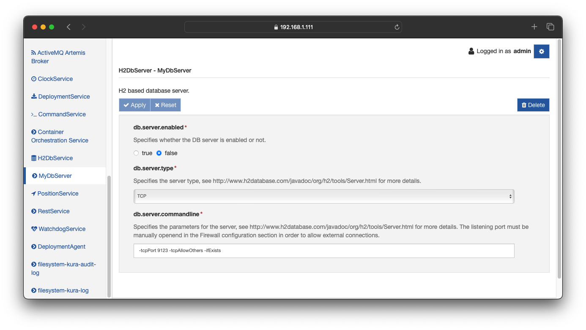
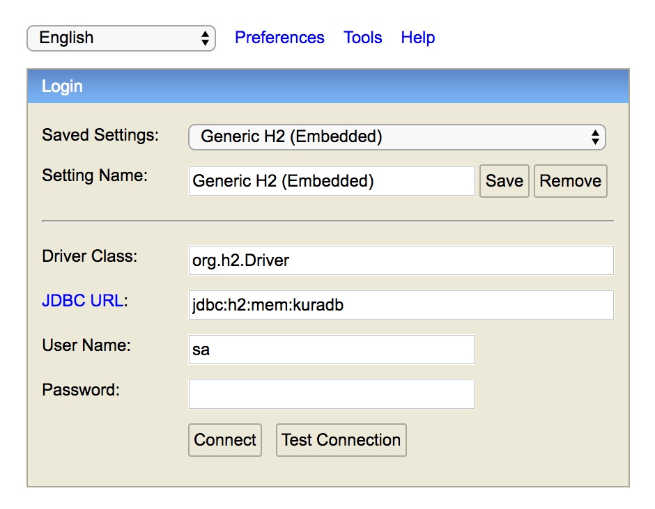

# H2Db Service

Kura integrates a Java SQL database named [H2](http://www.h2database.com/html/main.html). The main features of this SQL Database are:

- Very fast, open source, JDBC API
- Embedded and server modes; in-memory databases
- Browser-based Console application
- Small footprint


## Supported Features

Kura supports the following H2 database features:

- **Persistence modes**: The H2 implementation currently supports in-memory and file-based database instances. See the [Persistence Modes section](#persistence-modes) for more details.

- **Multiple database instances**: It is possible to create and configure multiple database instances from the Kura Administration UI, these instances can be selectively consumed by applications. A default database instance is created automatically.

- **TCP Server**: The current implementation allows external processes to access the database instances managed by Kura using TCP. This enables the integration of external applications that can share data with Kura components using the database.

- **Web-based console**: It is possible to start the H2 Web console directly from the Kura Administration UI. The console can be used to inspect the database contents and perform arbitrary queries for debug purposes.

- **Basic credential management**: The current implementation allows to change the password of the admin DB user from the Kura Administration UI. This allows the access restriction to the existing database instances.

By default, the DataService in Kura uses the H2 database to persist the messages.


## Limitations

- **Private in-memory instances**: Only named in-memory instances are supported (e.g. ```jdbc:h2:mem:<dbname>```, where ```<dbname>``` is not the empty string), private instances represented by the ```jdbc:h2:mem:``` URL are currently not supported.

- **Remote connections**: The current implementation only supports embedded database instances. Connecting to remote instances using the ```jdbc:h2:tcp:*``` and ```jdbc:h2:ssl:*``` connector URLs is not supported.


!!! note
    The new `DbWireRecordFilter` and `DbWireRecordStore` Wire components have been added. These components provide the same functionalities offered by the old `H2DbWireRecordFilter` and `H2DbWireRecordStore` components, but they can be used for connectiong to a generic relational database (i.e. H2DB, MySQL or MariaDB). The legacy components will continue to be available in order to keep backward compatibility, but will be deprecated since Kura 5.2.0 and should not be used for new installations.


## Usage

### Creating a new H2 database instance

To create a new H2 database instance, use the following procedure:

1. Open the Administrative UI and press the **+** button in the side menu, under the Services section. A pop-up dialog should appear.
2. Select ```org.eclipse.kura.core.db.H2DbService``` from the **Factory** drop-down list, enter an arbitrary name for the new instance and click **Apply**. 
3. An entry for the newly created instance should appear in the side menu under **Services**, click on it to review its configuration. It is not possible to create different DB instances that manage the same DB URL. When creating a new instance please make sure that the URL specified in the field **db.connector.url** is not managed by another instance.

### Configuration Parameters
The **H2DbService** provides the following configuration parameters:

* **Connector URL**: JDBC connector URL of the database instance.  Passing the USER and PASSWORD parameters in the connector URL is not supported, these paramters will be ignored if present. Please use the db.user and db.password fields to provide the credentials. 

!!! warning
    If the database is created in persisted mode, please make sure that the Linux user running Eclipse Kura has the permissions required to create the database file.
    If the permissions are not ok, Eclipse Kura may be able to create the database (by default it runs with the CAP_DAC_OVERRIDE capability) but it may not be able to perform the periodic defragmentation process, this may cause the database file size to grow expecially if the write rate is high.

    Executing the following commands as `root` can be useful to detect potential issues, replace `database_parent_directory` with the parent directory of the database file and `kura_linux_user` with the Linux user that is executing Eclipse Kura (e.g. kurad):
    ```
    export TARGET="$(readlink -f database_parent_directory)"
    export KURA_USER="kura_linux_user"
    sudo -u "${KURA_USER}" sh -c "touch '${TARGET}/.testfile' && rm '${TARGET}/.testfile'"
    ```

    If command fails it may be necessary to change the database directory or adjust the permissions.

* **User**: Specifies the user for the database connection. Furthermore 

* **Password**: Specifies the password. The default password is the empty string.

* **Checkpoint interval (seconds)**: H2DbService instances support running periodic checkpoints to ensure data consistency. This parameter specifies the interval in seconds between two successive checkpoints. This setting has no effect for in-memory database instances.

* **Defrag interval (minutes)**: H2DbService instances support running periodic defragmentation (compaction). This parameter specifies the interval in minutes between two successive checkpoints, set to zero to disable. This setting has no effect for in-memory database instances. Existing database connections will be closed during the defragmentation process and need to be reopened by the applications.

* **Connection pool max size**: The H2DbService manages connections using a connection pool. This parameter defines the maximum number of connections for the pool

### Selecting a database instance for existing components
A database instance is identified by its **Kura service PID**. The PID for the default instance is ```org.eclipse.kura.db.H2DbService``` while the PID for instances created using the Web UI is the string entered in the **Name** field at step 2 of the previous section.

The built-in components that use database functionalities allow to specify which instance to use in their configuration. These components are the **DataService** component of the cloud stack, the **DbWireRecordFilter** and **DbWireRecordStore** wire components. The configuration of each component contains a property that allows to specify the service PID of the desired instance.

### Usage through Wires

It is possible to store and extract Wire Records into/from a H2 database instance using the **Wire Record Store** and **Wire Record Query** wire components.

When a Wire Record is received by a **Wire Record Store** attached to a H2 based database instance, the data will be stored in a table whose name is the current value of the **Record Collection Name** configuration parameter of the Wire Component.

Each property contained in a Wire Record will be appended to a column with the same name as the property key. A new column will be created if it doesn't already exists.

!!! note
    Storing wire record properties with the FLOAT data type using the **Wire Record Store** is not recommended since the type information will be lost. Values inserted as FLOAT using the **Wire Record Store** will be retrieved as DOUBLE using the **Wire Record Query** component.

!!! warning
    It is not recommended to store Wire Records having properties with the same key and different value type.
    If the value type changes, the target column will be dropped and recreated with the type derived from the last received record. All existing data in the target column will be lost.
    The purpose of this is to allow changing the type of a column with a Wire Graph configuration update.

### Enabling the TCP Server

!!! danger
    This feature is intended to be used **only for debugging/development purposes**. The server created by H2 is **not running on a secure protocol**. Only enable the server for a limited time and make sure to properly secure the firewall ports on which it is running.

The TCP server can be used by creating a **H2DbServer** instance:

1. Open the Web UI and press the **+** button in the side menu, under the **Services** section. A pop-up dialog should appear.
2. Select ```org.eclipse.kura.core.db.H2DbServer``` from the **Factory** drop-down​ list, enter an arbitrary name for the new instance and click Apply.
3. Clicking on the name of the new server instance on the left side of the Web UI​. The configuration of the server component will appear.
4. Set the **db.server.type** field to **TCP**.
5. Review the server options under **db.server.commandline**, check [the official documentation](http://www.h2database.com/javadoc/org/h2/tools/Server.html) for more information about the available options.
6. Set the **db.server.enabled** to **true**.

The server, with the default configuration, will be listening on port 9123.

!!! tip
    Make sure to review the firewall configuration in order to ensure that the server is reachable from an external process.

### Enabling the Web Console

!!! danger
    This feature is intended to be used **only for debugging/development purposes**. The server created by H2 is **not running on a secure protocol**. Only enable the server for a limited time and make sure to properly secure the firewall ports on which it is running.

In order to enable the H2 Web console, proceed as follows:

1. Create a new H2DbServer instance.
2. Set the **db.server.type** field to **WEB**.
3. Enter appropriate parameters for the Web server in the **db.server.commandline** field. An example of valid settings can be:  
`-webPort 9123 -webAllowOthers -ifExists -webExternalNames <device-ip>`.
4. Set the **db.server.enabled** to **true**.

The server is now listening on the specified port.

!!! tip
    Make sure to review the firewall configuration in order to ensure that the server is reachable from an external process.

Use a browser to access the console. Open the **http://<device-ip>:<web-console-port>** URL, where **<device-ip>** is the IP address of the gateway and **<web-console-port>** is the port specified at step 3.



Enter the DB URL as specified in the Kura configuration in the **JDBC URL** field and the credentials. Click on **Connect**, you should be able to access the console.


### Change the Database Password

To change the database password the System Administrator needs to:

1. Open the configuration of the desired database instance in the Web UI.
2. Enter the new password in the **db.password** field.
3. Click **Apply**.

!!! warn
    If the H2DbServer instance fails to open a database, it will delete and recreate all database files. This behavior​ is aimed at preventing potential issues caused by incorrect credentials in the configuration snapshots. It is highly recommended to perform a backup of an existing database before trying to open it using a H2DbService instance and before changing the password.


## Persistence Modes

The H2 database supports several persistence modes.

### In Memory

An in-memory database instance can be created using the following URL structure: **jdbc:h2:mem:<dbname>**, where **<dbname>** is a non-empty string that represents the database name. This configuration is suggested for database instances that are frequently updated. Examples:

- **jdbc:h2:mem:kuradb**
- **jdbc:h2:mem:mydb**

The default database instance is in-memory by default and uses the **jdbc:h2:mem:kuradb** URL.

### Persistent

A persistent database instance can be created using the **jdbc:h2:file:<dbpath>**, where **<dbpath>** is a non-empty string that represents the database path.

If no URL parameters are supplied the database will enable the transaction log by default. The transaction log is used to restore the database to a consistent state after a crash or power failure. This provides good protection against data losses but causes a lot of writes to the storage device, reducing both performance and the lifetime of flash-based storage devices.

Examples:
- **jdbc:h2:file:/opt/db/mydb**

Make sure to use absolute paths in the DB URL since H2 does not support DB paths relative to the working directory.
