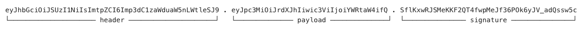

# JSON Web Token (JWT) Services

Two services issue and verify JSON Web Tokens (JWT): the **JWT Issuing Service** mints them, the **JWT Verification Service** accepts them. Tokens are signed with **RS256** using an RSA private key held in a `KeystoreService`, and verified against the X.509 certificates of a `KeystoreService`. Each service is configured independently and points at its own keystore, so the key store holding the signing key and the trust store holding the accepted certificates need not be the same.

Contents:

- [Introduction to JWT](#introduction-to-jwt): how JWT works and main characteristics
- [Configuration](#configuration): service parameters and their explanation
- [Issuing a token](#issuing-a-token): how to issue a token, how claims will be populated by this service, how to set the expiration time correctly
- [Verifying a token](#verifying-a-token): how to create a verification request and conditions for deciding if a token is valid or not
- [Hardening](#hardening): notes on how to tighten the security of these service
- [Operational notes](#operational-notes): general notes about the services' behaviour

## Introduction to JWT

JWT (JSON Web Token, RFC 7519) is a compact, URL-safe way to carry a set of claims (statements about a subject) between two parties. In practice it's the format behind most bearer tokens: a client presents one, and the recipient decides who the caller is and what they may do.

!!! warning "About JWT Security"
    The common form (JWS) protects integrity and authenticity. The payload is merely base64 encoded, so anyone holding the token can read it: **never put secrets in a JWT**.

    JWT is stateless, so it is **hard to revoke**. A valid token stays valid until it expires; there's no natural "log out". This is why short lifetimes matter, and why the service has a maximum-lifetime cap.

A JWT is structured as follows, with three base64 encoded sections separated by a dot (`.`):



- Header: `alg` (RS256), `typ` (JWT), and usually `kid`, naming which key signed it so the verifier can pick the right certificate
- Payload: the claims. Seven are registered by the RFC (anything else is a custom claim), and they're exactly the ones the service manages:
    - `iss`: issuer, who generated it
    - `sub`: subject, who it's about
    - `aud`: audience, who it's for
    - `exp`/`nbf`: not valid after/before
    - `iat`: issued at
    - `jti`: unique token id
- Signature: computed over the ASCII of `base64UrlEncode(header)` + `.` + `base64UrlEncode(payload)`. Change one byte of either and it stops matching


## Configuration

### JWT Issuing Service

- *Keystore Target Filter*: OSGi filter selecting the `KeystoreService` holding the signing key. Defaults to `(kura.service.pid=changeme)`, so the service issues nothing until it is pointed at a real keystore
- *Signing Key Alias*: alias of the RSA private key entry used to sign, `jwt-signing-key` by default. Published as the token's `kid` header. If the alias does not resolve to an RSA private key entry, issuing is unavailable
- *Issuer*: value asserted in the `iss` claim of issued tokens, `kura` by default
- *Maximum Token Lifetime (sec)*: upper bound on `exp`, `3600` by default. `0` means no bound

### JWT Verification Service

- *Truststore Target Filter*: OSGi filter selecting the `KeystoreService` holding the trusted certificates. Defaults to `(kura.service.pid=changeme)`, so the service verifies nothing until it is pointed at a real keystore
- *Trusted Issuers*: comma-separated `iss` values accepted when verifying. Empty means the `iss` claim is not checked at all
- *Verification Key Aliases*: comma-separated trust-store aliases allowed to verify. Empty means every entry in the store that yields an X.509 certificate with an RSA public key is used in verification
- *Clock Skew Tolerance (sec)*: tolerance window applied to `exp`, `nbf` and `iat`, `30` seconds by default
- *Require Valid Certificate*: when enabled, which is the default, a certificate outside its own validity period is not used to verify tokens

Blank and repeated entries in the two comma-separated lists are ignored, and surrounding whitespace is trimmed, so `kura, , kura.gateway ` and `kura,kura.gateway` are equivalent.


## Issuing a token

```java
@Reference
private TokenIssuingService tokenIssuingService;

final String token = this.tokenIssuingService.issue(TokenIssueRequest.builder()
        .identityName("admin")
        .intendedConsumer("rest-api")
        .expiresAt(Instant.now().plus(Duration.ofMinutes(15)))
        .claim("roles", List.of("operator"))
        .build());
```

A request says **what to assert**, never **how to protect it**. The service always controls:

- `iss`: taken from the Issuer setting; the caller cannot override it
- `iat`: the issuing instant
- `jti`: a freshly generated unique id; `issue()` is not idempotent, so two equal requests yield two distinct, independently valid tokens
- `kid`: the *Signing Key Alias*, so verifiers can select the right certificate
- the algorithm (RS256) and the signing key

The `identityName` is mandatory and becomes the `sub` claim: it is the Kura identity the token is issued for. Everything else is optional: intended consumers (`aud`), `nbf`, `exp`, and custom claims. Call `intendedConsumer(...)` once per consumer to declare several of them; `aud` is omitted entirely when none is declared.

!!! warning
    The returned string is a credential. Do not log it, do not put it in a URL, and transport it only over a secured channel.

### The registered claims are reserved

The seven registered claim names — `iss`, `sub`, `aud`, `exp`, `nbf`, `iat`, `jti` — cannot be set through `claim(...)`. A request that carries one of them fails with `KuraErrorCode.BAD_REQUEST` naming the offending claim, and no token is issued. Use the dedicated builder methods (`identityName`, `intendedConsumer`, `expiresAt`, `notBefore`) instead; the remaining three belong to the service.

### Supported custom claim values

| Java type | JSON form in the payload |
| --- | --- |
| `String` | string |
| `Boolean` | boolean |
| `Integer`, `Long`, `Double` | number |
| `Instant` | NumericDate, that is whole epoch seconds |
| `List<?>` | array |
| `Map<String, ?>` | object |
| `null` | null |

Elements of a list and values of a map must themselves be of a supported type, and map keys must be `String`. Any other value type is refused with `KuraErrorCode.BAD_REQUEST` rather than serialized on a best-effort basis, so a token never carries a claim the caller did not intend.

### How `exp` is decided

| Maximum lifetime | Requested `exp` | Resulting `exp` |
| --- | --- | --- |
| `0` | none | **caution** no `exp` claim; the token never expires |
| `0` | any | exactly as requested |
| `> 0` | none | now + maximum lifetime |
| `> 0` | within the maximum | exactly as requested |
| `> 0` | beyond the maximum | capped to now + maximum lifetime |

The cap only applies upwards. A requested `exp` in the past is honoured, producing a token that is already invalid. JWT timestamps are whole seconds, so sub-second precision is truncated.

Capping is silent: no error is raised when a requested lifetime is shortened. Call `getMaximumLifetime()` to discover the configured bound before requesting, or read `getExpiresAt()` back from the verification proof, rather than assuming the requested window was honoured.


## Verifying a token

```java
@Reference
private TokenVerificationService tokenVerificationService;

final VerificationProof proof = this.tokenVerificationService.verify(TokenVerifyRequest.builder()
        .token(encodedToken)
        .intendedConsumer("rest-api")
        .build());

final String identityName = proof.getIdentityName();
```

Holding a `VerificationProof` is the proof that verification succeeded. It exposes methods to access the verified token's claims.

!!! warning
    `getExpiresAt()` is empty for a token issued without `exp`. Such a proof must not be cached indefinitely on the strength of a missing expiration.

A token is accepted only when all of the following hold:

1. it is a well-formed JWT;
2. its `kid` names a certificate allowed by *Verification Key Aliases*. A token carrying no `kid` may be verified by any of the allowed certificates;
3. that certificate is within its validity period (unless *Require Valid Certificate* is disabled);
4. the RS256 signature verifies against it;
5. `iss` is the configured *Issuer* or one of the *Trusted Issuers*, a token without `iss` is rejected;
6. `exp`, `nbf` and `iat` are satisfied within the clock-skew tolerance;
7. `sub` is present and not blank, so the proof always carries an identity;
8. the intended consumer check passes (see [next section](#the-intended-consumer-check)).

### How the trust anchor is chosen

The token's `kid` is a **hint, not a constraint**. When it names an alias present in the trust store, that certificate is tried first; every other allowed certificate is then tried as a fallback, and so is every allowed certificate when the `kid` is absent or names an alias this store does not have.

Both `TrustedCertificateEntry` and `PrivateKeyEntry` entries contribute their X.509 certificate as a trust anchor. Entries that hold no X.509 certificate, or whose public key is not RSA, are skipped.

### The issuer check

*Trusted Issuers* is the whole trust set, and an empty setting **disables the check**: any `iss` is accepted, including none at all. This is the default, and it is almost never what a deployment wants — see [Hardening](#always-configure-trusted-issuers).

When the setting is non-empty, `iss` must match one of the listed values exactly, and a token carrying no `iss` is rejected. Matching is exact, so `kura.gateway` does not admit `kura.gateway.attacker`.

### The intended consumer check

Why is the intended consumer a request parameter, and nothing else is? Every other check the service performs, it can decide on its own:

- the signature and trust anchor against the keystore
- `iss` against the configured trust set
- `exp` / `nbf` / `iat` against the clock

The audience is the exception. RFC 7519 requires each principal processing a token to identify itself with a value in `aud`, and only the caller knows which principal it is, so the expected audience cannot be configuration.

When an intended consumer is set, the token is accepted only if its `aud` contains that value, and a token with no `aud` at all is rejected. When it is left unset no audience constraint is enforced, and a token minted for a different consumer verifies happily.


## Hardening

### Do not leak sensitive information

A JWT is not encrypted, so never leak sensitive information in the JWT claim values or custom claim names. For example, this is **bad**:

```
Signing Key Alias = <customer name> // will be published as 'kid'
Issuer = <customer name> // will be published under 'iss'
```

Example of issuing a token with **bad** custom claims, that leak personal information:

```json
{
    "firstname": "Mario",
    "lastname": "Rossi",
    "birthDate": "1990-01-09",
    "email": "username@example.com",
    "country": "IT",
    "roles": ["user"],
    "exp": 1763210697
}
```

### Always configure Trusted Issuers

Left empty, *Trusted Issuers* accepts any `iss`, and a token with no `iss` at all. Every token a trusted certificate signed is then admitted, whatever minted it and whatever it was minted for. List the issuers you actually expect.

### Restrict Verification Key Aliases

Restrict *Verification Key Aliases* whenever the keystore is shared with TLS. With the list empty, every entry in the store that yields an X.509 certificate with an RSA public key is accepted for verification. Anyone holding a private key whose certificate is in that store can then mint tokens this service will accept. Naming the aliases you actually trust closes that path.

### Configure Maximum Token Lifetime (sec)

Always configure the service with a defined *Maximum Token Lifetime (sec)*, preferably as short as possible. This prevents issuing of tokens that never expire and keeps the token alive for the minimum required time to perform some operations.

### Always declare the intended consumer when verifying

The API leaves it optional, so nothing fails if you forget it, and nothing warns you either. Make it a habit in every verifier, and give each consumer a distinct name so tokens cannot be replayed sideways.


## Operational notes

### An expired signing certificate breaks verification, not issuing

When *Require Valid Certificate* is enabled, which is the default, an expired signing certificate breaks just verification. The private key still signs, so `issue()` keeps succeeding while every verifier rejects the result. Issuing looks healthy and the failure surfaces at the consumer.

### Clock drift is bidirectional

`iat` is verified, so a gateway whose clock runs ahead of a verifier by more than the skew tolerance issues tokens that verifier refuses as "not yet usable".

### Verification proves the token, not the identity

A successful verification says a trusted key signed that identity name at some point, within the token's validity window. It does not say the identity still exists, is still enabled, or holds any permission, and there is no way to revoke a token before its `exp`. Look the identity up and check its permissions before acting on the proof.