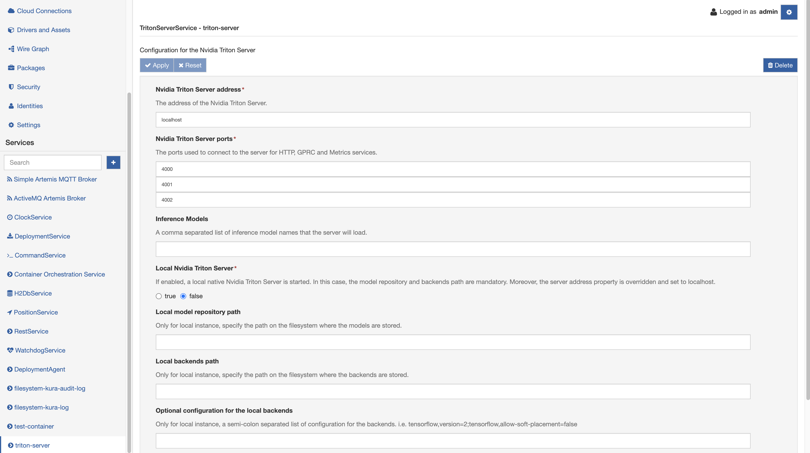
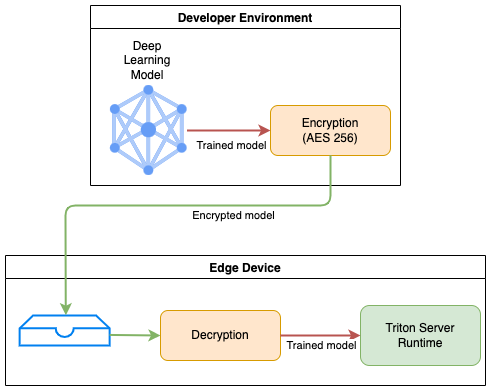

# Nvidia™ Triton Server Inference Engine

The [Nvidia™ Triton Server](https://developer.nvidia.com/nvidia-triton-inference-server) is an open-source inference service software that enables the user to deploy trained AI models from any framework on GPU or CPU infrastructure. It supports all major frameworks like TensorFlow, TensorRT, PyTorch, ONNX Runtime, and even custom framework backend. With specific backends, it is also possible to run Python scripts, mainly for pre-and post-processing purposes, and exploit the [DALI](https://github.com/triton-inference-server/dali_backend) building block for optimized operations. For more detail about the Triton Server, please refer to the official [website](https://github.com/triton-inference-server/server).

Kura provides three components for exposing the Triton Server service functionality which implement the inference engine APIs and provides methods for interacting with a local or remote Nvidia™ Triton Server:

- **TritonServerRemoteService**: provides methods for interacting with a remote Nvidia™ Triton Server without managing the server lifecycle. Can be used both for connecting to a remote instance or a local non-managed instance. It exposes a simpler but more limited configuration.
- **TritonServerNativeService**: provides methods for interacting with a local native Nvidia™ Triton Server. Requires the Triton Server executable to be already available on the device and offers more options and features (like AI Model Encryption).
- **TritonServerContainerService**: provides methods for interacting with a local container running Nvidia™ Triton Server. Requires the Triton Server container image to be already available on the device and offers more options and features (like AI Model Encryption).
- **TritonServerService**: provides methods for interacting with a local or remote Nvidia™ Triton Server within the same component. **Note**: _deprecated since 5.2.0_ 


## Nvidia™ Triton Server installation

Before running Kura's Triton Server Service, you must install the Triton Inference Server. Here you can find the necessary steps for the available suggested installation methods.

### Native Triton installation on Jetson devices

A release of Triton for JetPack is provided in the tar file in the Triton Inference Server [release notes](https://github.com/triton-inference-server/server/releases). Full documentation is available [here](https://github.com/triton-inference-server/server/blob/main/docs/jetson.md).

Installation steps:

- Before running the executable you need to install the [Runtime Dependencies for Triton](https://github.com/triton-inference-server/server/blob/main/docs/jetson.md#runtime-dependencies-for-triton).
- After doing so you can extract the tar file and run the executable in the `bin` folder.
- It is highly recommended to add the `tritonserver` executable to your path or symlinking the executable to `/usr/local/bin`.

### Triton Docker image installation

Before you can use the Triton Docker image you must install [Docker](https://docs.docker.com/engine/install). If you plan on using a GPU for inference you must also install the [NVIDIA Container Toolkit](https://github.com/NVIDIA/nvidia-docker).

Pull the image using the following command.

```
$ docker pull nvcr.io/nvidia/tritonserver:<xx.yy>-py3
```

Where `<xx.yy>` is the version of Triton that you want to pull.

### Native Triton installation on supported devices

The official docs mention the possibility to perform a native installation on supported platform by [extracting the binaries](https://github.com/triton-inference-server/server/blob/main/docs/build.md#extract-build-artifacts) from the Docker images. To do so you must install the necessary dependencies (some can be found in the Jetson [runtime dependencies docs](https://github.com/triton-inference-server/server/blob/main/docs/jetson.md#runtime-dependencies-for-triton)) on the system. For Triton to support NVIDIA GPUs you must install CUDA, cuBLAS and cuDNN referencing the [support matrix](https://docs.nvidia.com/deeplearning/frameworks/support-matrix/index.html).

!!! note
    For Python models the libraries available to the Python model are the ones available for the user running the Triton server. Therefore you'll need to install the libraries through `pip` for the `kurad` user.

### Triton Server setup

The Triton Inference Server serves models from one or more model repositories that are specified when the server is started. The model repository is the directory where you place the models that you want Triton to serve. Be sure to follow [the instructions](https://github.com/triton-inference-server/server/blob/main/docs/model_repository.md) to setup the model repository directory.

Further information about an example Triton Server setup can be found in the [official documentation](https://github.com/triton-inference-server/server/blob/main/docs/quickstart.md).


## Triton Server Remote Service component

The Kura Triton Server Remote Service component is the implementation of the inference engine APIs and provides methods for interacting with a remote (i.e. unmnanaged) Nvidia™ Triton Server. As presented below, the component enables the user to communicate to an external server to load specific models. With this component the server lifecycle (startup, shutdown) won't be handled by Kura and it's the user responsibility to make it available to Kura for connecting.



The parameters used to configure the Triton Service are the following:

- **Nvidia Triton Server address**: the address of the Nvidia Triton Server.
- **Nvidia Triton Server ports**: the ports used to connect to the server for HTTP, GRPC, and Metrics services.
- **Inference Models**: a comma-separated list of inference model names that the server will load. The models have to be already present in the filesystem where the server is running. This option simply tells the server to load the given models from a local or remote repository.
- **Timeout (in seconds) for time consuming tasks**: Timeout (in seconds) for time consuming tasks like server startup, shutdown or model load. If the task exceeds the timeout, the operation will be terminated with an error.
- **Max. GRPC message size (bytes)**: this field controls the maximum allowed size for the GRPC calls to the server instance. By default, size of 4194304 bytes (= 4.19 MB) is used. Increase this value to be able to send large amounts of data as input to the Triton server (like Full HD images). The Kura logs will show the following error when exceeding such limit:
    ```
    io.grpc.StatusRuntimeException: RESOURCE_EXHAUSTED: gRPC message exceeds maximum size 4194304
    ```

!!! note
    Pay attention on the ports used for communicating with the Triton Server. The default ports are the 8000-8002, but these are tipically used by Kura for debug purposes.


## Triton Server Native Service component

The Kura Triton Server component is the implementation of the inference engine APIs and provides methods for interacting with a local native Nvidia™ Triton Server. As presented below, the component enables the user to configure a local server running on the gateway and handles its lifecycle. This operating mode supports more features for interacting with the server like the [AI Model Encryption](#ai-model-encryption-support).

!!! note
    **Requirement**: `tritonserver` executable needs to be available in the path to the `kurad` user. Be sure to have a working Triton Server installation before configuring the local native Triton Server instance through Kura UI.

The parameters used to configure the Triton Service are the following:

- **Nvidia Triton Server ports**: the ports used to connect to the server for HTTP, GRPC, and Metrics services.
- **Local model repository path**: Specify the path on the filesystem where the models are stored.
- **Local model decryption password**: Specify the password to be used for decrypting models stored in the model repository. If none is specified, models are supposed to be plaintext.
- **Inference Models**: a comma-separated list of inference model names that the server will load. The models have to be already present in the filesystem where the server is running. This option simply tells the server to load the given models from a local or remote repository.
- **Local backends path**: Specify the path on the filesystem where the backends are stored.
- **Optional configuration for the local backends**: A semi-colon separated list of configuration for the backends. i.e. tensorflow,version=2;tensorflow,allow-soft-placement=false 
- **Timeout (in seconds) for time consuming tasks**: Timeout (in seconds) for time consuming tasks like server startup, shutdown or model load. If the task exceeds the timeout, the operation will be terminated with an error.
- **Max. GRPC message size (bytes)**: this field controls the maximum allowed size for the GRPC calls to the server instance.

!!! note
    Pay attention on the ports used for communicating with the Triton Server. The default ports are the 8000-8002, but these are tipically used by Kura for debug purposes.


## Triton Server Container Service component

The Kura Triton Server component is the implementation of the inference engine APIs and provides methods for interacting with a local container running the Nvidia™ Triton Server. As presented below, the component enables the user to configure a local server running on the gateway and handles its lifecycle. This operating mode supports more features for interacting with the server like the [AI Model Encryption](#ai-model-encryption-support).

!!! note
    **Requirement**:
    1. Triton Server container image already installed on the device. For instructions refer to the installation section in this page.
    2. Kura's Container Orchestration Service enabled.

The parameters used to configure the Triton Service are the following:

- **Container Image**: The image the container will be created with.
- **Container Image Tag**: Describes which image version that should be used for creating the container.
- **Nvidia Triton Server ports**: The ports used to connect to the server for HTTP, GRPC, and Metrics services.
- **Local model repository path**: Specify the path on the filesystem where the models are stored.
- **Local model decryption password**: Specify the password to be used for decrypting models stored in the model repository. If none is specified, models are supposed to be plaintext.
- **Inference Models**: A comma-separated list of inference model names that the server will load. The models have to be already present in the filesystem where the server is running. This option simply tells the server to load the given models from a local or remote repository.
- **Local Backends Path**: Specify the path on the filesystem where the backends for the Triton server are stored. If left empty, the Triton server will use the default value.
- **Optional configuration for the local backends**: A semi-colon separated list of configuration for the backends. i.e. tensorflow,version=2;tensorflow,allow-soft-placement=false 
- **Memory**: The maximum amount of memory the container can use in bytes. Set it as a positive integer, optionally followed by a suffix of b, k, m, g, to indicate bytes, kilobytes, megabytes, or gigabytes. The minimum allowed value is platform dependent (i.e. 6m). If left empty, the memory assigned to the container will be set to a default value by the native container orchestrator.
- **CPUs**: Specify how many CPUs the Triton container can use. Decimal values are allowed, so if set to 1.5, the container will use at most one and a half cpu resource.
- **GPUs**: Specify how many Nvidia GPUs the Triton container can use. Allowed values are 'all' or an integer number. If there's no Nvidia GPU installed, leave the field empty. If the Nvidia Container Runtime is used, leave the field empty.
- **Runtime**: The runtime used by the Triton server container. If the container uses the Nvidia Container Runtime, set it to _nvidia_ and leave the **GPUs** field empty.
- **Devices**: A comma-separated list of device paths passed to the Triton server container (i.e. /dev/video0).
- **Timeout (in seconds) for time consuming tasks**: Timeout (in seconds) for time consuming tasks like server startup, shutdown or model load. If the task exceeds the timeout, the operation will be terminated with an error.
- **Max. GRPC message size (bytes)**: this field controls the maximum allowed size for the GRPC calls to the server instance.

!!! note
    Pay attention on the ports used for communicating with the Triton Server. The default ports are the 8000-8002, but these are typically used by Kura for debug purposes.


## Triton Server Service component [deprecated since 5.2.0]

The Kura Triton Server component is the implementation of the inference engine APIs and provides methods for interacting with a local or remote Nvidia™ Triton Server. As presented below, the component enables the user to configure a local server running on the gateway or to communicate to an external server to load specific models.

The parameters used to configure the Triton Service are the following:

- **Local Nvidia Triton Server**: If enabled, a local native Nvidia Triton Server is started on the gateway. In this case, the model repository and backends path are mandatory. Moreover, the server address property is overridden and set to localhost. Be aware that the Triton Server has to be already installed on the system.
- **Nvidia Triton Server address**: the address of the Nvidia Triton Server.
- **Nvidia Triton Server ports**: the ports used to connect to the server for HTTP, GRPC, and Metrics services.
- **Local model repository path**: Only for a local instance, specify the path on the filesystem where the models are stored.
- **Local model decryption password**: Only for local instance, specify the password to be used for decrypting models stored in the model repository. If none is specified, models are supposed to be plaintext.
- **Inference Models**: a comma-separated list of inference model names that the server will load. The models have to be already present in the filesystem where the server is running. This option simply tells the server to load the given models from a local or remote repository.
- **Local backends path**: Only for a local instance, specify the path on the filesystem where the backends are stored.
- **Optional configuration for the local backends**: Only for local instance, a semi-colon separated list of configuration for the backends. i.e. tensorflow,version=2;tensorflow,allow-soft-placement=false 
- **Timeout (in seconds) for time consuming tasks**: Timeout (in seconds) for time consuming tasks like server startup, shutdown or model load. If the task exceeds the timeout, the operation will be terminated with an error.
- **Max. GRPC message size (bytes)**: this field controls the maximum allowed size for the GRPC calls to the server instance.

!!! note
    Pay attention on the ports used for communicating with the Triton Server. The default ports are the 8000-8002, but these are tipically used by Kura for debug purposes.

### Configuration for a local native Triton Server with Triton Server Service component [deprecated since 5.2.0]

!!! note
    **Requirement**: `tritonserver` executable needs to be available in the path to the `kurad` user. Be sure to have a working Triton Server installation before configuring the local native Triton Server instance through Kura UI.

When the **Local Nvidia Triton Server** option is set to true, a local instance of the Nvidia™ Triton Server is started on the gateway. The following configuration is required:

- **Local Nvidia Triton Server**: true
- **Nvidia Triton Server address**: localhost
- **Nvidia Triton Server ports**: mandatory
- **Local model repository path**: mandatory
- **Inference Models**: mandatory. Note that the models have to be already present on the filesystem.
- **Local backends path**: mandatory

The typical command used to start the Triton Server is like this:

```shell
tritonserver --model-repository=<model_repository_path> \
--backend-directory=<backend_repository_path> \
--backend-config=<backend_config> \
--http-port=<http_port> \
--grpc-port=<grpc_port> \
--metrics-port=<metrics_port> \
--model-control-mode=explicit \
--load-model=<model_name_1> \
--load-model=<model_name_2> \
...
```

### Configuration for a local Triton Server running in a Docker container with Triton Server Service component [deprecated since 5.2.0]

If the Nvidia™ Triton Server is running as a Docker container in the gateway, the following configuration is required:

- **Local Nvidia Triton Server**: false
- **Nvidia Triton Server address**: localhost
- **Nvidia Triton Server ports**: \<mandatory\>
- **Inference Models**: \<mandatory\>. The models have to be already present on the filesystem.

In order to correctly load the models at runtime, configure the server with the `--model-control-mode=explicit` option. The typical command used for running the docker container is as follows. Note the forward of the ports to not interfere with Kura.

```shell
docker run --rm \
-p4000:8000 \
-p4001:8001 \
-p4002:8002 \
--shm-size=150m \
-v path/to/models:/models \
nvcr.io/nvidia/tritonserver:[version] \
tritonserver --model-repository=/models --model-control-mode=explicit
```

### Configuration for a remote Triton Server with Triton Server Service component [deprecated since 5.2.0]

When the Nvidia™ Triton Server is running on a remote server, the following configuration is needed:

 - **Local Nvidia Triton Server**: false
 - **Nvidia Triton Server address**: mandatory
 - **Nvidia Triton Server ports**: mandatory
 - ** Inference Models**: mandatory. The models have to be already present on the filesystem.


## AI Model Encryption Support

For ensuring inference integrity and providing copyright protection of deep-learning models on edge devices, Kura provides decryption capabilities for trained models to be served through the Triton Server.

### How it works

**Prerequisites**: a deep-learning trained model (or more) exists with the corresponding necessary configuration for running on the Triton Server without encryption. A folder containing the required files (model, configuration etc) has been tested on a Triton Server.

**Restrictions**: if model encryption is used, the following restrictions apply:

- model encryption support is only available for a *local* Triton Server instance
- all models in the folder containing the encrypted models *must* be encrypted
- all models *must* be encrypted with OpenPGP-compliant AES 256 cipher algorithm
- all models *must* be encrypted with the same password

Once the development of the deep-learning model is complete, the developer who wants to deploy the model on the edge device in a secure manner can proceed with encrypting the Triton model using the procedure detailed below. After encrypting the model he/she can transfer the file on the edge device using his/her preferred method.



Kura will keep the stored model protected at all times and have the model decrypted **in runtime only** for use by the Inference Server Runtime. As soon as the model is correctly loaded into memory the decrypted model will be removed from the filesystem.

As an additional security measure, the [Model Repository](https://github.com/triton-inference-server/server/blob/main/docs/model_repository.md) containing the decrypted models will be stored in a temporary subfolder and will feature restrictive permission such that only Kura, the Inference Server and the `root` user will be able to access it.

### Encryption procedure

Given a trained model inside the folder `tf_autoencoder_fp32` (for example) with the following layout (see the [official documentation](https://github.com/triton-inference-server/server/blob/main/docs/model_repository.md) for details):

```
tf_autoencoder_fp32
├── 1
│   └── model.savedmodel
│       ├── assets
│       ├── keras_metadata.pb
│       ├── saved_model.pb
│       └── variables
│           ├── variables.data-00000-of-00001
│           └── variables.index
└── config.pbtxt
```

Compress the model into a zip archive with the following command:

```bash
zip -vr tf_autoencoder_fp32.zip tf_autoencoder_fp32/
```

then encrypt it with the AES 256 algorithm using the following `gpg` command:

```bash
gpg --armor --symmetric --cipher-algo AES256 tf_autoencoder_fp32.zip
```

The resulting archive `tf_autoencoder_fp32.zip.asc` can be transferred to the _Local Model Repository Path_ on the target machine and will be decrypted by Kura.