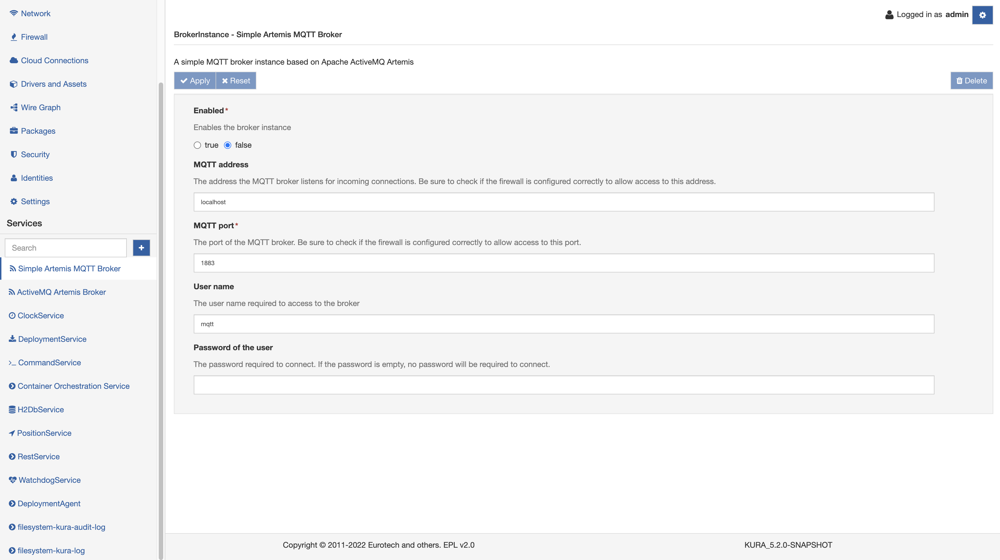

# Simple Artemis MQTT Broker

By default, this instance is disabled but, selecting the **Simple Artemis MQTT Broker** option in **Services** it is possible to enable a basic instance of an ​ActiveMQ-7 broker with MQTT capabilities.

The service has the following configuration fields:

- **Enabled** - (Required) - Enables the broker instance
- **MQTT address** - MQTT broker listener address. In order to allow access to the broker from processes running on external nodes, make sure to bind the server to an externally accessible address. Setting this parameter to 0.0.0.0 binds to all addresses.
- **MQTT port** - (Required) - MQTT broker port, make sure to open the specified port in the firewall configuration section if external access to the broker is required.
- **User name** - The username​ required to access to the broker
- **Password of the user** - The password required to connect. If the password is empty, no password will be required to connect.