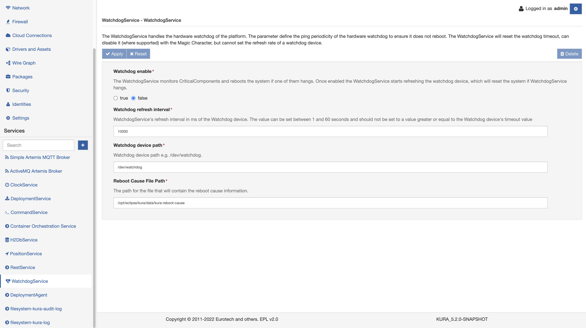

# Watchdog Service

The WatchdogService provides methods for starting, stopping, and updating a hardware watchdog if it is present on the system. Once started, the watchdog must be updated to prevent the system from rebooting.

To use this service, select the **WatchdogService** option located in the **Services** area as shown in the screen capture below.



This service provides the following configuration parameters:

- **enabled** - sets whether or not this service is enabled or disabled. (Required field)

- **pingInterval** - defines the maximum time interval (in milliseconds) allowed between two watchdog refreshes to prevent the system from rebooting. (This is a required field.) The interval must be set to a value less than the system's **watchdog timeout**; otherwise, the watchdog will not be refreshed in time, resulting in a system reboot. On most systems, you can check the watchdog timeout using the following command:
    ```bash
    wdctl <watchdog-device>
    ```
    The `wdctl` tool allows to change the default timeout value. Refer to specific [man page](https://man7.org/linux/man-pages/man8/wdctl.8.html) for details.

- **Watchdog device path** - sets the watchdog device path. (Required field)

- **Reboot Cause File Path** - sets the path to the file that will contain the reboot cause information. (Required field)