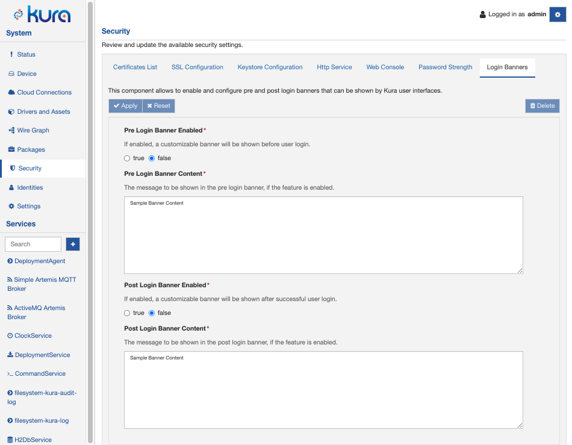
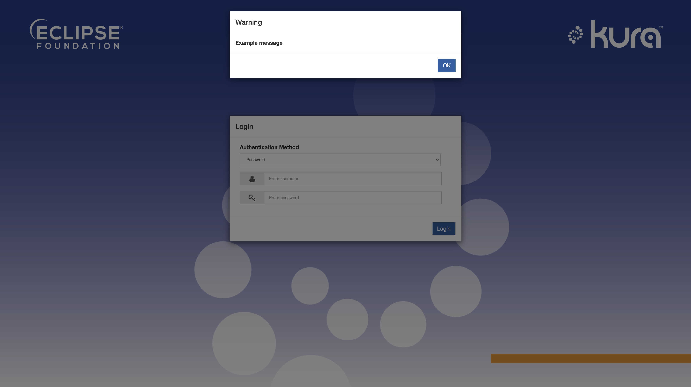

# Login Banners

Eclipse Kura allows the configuration of messages that should be presented to the user before and after authentication via user interfaces, for example, in a dedicated banner dialog.

A typical use case for these banners is to describe the intended system use for security reasons.

The banners can be configured in the **Security** -> **Login Banners** section of the Eclipse Kura Web Console.

This section provides the following configuration options:

* **Pre Login Banner Enabled**: If enabled, a customizable banner will be shown before user login. (default: false)

* **Pre Login Banner Content**: The message to be shown in the pre-login banner, if the feature is enabled. (default: Sample Banner Content)

* **Post Login Banner Enabled**: If enabled, a customizable banner will be shown after successful user login. (default: false)

* **Post Login Banner Content**: The message to be shown in the post-login banner, if the feature is enabled. (default: Sample Banner Content)

## Login Banner Enabled

For example, if the pre-login banner is enabled, it will be shown by the Kura Web UI as depicted in the image below.

