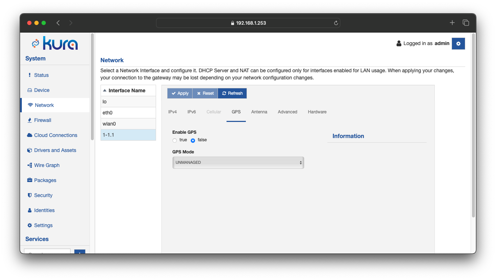

# Cellular Configuration

If it is not configured, the cellular interface is presented on the interface list by modem USB address (i.e. 2-1). This 'fake' interface name is completed by 'proper' interface name (e.g., ppp0) when the first modem configuration is submitted.

The cellular interface should be configured by first enabling it in the **IPv4** or **IPv6** tab, and then setting the **Cellular** tab. Note that the cellular interface can only be set as _WAN using DHCP_, _Disabled_ or _Not Managed_ (only for IPv4 connections). The cellular interface configuration options are described below.

## Cellular Configuration

The **Cellular** tab contains the following configuration parameters:

- **Model**: specifies the modem model.

- **Network Technology**: describes the network technology used by this modem.
    - HSDPA
    - EVDO
    - EDGE

- **Connection Type**: specifies the type of connection to the modem.

- **Modem Identifier**: provides a unique name for this modem.

- **Interface #**: provides a unique number for the modem interface (e.g., an interface # of 0 would name the modem interface ppp0).

- **Dial String**: instructs how the modem should attempt to connect. Typical dial strings are as follows:
    - HSPA modem: atd&ast;99&ast;&ast;&ast;1#
    - EVDO/CDMA modem: atd#777

- **APN**: defines the modem access point name.

    This is an optional parameter. If left empty, the value is automatically picked up from the 
    Mobile Broadband Provider the modem is registered to. If a value is filled, the APN value is explicitly 
    configured.

    To avoid misconfiguration issues, it is strongly recommended to set it manually.

    !!! note
        **APN value configuration**

        A good practice is to set the interface status to **Disabled** and then **Enable For WAN** when the APN is explicitly set. NetworkManager, indeed, may fallback to the default value if a wrong APN is specified, causing misleading behaviors. This does not happen if the interface is disabled and re-enabled after APN changes.
        
- **Auth Type**: specifies the authentication type.
    - None
    - Auto
    - CHAP
    - PAP

- **Username**: supplies the username; disabled if no authentication method is specified.

- **Password**: supplies the password; disabled if no authentication method is specified.

- **Modem Reset Timeout**: sets the modem reset timeout in minutes. If set to a non-zero value, the modem is reset after n consecutive minutes of unsuccessful connection attempts. If set to zero, the modem keeps trying to establish a PPP connection without resetting. The default value is 5 minutes.

- **Reopen Connection on Termination**: sets the _persist_ option of the PPP daemon that specifies if PPP daemon should exit after connection is terminated. Note that the _maxfail_ option still has an effect on persistent connections.

- **Connection Attempts Retry Delay**: Sets the _holdoff_ parameter to instruct the PPP daemon on how many seconds to wait before re-initiating the link after it terminates. This option only has any effect if the persist option (Reopen Connection on Termination) is set to true. The holdoff period is not applied if the link was terminated because it was idle. The default value is 1 second.

- **Connection Attempts**: sets the _maxfail_ option of the PPP daemon that limits the number of consecutive failed PPP connection attempts. The default value is 5 connection attempts. A value of zero means no limit. The PPP daemon terminates after the specified number of failed PPP connection attempts and restarts by the _ModemMonitor_ thread.  

- **Disconnect if Idle**: sets the _idle_ option of the PPP daemon, which terminates the PPP connection if the link is idle for a specified number of seconds. The default value is 95 seconds. To disable this option, set it to zero.

- **Active Filter**: sets the _active-filter_ option of the PPP daemon. This option specifies a packet filter _(filter-expression)_ to be applied to data packets in order to determine which packets are regarded as link activity, and thereby, reset the idle timer. The _filter-expression_ syntax is as described for tcpdump(1); however, qualifiers that do not apply to a PPP link, such as _ether_ and _arp_, are not permitted. The default value is _inbound_. To disable the _active-filter_ option, leave it blank.

- **LCP Echo Interval**: sets the _lcp-echo-interval_ option of the PPP daemon. If set to a positive number, the modem sends LCP echo request to the peer at the specified number of seconds. To disable this option, set it to zero. This option may be used with the _lcp-echo-failure_ option to detect that the peer is no longer connected.

- **LCP Echo Failure**: sets the _lcp-echo-failure_ option of the PPP daemon. If set to a positive number, the modem presumes the peer to be dead if a specified number of LCP echo-requests are sent without receiving a valid LCP echo-reply. To disable this option, set it to zero.

### GPS

The **GPS** tab allows the user to enable or disable the GPS module provided by the cellular modem. The available properties are:

- **Enable GPS**: enables GPS module for the selected modem.
- **GPS Mode**: specifies the GPS mode.
    - `UNMANAGED`: the GPS device of the modem will be setup but not directly managed, therefore freeing the serial port for other services to use. This can be used in order to perform the setup of the GPS and then have another service (like `gpsd`) parse the NMEA strings in order to extract the position informations.
    - `MANAGED_GPS`: the GPS device of the modem will be setup and directly managed (typically by ModemManager) therefore the serial port won't be available for other services to use.

!!! note "GPS modes availability"
    GPS modes available for the modem are dependent on the modem model, modem firmware version and _ModemManager_ version installed on the system. Some modes may not be selectable if the modem does not support them.

Therefore, to use the GPS module provided by the cellular modem with Kura's _PositionService_, the following considerations should be taken into account:

- The _PositionService_ should be enabled. Serial settings of the _PositionService_ should not be changed; it will be redirected to the modem GPS port automatically.
- To use the `gpsd` and `serial` _PositionService_ providers with the GPS module provided by the cellular modem, the GPS mode should be set to `UNMANAGED`.
- To use the `modemmanager` _PositionService_ provider with the GPS module provided by the cellular modem, the GPS mode should be set to `MANAGED_GPS`.

Refer to the [Position Service](../core-services/position-service.md) section for more information.
