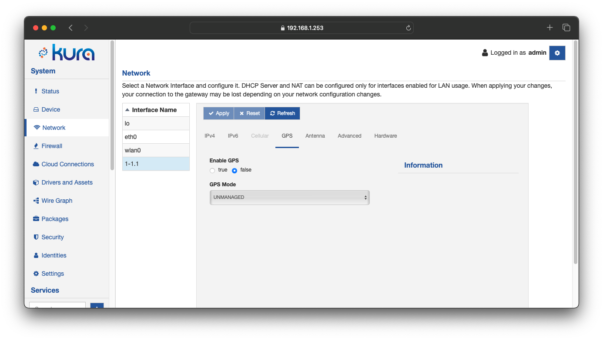

# Cellular Configuration

If it is not configured, the cellular interface is presented on the interface list by modem USB address (i.e. 2-1). This 'fake' interface name is completed by 'proper' interface name (e.g.  ppp0, wwan0,...) when the first modem configuration is submitted.

The cellular interface should be configured by first enabling it in the **IPv4** or **IPv6** tab, and then setting the **Cellular** tab. Note that the cellular interface can only be set as _WAN using DHCP_, _Disabled_ or _Not Managed_ (only for IPv4 connections). The cellular interface configuration options are described below.

## Cellular Configuration

The **Cellular** tab contains the following configuration parameters:

- **Model**: specifies the modem model.

- **Network Technology**: describes the network technology used by this modem.
    - HSDPA
    - EVDO
    - EDGE

- **Connection Type**: specifies the type of connection to the modem.

- **Modem Identifier**: provides a unique name for this modem.

- **Interface #**: provides a unique number for the modem interface (e.g., an interface # of 0 would name the modem interface ppp0).

- **Dial String**: legacy setting that used to help establishing PPP data sessions for GSM-based modems. Deprecated by NetworkManager and not used anymore. Kura will read it and populate the configuration with the correct values but NetworkManager might not honor the setting depending on its version. Typical dial strings are as follows:
    - HSPA modem: atd&ast;99&ast;&ast;&ast;1#
    - EVDO/CDMA modem: atd#777

- **APN**: defines the modem access point name.

    This is an optional parameter. If left empty, the value is automatically picked up from the 
    Mobile Broadband Provider the modem is registered to. If a value is filled, the APN value is explicitly 
    configured.

    To avoid misconfiguration issues, it is strongly recommended to set it manually.

    !!! note
        **APN value configuration**

        A good practice is to set the interface status to **Disabled** and then **Enable For WAN** when the APN is explicitly set. NetworkManager, indeed, may fallback to the default value if a wrong APN is specified, causing misleading behaviors. This does not happen if the interface is disabled and re-enabled after APN changes.
        
- **Auth Type**: specifies the authentication type.
    - None
    - Auto
    - CHAP
    - PAP

- **Username**: supplies the username; disabled if no authentication method is specified.

- **Password**: supplies the password; disabled if no authentication method is specified.

- **Modem Reset Timeout**: sets the modem reset timeout in minutes. If set to a non-zero value, the modem is reset after n consecutive minutes of unsuccessful connection attempts. If set to zero, the modem keeps trying to establish a connection without resetting. The default value is 5 minutes.

- **Reopen Connection On Termination**: specifies if the modem should retry to establish a connection after it is terminated. If set to true, the modem will keep trying to establish a connection. The **Connection Attempts Retry Delay** and **Connection Attempts** options are used only if this parameter is set to true.

- **Connection Attempts Retry Delay**: sets the delay in seconds between connection attempts, if the **Reopen Connection On Termination** option is enabled. The default value is 30 seconds.

- **Connection Attempts**: sets the maximum number of consecutive modem connection attempts, if the **Reopen Connection On Termination** option is enabled. The default value is 5 connection attempts. A value of 0 means no limit. When the connection attempts are exhausted, the process will be restarted after a grace period.

- **LCP Echo Interval**: when a PPP connection is used, sets the _lcp-echo-interval_ option of the PPP daemon. If set to a positive number, the modem sends LCP echo request to the peer at the specified number of seconds. To disable this option, set it to zero. This option may be used with the _lcp-echo-failure_ option to detect that the peer is no longer connected.

- **LCP Echo Failure**: when a PPP connection is used, sets the _lcp-echo-failure_ option of the PPP daemon. If set to a positive number, the modem presumes the peer to be dead if a specified number of LCP echo-requests are sent without receiving a valid LCP echo-reply. To disable this option, set it to zero.

#### Cellular automatic reconnection

When the **Reopen Connection On Termination** is enabled, Kura will keep trying to establish a cellular connection if it is unsuccessful or terminated. The **Connection Attempts Retry Delay** option specifies the time interval between consecutive connection attempts, while the **Connection Attempts** specifies the maximum number of attempts before giving up. If the maximum attempts limit is reached, Kura will restart the process after a grace time. The number of attempts and the delay determines the grace time with the following formula:

```
"Grace Time" = "Connection Attempts Retry Delay" x "Connection Attempts" [s]
```

So, if the **Connection Attempts** are set to 3 and the **Connection Attempts Retry Delay** to 15s, Kura will try to establish a connection for 3 times every 15s. If it fails, Kura will wait for 45s and restart the process. Be aware that the **Connection Attempts Retry Delay** should be carefully set in order to not prevent a successful connection to the selected APN. Please refer to the cellular connection provider.

The cellular connection is delegated to NetworkManager and ModemManager, therefore Kura has not a direct control of the connection process. In some situations, depending on the status of the modem, the tools don't guarantee the configured number of reconnections and the delay between connection attempts can be higher.

### GPS



The **GPS** tab allows the user to enable or disable the GPS module provided by the cellular modem. The available properties are:

- **Enable GPS**: enables GPS module for the selected modem.
- **GPS Mode**: specifies the GPS mode.
    - `UNMANAGED`: the GPS device of the modem will be setup but not directly managed, therefore freeing the serial port for other services to use. This can be used in order to perform the setup of the GPS and then have another service (like `gpsd`) parse the NMEA strings in order to extract the position informations.
    - `MANAGED_GPS`: the GPS device of the modem will be setup and directly managed (typically by ModemManager) therefore the serial port won't be available for other services to use.

!!! note "GPS modes availability"
    GPS modes available for the modem are dependent on the modem model, modem firmware version and _ModemManager_ version installed on the system. Some modes may not be selectable if the modem does not support them.

Therefore, to use the GPS module provided by the cellular modem with Kura's _PositionService_, the following considerations should be taken into account:

- The _PositionService_ should be enabled. Serial settings of the _PositionService_ should not be changed; it will be redirected to the modem GPS port automatically.
- To use the `gpsd` and `serial` _PositionService_ providers with the GPS module provided by the cellular modem, the GPS mode should be set to `UNMANAGED`.
- To use the `modemmanager` _PositionService_ provider with the GPS module provided by the cellular modem, the GPS mode should be set to `MANAGED_GPS`.

Refer to the [Position Service](../core-services/position-service.md) section for more information.
