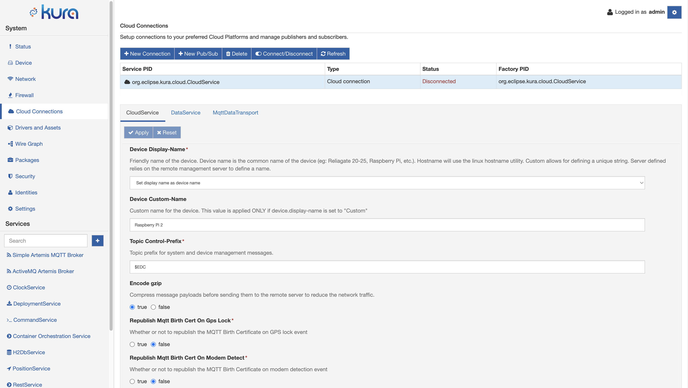
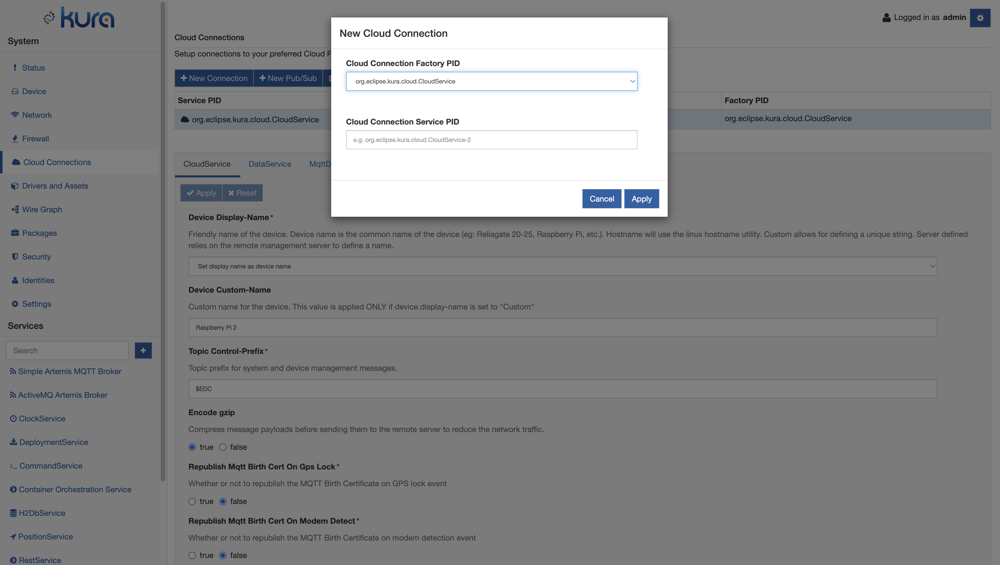
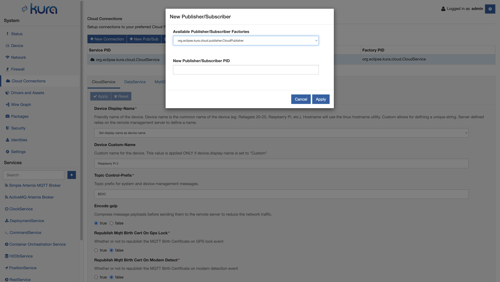

# Cloud Connections

The Cloud Connections section of the Kura Gateway Administration Console allows to create and manage cloud connections.

By default, Kura starts with a single cloud connection, as depicted in the following image:

The cloud services page allows to:
- **create** a new cloud connection;
- **delete** an existing cloud connection;
- **connect** a selected cloud stack to the configured cloud platform;
- **disconnect** the selected cloud stack from the connected cloud platform;
- **refresh** the existing cloud connections.

When clicking on the **New** button, a dialog is displayed as depicted in the image below:

The user can select one of the existing cloud connection factories and give it a name (depending on the implementation, a name format can be suggested or forced).

Selecting a created Cloud Connection it is possible to associate a new publisher/subscriber by clicking the New Pub/Sub button. As for the connection creation case, the user can select one of the existing publisher/subscriber factories and give it a name.

