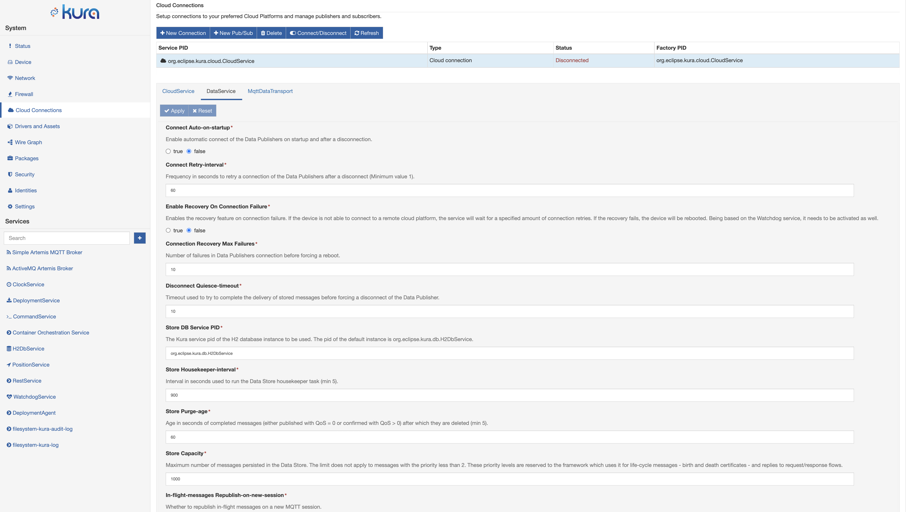
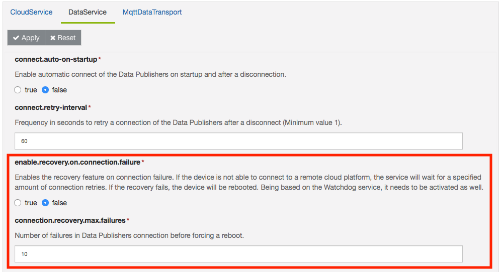
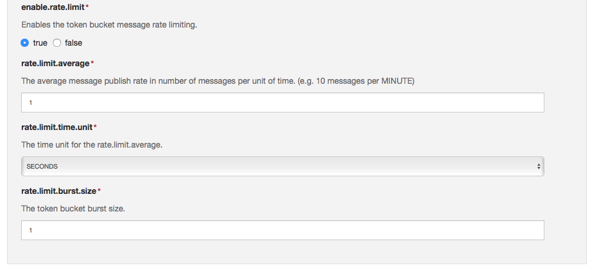

# Data Service Configuration

The **DataService** provides the ability to connect to a remote broker, publish messages, subscribe to topics, receive messages on the subscribed topics, and disconnect from the remote message broker. The DataService delegates to the MqttDataTransport service the implementation of the transport protocol that is used to interact with the remote server.

The DataService also adds the capability of storing published messages in a persistent store function and sending them over the wire at a later time. The purpose of this feature is to relieve service users from implementing their own persistent store. Service users may publish messages independently on the DataService connection status.

!!! info
    Starting from Kura 5.3.0, the DataService allows to bind to custom persistent stores. A custom persistent store can be defined by creating an implementation the new `org.eclipse.kura.message.store.provider.MessageStoreProvider` service interface and registering it as an OSGi service.

In order to overcome the potential latencies introduced by buffering messages, the DataService allows a priority level to be assigned to​ each published message. Depending on the store configuration, there are certain guarantees that stored messages are not lost due to sudden crashes or power outages.

To use this service, select the **DataService** option located in the **Cloud Connections** area as shown in the screen capture below.

The **DataService** offers methods and configuration options to manage the connection to the remote server including the following (all required) parameters described below.

- **Connect Auto-on-startup** - When set to true, the service tries to auto-connect to the remote server on start-up and restore the connection every time the device is disconnected. These attempts are made at the frequency defined in the **Connect Retry-interval** parameter until the connection is established.
Using the Connect/Disconnect button disables this function.
- **Connect Retry-interval** - Frequency in seconds to retry a connection of the Data Publishers after a disconnect.
- **Enable Recovery On Connection Failure** - Enables the recovery feature on connection failure. If the device is not able to connect to a remote cloud platform, the service will wait for a specified amount of connection retries. If the recovery fails, the device will be rebooted. Being based on the Watchdog service, it needs to be activated as well.
- **Connection Recovery Max Failure** - Number of failures in Data Publishers connection before forcing a reboot.
- **Disconnect Quiesce-timeout** - Allows the delivery of in-flight messages to be completed before disconnecting from the broker when a disconnection from the broker is being forced.
- **Message Store Provider Service PID** - The Kura service pid of the Message Store instance to be used. The pid of the default instance is org.eclipse.kura.db.H2DbService. The Message Store instance must implement the `org.eclipse.kura.message.store.provider.MessageStoreProvider` interface.
- **Store Housekeeper-interval** - Defines the interval in seconds used to run the Data Store housekeeper task.
- **Store Purge-age** - defines the age in seconds of completed messages (either published with QoS = 0 or confirmed with QoS > 0) after which they are deleted (minimum 5).
- **Store Capacity** - Defines the maximum number of messages persisted in the Data Store.
- **In-flight-messages** parameters - Define the management of messages that have been published and not yet confirmed, including:
  - **In-flight-messages Republish-on-new-session** - Whether to republish in-flight messages on a new MQTT session.
  - **In-flight-messages Max-number** - The maximum number of in-flight messages.
  - **In-flight-messages Congestion-timeout** - Timeouts the in-flight messages congestion condition. The service will force a disconnect attempting to reconnect (0 to disable).

## Connection Monitors

The DataService offers methods and configuration options to monitor the connection to the remote server and, eventually, cause a system reboot to recover from transient network problems.

This feature, if enabled, leverages the watchdog service and reboots the gateway if the maximum number of configured connection attempts has been made.

A reboot is not requested if the connection to the remote broker succeeds but an _authentication error_, an _invalid client id_ or an _authorization error_ is thrown by the remote cloud platform and causes a connection drop.

The image below shows the parameters that need to be tuned in order to enable this connection monitor feature.

To configure this functionality, the System Administrator needs to specify the following configuration elements:

- **Enable Recovery On Connection Failure**: when enabled, activates the recovery feature on connection failure: if the device is not able to connect to a remote cloud platform, the service will wait for a specified amount of connection retries. If the recovery fails, the device will be rebooted. Being based on the Watchdog service, it needs to be activated as well.

- **Connection Recovery Max Failure**: related to the previous parameter. It specifies the number of failures before a reboot is requested.
    !!! warning
        To be fully working, this feature needs the enabling of the Watchdog Service.

## Message Publishing Backoff Delay

In order to have a finer control on the data flow, when a device reconnects to a remote cloud platform, Kura integrates into the Data Service a Backoff delay feature that limits the rate of messages sent.

This feature, enabled by default, integrates the [Token Bucket concept](https://en.wikipedia.org/wiki/Token_bucket) to limit the bursts of messages sent to a remote cloud platform.

In the image below, the parameters that need to be tuned, in the Data Service, to take advantage of this feature:

- **Enable Rate Limit** - Enables the token bucket message rate limiting.
- **Rate Limit Average** - he average message publish rate in number of messages per unit of time (e.g. 10 messages per MINUTE).

    !!! danger
        The maximum allowed message rate is **1 message per millisecond**, so the following limitations are applied:

        - 86400000 per DAY
        - 3600000 per HOUR
        - 60000 messages per MINUTE
        - 1000 messages per SECOND
- **Rate Limit Time Unit** - The time unit for the Rate Limit Average.
- **Rate Limit Burst Size** - The token bucket burst size.

The default setup limits the data flow to **1 message per second with a bucket size of 1 token**.

!!! warning
    This feature needs to be properly tuned by the System Administrator in order to prevent delays in the remote cloud platform due to messages stacked at the edge.

    **If not sure of the number of messages that your gateways will try to push to the remote platform, we suggest to disable this feature.**

## Connection schedule

Starting from Kura 5.3.0, the Data Service supports a configurable time based connection schedule. If this functionality is enabled, the Data Service will connect at specific time instants represented by a configurable Cron expression, keep the connection open until it becomes idle and then disconnect until the next instant that matches the expression.

More in detail, the connection logic is as follows:

1. The DataService parses the confgiured Cron expression and schedules a connection attempt at the next instant that matches the expression. When the connection instant is reached, the logic continues from step 2.

2. The Data Service will start the auto connect logic. One or more connection attempts will be performed until the connection is established honoring the _connect.retry-interval_ parameter.

3. The Data Service starts a timer that ticks after _connection.schedule.inactivity.interval.seconds_ seconds. When the timer ticks the connection will be closed, and the logic resumed from step 1. The timer is reset delaying the disconnection when a message is published or confirmed (for QoS >= 1). The connection will not be closed if there are messages with QoS >= 1 that have not been confirmed yet. If an unexpected connection drop occurs in this phase, the logic will resume from step 2.

The Data Service will attempt to detect large time shifts in system clock, if a time shift is detected, the logic will switch to step 1, rescheduling the next connection attempt.

The relevant configuration parameters are the following:

- **Enable Connection Schedule**: Enables or disables the connection schedule feature. Please note that in order to enable the connection logic, the **Connect Auto-on-startup** parameter must be set to true as well.

- **Connection Schedule CRON Expression**: A CRON expression that specifies the instants when the gateway should perform a connection attempt. This parameter is only used if Enable Connection Schedule is set to true. The default expression schedules a connection every day at midnight.

- **Allow priority message to overide connection schedule** - Allows messages beyond a specified priority to force a connection and be sent regardless of connection schedule.

- **Message schedule priority override threshold** - A message with a priority equal to or less than this threshold will cause the framework to automatically re-connect and send regardless of the connection schedule.

- **Connection Schedule Disconnect Inactivity Interval Second**: Specifies an inactivity timeout in seconds. If the timeout expires, the cloud connection will be automatically closed. This parameter is only used if **Enable Connection Schedule** is set to true.

