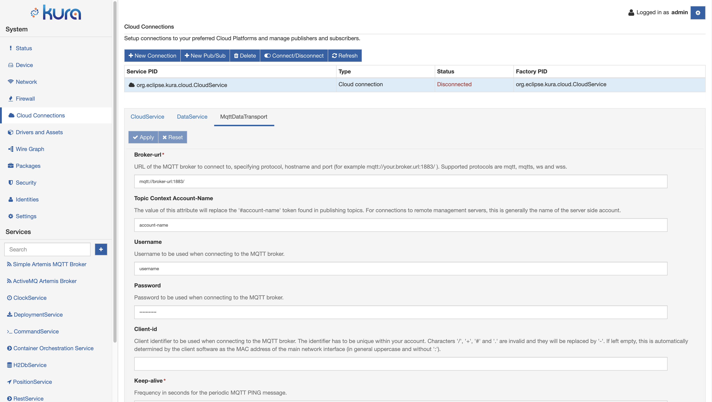

# Data Transport Service Configuration

The **DataTransport** service provides the ability to connect to a remote broker, publish messages, subscribe to topics, receive messages on the subscribed topics, and disconnect from the remote message broker. To use this service, select the **MqttDataTransport** option located in the **Cloud Connections** area as shown in the screen captures below.

The MqttDataTransport service provides the following configuration parameters:

- **broker-url**: defines the URL of the MQTT broker to connect to. For the Everyware Cloud sandbox, this address is either mqtt://broker-sbx.everyware.io:1883/ or mqtts://broker-sbx.everyware.io:8883/ for an encrypted connection. (Required field).

- **topic.context.account-name**: defines the name of the account to which the device belongs.

- **username** and **password**: define the username and password that have been assigned to the device by the account administrator (generally username is account-name_broker). (Required field).

- **client-id**: defines the identifier of the MQTT client representing the device when connecting to the MQTT broker. If left empty, it is automatically determined by the client software as the MAC address of the main network interface (in general numbers and uppercase letters without ':'). This identifier has to be unique within your account.

- **keep-alive**: defines the "keep alive" interval measured in seconds. It specifies the maximum amount of time that should pass without communication between the client and the server. The client will ensure that at least one message travels across the network within each keep alive period. In the absence of a data-related message during this time period, the client will send a very small MQTT "ping" message that the server will acknowledge. The keep alive interval enables the client to detect when the server is no longer available without having to wait for the long TCP/IP timeout. (Required field).

    !!! warning
        The keep-alive interval may "conflict" with the TCP idle timeout set at the TCP/IP level. As a best practice the TCP idle timeout should be at least 1,5 times the keep-alive time interval. If the TCP idle timeout is less or equal the keep-alive, the MQTT connection may be dropped due to the TCP idle timeout expiration.

- **timeout**: sets the timeout used for all interactions with the MQTT broker. (Required field).

- **clean-session**: controls the behavior of both the client and the server at the time of connection and disconnection. When this parameter is set to true, the state information is discarded at connection and disconnection; when set to false, the state information is maintained. (Required field).

- **lwt** parameters: define the MQTT "Last Will and Testament" (LWT) settings for the client. In the event that the client unexpectedly loses its connection to the server, the server publishes the LWT message _(lwt.payload)_ to the LWT topic on behalf of the client. This allows other clients (subscribed to the LWT topic) to be made aware that the client has disconnected. LWT parameters that may be configured include:
    - **lwt.topic**
    - **lwt.payload**
    - **lwt.qos**
    - **lwt.retain**

- **in-flight.persistence**: defines the storage type where in-flight messages are persisted across reconnections. They may be stored in memory, or in a file on the disk. (Required field).

- **protocol-version**: defines the MQTT Protocol version to be used. This value may be 3.1 or 3.1.1.

- **SSL** parameters: define the SSL specific settings for the client. SSL parameters that can be configured include:
    - **ssl.default.protocol**
    - **ssl.hostname.verification**
    - **ssl.default.cipherSuites**
    - **ssl.certificate.alias**