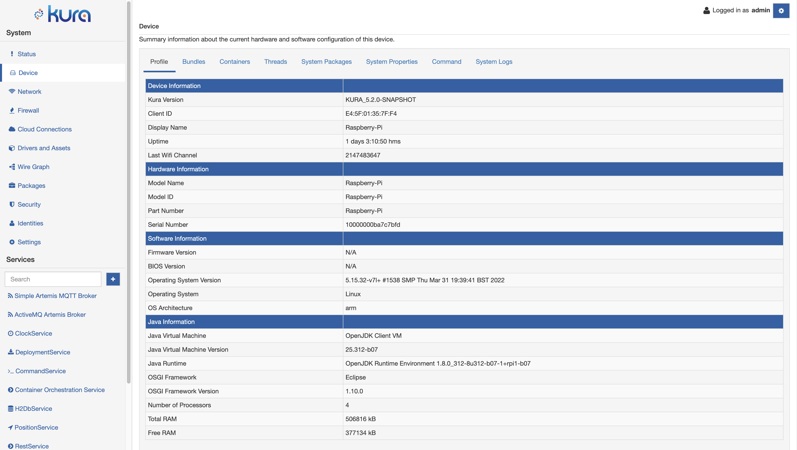
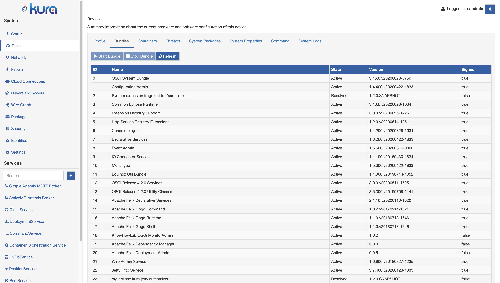
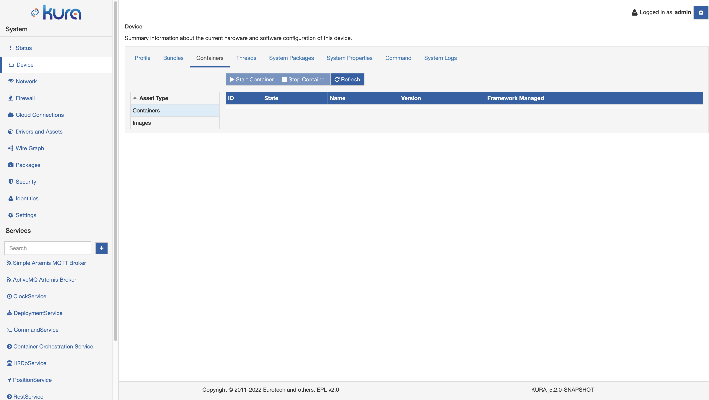
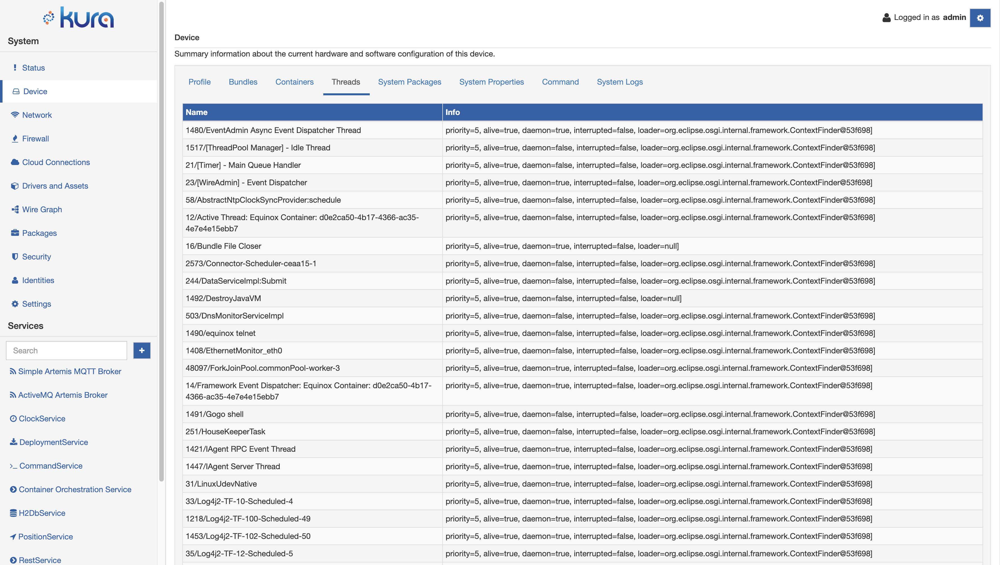
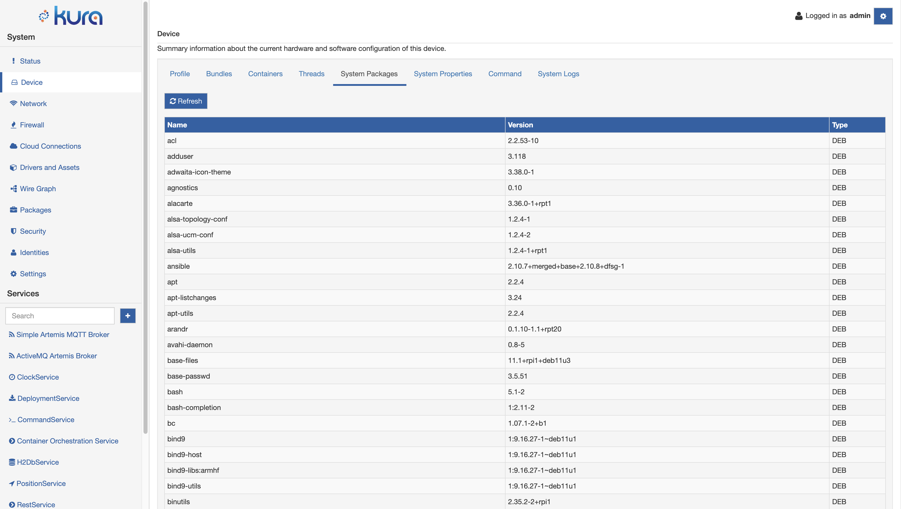
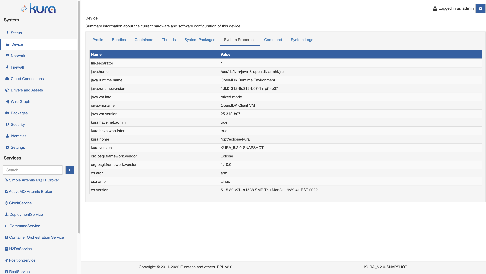
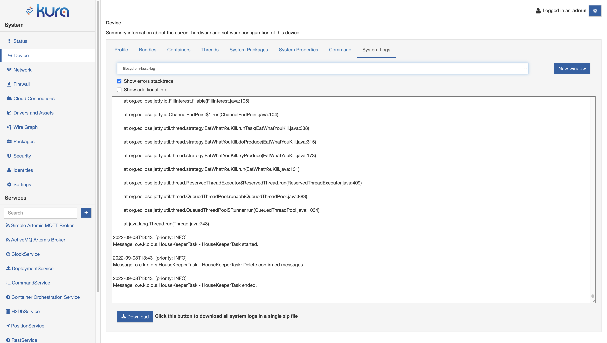

# Device Information

The **Device** section provides several information about the  gateway where ESF is running on. This section can be accessed by selecting the **Device** option located in the **System** area.

## Profile

The **Profile** tab shows several information about the gateway, organized under the Device, Hardware, Software and Java Information.

## Bundles

This tab lists all the bundles installed on Kura, with details about the name, version, id, state and signature status. The signature value will be **true** if the corresponding bundle is signed, **false** otherwise.

The buttons in the upper part of the tab allows the user to manage the listed bundles:

- **Start Bundle**: starts a bundle that is in **Resolved** or **Installed** state;
- **Stop Bundle**: stops a bundle that is in **Active** state;
- **Refresh**: reloads the bundles states list.

## Containers

The **Containers** tab lists the containers and images that are currently managed by the *Container Orchestration Service*. From this tab, the user can start and stop containers and delete images.

## Threads

The **Threads** tab shows a list of the threads that are currently running in the JVM.

## System Packages

The **System Packages** tab shows the list of all the Linux packages installed on the OS. The package is detailed with the name, version and type (DEB/RPM/APK).

## System Properties

The **System Properties** tab shows a list of relevant properties including OS and JVM parameters.

## Command

A detailed description of this tab is presented in the [Command Service](doc:command-service) page.

## System Logs

The **System Logs** tab allows downloading a compressed file containing all the relevant log files from the gateway. The download button creates and downloads a compressed file with the following items:

* all the files in `/var/log` or the content of the folder defined by the **kura.log.download.sources** property;
* the content of the journal for the Kura process (`kura-journal.log`);
* the content of the journal for the whole system (`system-journal.log`).

In addition to this feature, the page also allows the **real-time** displaying of system logs, if the framework has the availability of one or more components that implement the LogProvider API. The UI also provides a useful button to open a new Kura instance in a new browser window. A reference implementation of the LogProvider API is provided in the `org.eclipse.kura.log.filesystem.provider` bundle. This bundle exposes in the framework a factory that can be used to read filesystem files. By default, Eclipse Kura creates two log providers at startup: one that reads from `/var/log/kura.log` and the other that reads from `/var/log/kura-audit.log`.

The collected logs are stored in a cache server-side and are collected from the point in time where the log providers get attached to the UI (usually, from the login or after a refresh of the browser's window). When the section "System Logs" is accessed, the new log entries are polled from the server's cache and stored client-side.