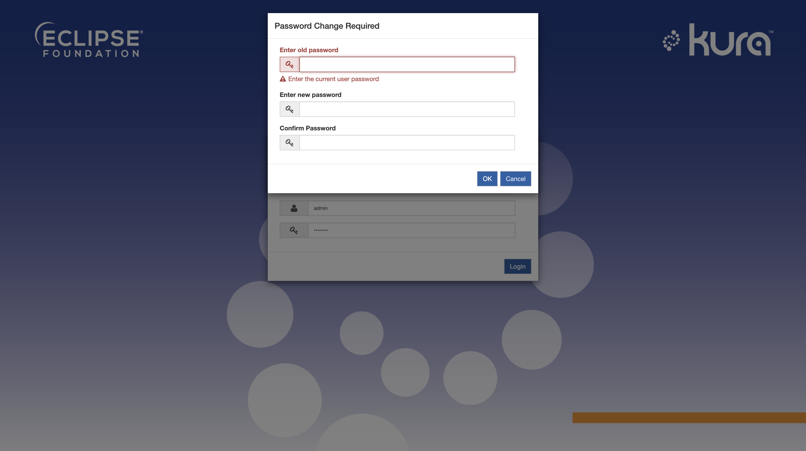
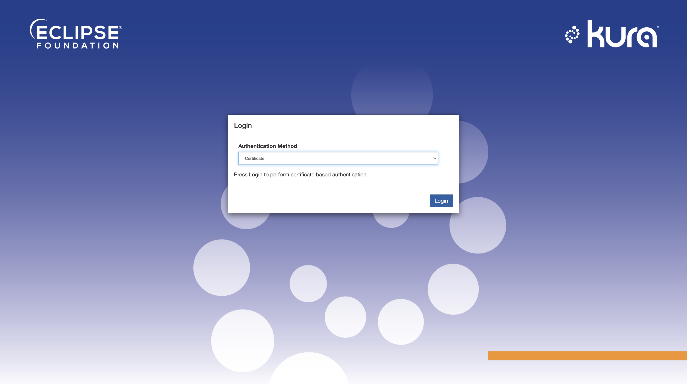
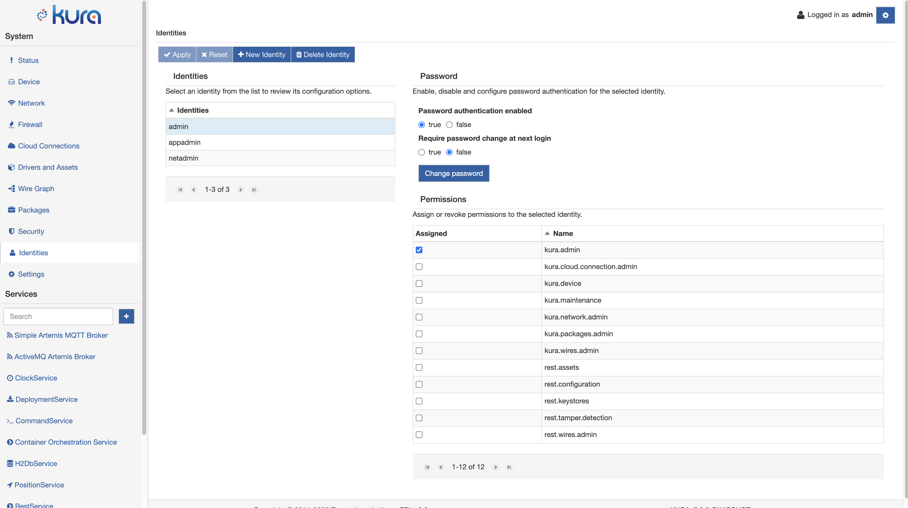

# Gateway Administration Console Authentication

The Gateway Administration Console supports multiple login identities with associated permissions and HTTPS client side authentication with certificates.

The identity and permission configuration and credentials is stored externally the UserAdmin service (see [Authentication and Authorization](doc:authentication-and-authorization) for more details).

## Permissions

The Gateway Administration Console defines the following permissions, that allow to restrict the operations that an identity is allowed to perform:

* **kura.cloud.connection.admin**: Allows to manage cloud connections using **Cloud Connections** tab.
* **kura.packages.admin**: Allows to install deployment packages using the **Packages** tab.
* **kura.device**: Allows to interact with the **Device** and **Status** tabs.
* **kura.network.admin**: Allows to manage network connectivity and firewall configuration using the **Network** and **Firewall** tabs.
* **kura.wires.admin**: Allows to manage Wire Graph and Driver and Asset configurations using the **Wires** and **Drivers and Assets** tabs.
* **kura.admin**: This permission implies all other permissions, including the ones defined by external applications. 

## Default identities

Kura provides the following identities by default:

| Name | Password | Permissions |
| ---- | -------- | ----------- |
| admin | admin | kura.admin |
| appadmin | appadmin | kura.cloud.connection.admin, kura.packages.admin, kura.wires.admin |
| netadmin | netadmin | kura.cloud.connection.admin, kura.device, kura.network.admin |

It is possible to modify/remove the default identity configuration.

## Login

The login screen can be accessed by entering the `https://${device.ip}` URL in a browser window, where `${device.ip}` is the IP address. Replace `https` with `http` if HTTPS support has been disabled on the gateway.

### Identity name and password

In order to login with identity name and password, select **Password** as authentication method and enter the credentials.

!!! note
    **Password** authentication method might not be available if it has been disabled by the administrator using the **Security** -> **Web Console** section.

### Forced password change on login

Kura supports forcing an identity to change the password at login, before accessing the Administration Console. This functionality is enabled by default after a fresh installation. At login the following prompt will appear forcing the user to define a new password.

This functionality can be configured by an admin identity using the **Identities** section of the Administration Console.

The forced password change can also be disabled by editing the `snapshot_0.xml` file removing the `kura.need.password.change` property for the desired identity in the `org.eclipse.kura.internal.useradmin.store.RoleRepositoryStoreImpl` configuration before Kura first boot. If this functionality is enabled, REST API username and password authentication is will be disabled for the specific identity until the password is updated, REST API certificate authentication will still work.

### Certificate authentication

In order to perform HTTPS certificate authentication, select the **Certificate** authentication method and click **Login**, the browser may prompt to select the certificate to use.

!!! note
    **Certificate** authentication method might not be available if no HTTPS with client authentication ports have been configured or if it has been explicitly disabled by the administrator using the **Security** -> **Web Console** section.

## Identity and Permission management

The Gateway Administration Console allows the management of identity and permission configuration in a dedicated view, accessible by navigating to the **Identities** section:

The section above allows to:

### Create new identities

New identities can be created by clicking the **New Identity** button.

### Remove existing identities

Existing identities can be removed by selecting the corresponding entry in the list and pressing the **Delete Identity** button.

### Manage password authentication

Password authentication can be enabled or disabled by changing the **Password authentication enabled** parameter. Changing this parameter will not modify the existing stored password. Enabling password authentication for a new identity requires to define a new password. The password can be set/modified by clicking the **Change password** button.

### Assign or remove permissions

Permissions can be assigned or removed by ticking the corresponding entries in the **Permissions** table. No changes will be applied to the gateway until the **Apply** button is pressed.

## Certificate based authentication

The Gateway Administration Console supports HTTPS certificate based client side authentication.
The authentication process works as follows:

* One or more **Https client certificate** must be added to keystore, this can be done using the [Certificate Management](doc:certificate-management) section.

* The user must provide a certificate or certificate chain signed by one of the CAs added as **Https client certificate**.

* The common name field of the leaf certificate provided by the user must be the name of the identity that should be used for the session.

* HTTPS with certificate based authentication must be enabled in the [HTTP/HTTPS Configuration](doc:httphttps-configuration) section.

Log in with certificate can be performed by selecting the **Certificate** authentication method in Gateway Administration Console login screen or by connecting directly to the HTTPS port with client side authentication specified in gateway configuration.