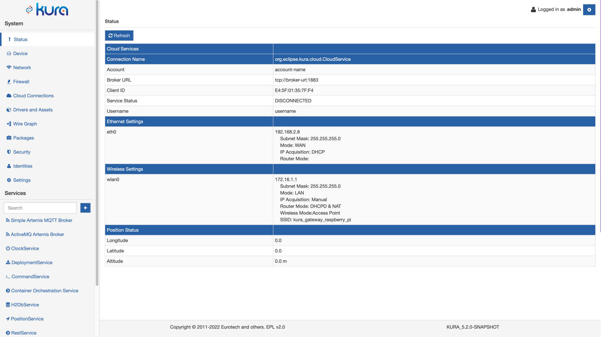
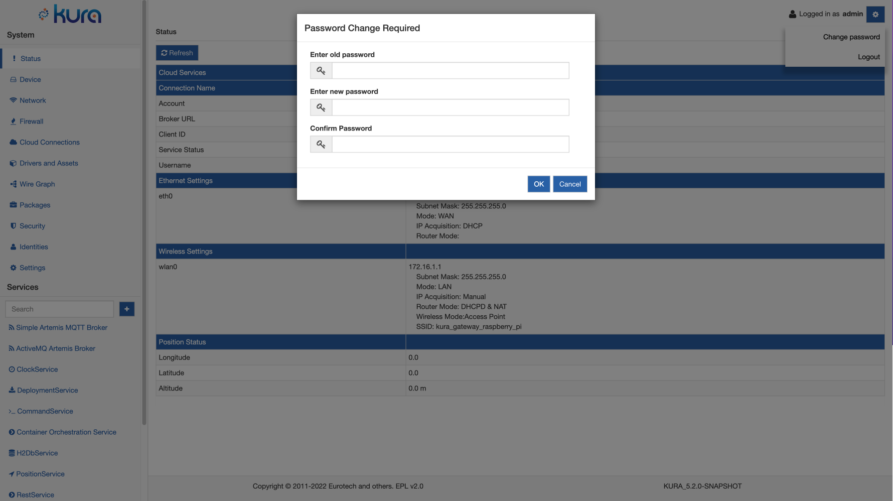
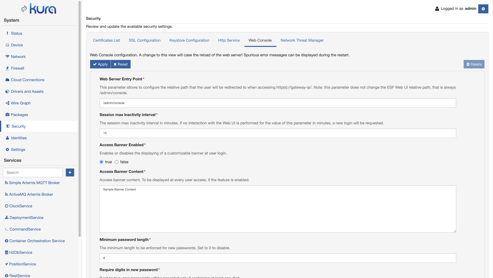

# Gateway Administration Console

## Accessing the Kura Gateway Administration Console
Kura provides a web-based, user interface for the administration and management of your IoT gateway. The Kura Gateway Administration Console enables you to monitor the gateway status, manage the network configuration, and manage the installed application and services. Access to the Kura Gateway Administration Console requires that a unit running Eclipse Kura is reachable via its Ethernet primary interface.

Connections on HTTP port 443 for these interfaces are allowed by default through the built-in firewall. The Kura Gateway Administration Console can be accessed by typing the IP address of the gateway into the browser's URL bar. Once the URL is submitted, the user is required to log in and is then redirected to the Administration Console (e.g., `https://192.168.2.8/admin/console`) shown in the screen capture below. The default login name and password is `admin/admin`.

!!! warning
    It is recommended to change the default password after initial setup and before deployment, as well as limiting access to the Administration Console to a trusted local network interface using appropriate firewall rules.

## Password change

Once logged in, the user can modify its password (recommended after the first login). To access the option, click on the button near the username in the header section. A dropdown menu appears with the logout and the password modification options. When clicking on "Change password", the following dialog will appear:

After confirming the changes, the user will be logged out.

## Accessing the Kura Gateway Administration Console over a Cellular Link

In order to connect to the Gateway Administration Console via a cellular interface, the following requirements must be met:

- The service plan must allow for a static, public IP address to be assigned to the cellular interface.
- The used ports must not be blocked by the provider.
- The user must add **Open Port** entries for the cellular interface. This may be done either through the **Firewall** tab.

If some of the used ports are blocked by the service provider, there is an option to reconfigure the gateway to use another port (i.e., 8080). In order to do so, the following requirements must be met:

- The **HttpService** configuration must be changed to use the new ports.
- The new ports must be open in the firewall for all network interfaces.

## HTTPS related warnings

Most browsers will probably warn the user that the connection is not secure when Gateway Administration Console is accessed using HTTPS.

In order to remove the warning, the browser must be able to verify the identity of the gateway as an HTTPS server. The verification process will fail with default server certificate provided by Kura because it is self-signed and it is not suitable for hostname verification.

Fixing this might require to configure the browser to trust the certificate provided by the gateway and/or using a server certificate signed by a CA trusted by the browser and assigning a DNS name to the gateway in order to pass hostname verification.

## System Use Notification Banner

For security reasons, it may be needed to display to the user a banner that describes the intended system use before authenticating. The system use notification message is customisable by authorised personnel in the **Security** section of the Kura Web UI, in the **Web Console** tab.

