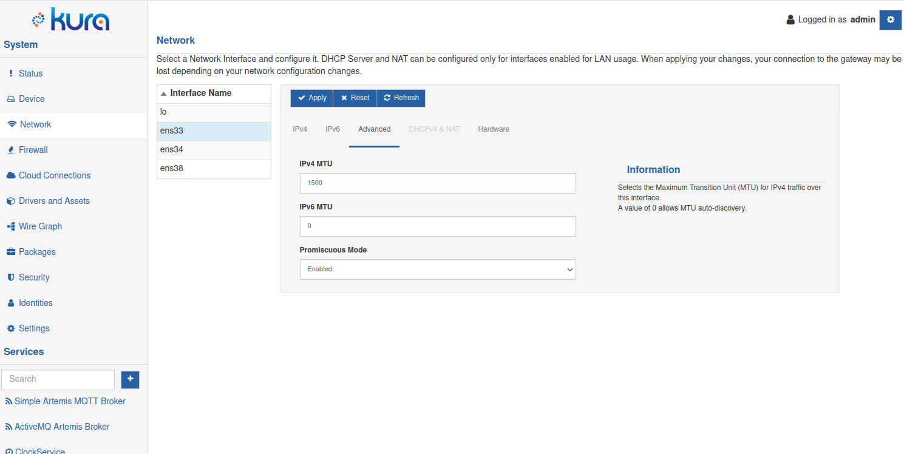

# Advanced Network Settings

For devices using Kura built on a Generic Profile, it is possible to to fine tune network traffic settings. Take a look at our [installer profiles](../getting-started/install-kura.md#installer-types) to know which are supported.

The Advanced configuration tab is designed for users who seek a higher level of control and customization over their network experience. Whether you are an IT professional, network administrator, or enthusiast looking to fine-tune specific aspects of your network, this tab provides access to advanced parameters like Maximum Transmission Unit (MTU) and Promiscuous Mode. Adjusting these settings allows for optimized performance in unique network environments, troubleshooting capabilities, and enhanced security monitoring. Please exercise caution when modifying these settings, ensuring that you have a clear understanding of their implications on your network's behavior.

!!! tip
    Some parameters requires a minimum version of NetworkManager, as described below and in Kura UI. The [System Component Inventory](../administration/system-component-inventory.md) can be used to check what version is available on your device.
    
The Advanced tab allow configuration of:

- **MTU (Maximum Transmission Unit)**
    - MTU determines the maximum size of data packets transmitted over your network. While most users can leave this at the default setting, adjusting the MTU may be necessary for optimizing performance in specialized environments or overcoming network constraints.
    - Use Case: Modify MTU if you encounter issues related to packet size, especially in scenarios involving VPNs, specific network equipment, or other unique requirements.
- **Promiscuous Mode**
    - Promiscuous mode is a specialized network mode where your device captures and analyzes all network packets, regardless of their destination. This is particularly useful for network monitoring, troubleshooting, and security analysis.
    - Use Case: Enable promiscuous mode when you need to closely inspect network traffic, diagnose connectivity issues, or enhance your device's capabilities for security monitoring.
	
## Advanced Configuration

The **Advanced** tab contains the following configuration parameters:

- **IPv4 MTU** - defines the Maximum Trasmission unit for IPv4 traffic on the selected interface, a value of 0 or empty delegates the MTU definition to the link layer.
- **IPv6 MTU** - defines the Maximum Trasmission unit for IPv6 traffic on the selected interface, a value of 0 or empty delegates the MTU definition to the link layer. Requires NetworkManager 1.40 or above.

!!! warning
    The MTU value for a VLAN is limited by the configured MTU of its parent interface as an upper bound.
    
- **Promiscuous Mode** - enable promiscuous mode for the selected interface; Requires NetworkManager 1.32 or above.
    - System default - This delegates to the underlying OS setting. In most cases the system default equates to _Disabled_
    - Enabled
    - Disabled
