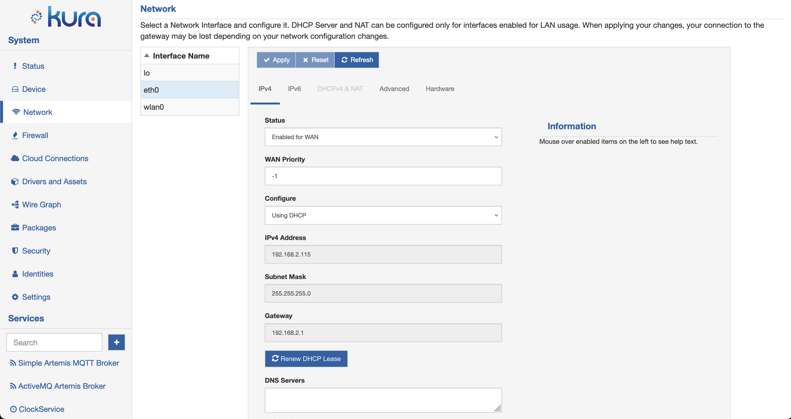
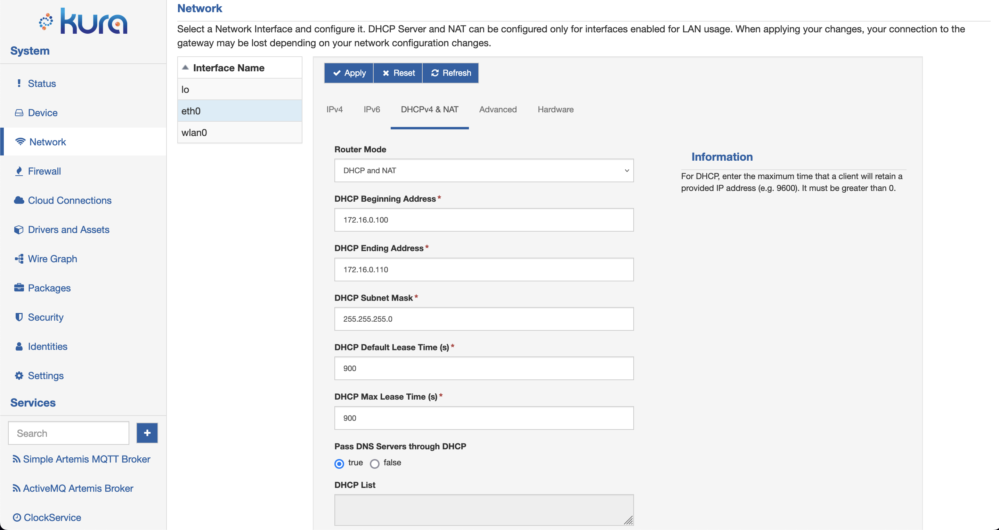

# Network Configuration

To configure the gateway network interfaces using the Gateway Administration Console, select the **Network** option located in the **System** area. With this option selected, the **Network** display appears with a list of available interfaces. Configuration tabs for the selected interface appear on the right side of the screen. By default, the loopback (lo) interface is selected when the network interfaces are displayed. Choose the desired network interface (e.g., eth0, eth1, wlan0, ppp0) and apply the necessary configuration changes using the tabs on the right. Submit the modified configuration by clicking the **Apply** button.

In case of typing errors, the **Reset** button can be used to reload the prior configuration on the screen.
Since the network configuration shown on the screen may not be synchronized with the current state of the system, it can be updated pressing the **Refresh** button. This can be used also to force the reload of specific parameters like the RSSI or dynamic IP addresses. The refresh procedure reads all the needed parameters from the system and can take several seconds before updating.

!!! tip
    It is recommended that the **IPv4** or **IPv6** tab is configured first since it defines how the interface is going to be used.

## TCP/IP Configuration

The **IPv4** and **IPv6** tabs contain the following configuration parameters:

- **Status**
    - Disabled: disables the selected interface (i.e., administratively down).
    - Enabled for LAN: designates the interface for a local network. It can be set as a DHCP server for hosts on the local network and can serve as a default gateway for those hosts; however, it cannot be set as an actual gateway interface for this device. That is, packets must be routed from this interface to another interface that is configured as WAN. The interface is automatically brought up at boot.
    - Enabled for WAN: designates the interface as a gateway to an external network. The interface is automatically brought up at boot.
    - Not Managed: the interface will be ignored by Kura (available only for **IPv4**).
    - Layer 2 Only: only the Layer 2 portion of the interface will be configured. The interface is automatically brought up at boot (available only for **IPv4**).
- **WAN Priority** - configure the network failover. See [here](network-failover.md) for more details.
- **Configure**
    - Manually: allows manual entry of the _IP Address_ and _Netmask_ fields, if the interface is configured as LAN; allows manual entry of the _IP Address_, _Netmask_, _Gateway_, and _DNS Servers_ fields, if the interface is designated as WAN.
    - Using DHCP/DHCPv6: configures the interface as a DHCP client obtaining the IP address from a network DHCP server.
    - Stateless Address Auto-Configuration (SLAAC): automatically assign an IP address (available only for **IPv6**).
- **Address Generation Mode** - defines the method used to automatically generate the IP address with SLAAC (available only for **IPv6**)
    - EUI64: use EUI-64 method for address generation
    - Stable-privacy: use RFC7217 method for address generation
- **IP Address** - defines the IP address of the interface, if manually configured.
- **Subnet Mask** - defines the subnet mask of the interface, if manually configured.
- **Gateway** - specifies the default gateway for the unit. (Required field if the interface is designated as WAN and manually configured.)
- **DNS Servers** - provides a list of DNS servers, if the interface is designated as WAN and is manually configured.
- **Privacy** - configure privacy extension for SLAAC (available only for **IPv6**).
    - Disabled: disables the privacy extension.
    - Prefer public addresses: use public address for outgoing traffic.
    - Prefer temporary addresses: prefer temporary address for outgoing traffic.

If the network interface is configured as *Enabled for LAN* and manually configured (i.e., not a DHCP client) in the **IPV4** tab, the **DHCPv4 & NAT** tab allows the DHCP server to be configured and/or NAT (IP forwarding with masquerading) to be enabled.

### More details about the Not Managed interface Status - (TBD: not applicable in NM)

When a network interface is configured as **Not Managed**, Kura will ignore it and the configuration will not be touched. The user can configure the interface with the network tools provided by the OS, allowing unusual network setups.

Regarding DNS, both Kura and the external tools store the DNS addresses in the `/etc/resolv.conf` file. So, if multiple interfaces are configured to get the DNS information and store it in the same file, the device can be misconfigured. To avoid that, the following table presents who is responsible to update the DNS file depending on the network interfaces configurations.

| Is there at least an interface set as `WAN`? | Is there at least one interface set as `Not Managed`? | Does Kura manage resolv.conf? |
| ------------------ | ------------------------- | ----------------------------- |
| NO                 | NO                        | **YES**                           |
| NO                 | YES                       | **NO**                            |
| YES                | NO                        | **YES**                           |
| YES                | YES                       | **YES**                           |

So, the only way to configure the DNS addresses with external tools, is to configure at least one interface as **Not Managed** and not to set any interface as **Enabled For Wan** using Kura. If at least one WAN interface is configured by Kura, it will take the control of the `/etc/resolv.conf/` file. Finally, if any interface is configured in **Enabled For Wan** or **Not Managed** mode, Kura will empty the file.

To avoid device misconfigurations when **Not Managed** interfaces are used, **don't** use the _dns-nameservers_ directive in the `/etc/network/interfaces` file. Please add the DNS addresses directly to the `/etc/resolv.conf` file.



## DHCPv4 & NAT Configuration

The **DHCPv4 & NAT** tab contains the following configuration parameters:

- **Router Mode**
    - DHCP and NAT: indicates that both DHCP server and NAT are enabled.
    - DHCP Only: indicates that DHCP server is enabled and NAT is disabled.
    - NAT Only: indicates that NAT is enabled and DHCP server is disabled.
    - Off: indicates that both DHCP server and NAT are disabled.
- **DHCP Beginning Address**: specifies the first address of DHCP pool (i.e., first available client IP address).
- **DHCP Ending Address**: specifies the last address of DHCP pool (i.e., last IP address that can be assigned to a client).
- **DHCP Subnet Mask**: defines the subnet mask that is assigned to a client.
- **DHCP Default Lease Time**: sets the default time (in minutes) that the client retains the provided IP address. It must be greater than 0.
- **DHCP Max Lease Time**: sets the maximum time (in minutes) that the client retains the provided IP address. It must be greater than 0.
- **Pass DNS Servers through DHCP**: enables DNS Proxy (i.e., passing DNS servers through DHCP).

If NAT is enabled and there is another interface designated as WAN (e.g., ppp0), the following iptables rules are added to the *custom automatic NAT service rules* section of the `/etc/init.d/firewall` script:

```shell
# custom automatic NAT service rules (if NAT option is enabled for LAN interface)
iptables -t nat -A POSTROUTING -o ppp0 -j MASQUERADE
iptables -A FORWARD -i ppp0 -o eth0 -m state --state RELATED,ESTABLISHED -j ACCEPT
iptables -A FORWARD -i eth0 -o ppp0 -j ACCEPT
```

Also, IP forwarding is enabled in the kernel as follows:

```shell
# allow fowarding if any masquerade is defined
echo 1 > /proc/sys/net/ipv4/ip_forward
```

The rules shown above create an *Overloaded* (i.e., many-to-one) NAT. This type of network address translation maps multiple IP addresses on the LAN side to a single IP address on the WAN side, allowing internet access from hosts on a local network via a gateway (WAN) interface. Note that for NAT rules to be added, it is insufficient to enable NATing through the **DHCPv4 & NAT** tab of the LAN interface; there must also be another interface designated as WAN.



## Network Linux Configuration

When applying a new network configuration, Kura changes the configuration files of the Linux networking subsystem. Please read the following note before proceeding with manual changes of the Linux networking configuration.

!!! warning
    It is **NOT** recommended performing manual editing of the Linux networking configuration files when the gateway configuration is being managed through Kura. While Linux may correctly accept manual changes, Kura may not be able to interpret the new configuration resulting in an inconsistent state.

## Network Configuration properties

The Network configuration can be modified using the Kura Gateway Administration Console, as described above, the [Configuration Service](doc:configuration-service) or appling a proper [snapshot](doc:snapshot-management).

The following table describes all the properties related to the Network Configuration. It includes the name of the property, the type, a description and the default value (if applicable). The network configuration pid is `org.eclipse.kura.net.admin.NetworkConfigurationService`.

### Common properties

Name                                             | Type     | Description                                                                                      | Default value
-------------------------------------------------|----------|--------------------------------------------------------------------------------------------------|-----------------------
`net.interfaces`                                 | String   | Comma-separated list of the interface names in the device                                        |
`net.interface.<interface>.type`                 | String	| The type of the network interface; possible values are: `ETHERNET`, `WIFI`, `MODEM`, `VLAN`, `LOOPBACK` and `UNKNOWN` | `UNKNOWN`
`net.interface.<interface>.config.wifi.mode`     | String   | For wifi interfaces, specify the modality; possible values are `INFRA`, `MASTER` and `UNKNOWN`   | `UNKNOWN`
`net.interface.<interface>.config.nat.enabled`   | Boolean  | Enable the NAT feature                                                                           | false
`net.interface.<interface>.config.promisc`       | Integer  | Enable the Promiscuous Mode; possible values are: -1 (System default), 0 (Disabled), 1 (Enabled) | -1

### IPv4 properties

Name                                                | Type     | Description                              | Default value
----------------------------------------------------|----------|------------------------------------------|----------------------------
`net.interface.<interface>.config.ip4.status`	    | String   | The status of the interface for the IPv4 configuration; possibile values are: `netIPv4StatusDisabled`, `netIPv4StatusUnmanaged`, `netIPv4StatusL2Only`, `netIPv4StatusEnabledLAN`, `netIPv4StatusEnabledWAN`, `netIPv4StatusUnknown` | `netIPv4StatusDisabled` (see note below)
`net.interface.<interface>.config.ip4.wan.priority` | Integer  | (NetworkManager only) Priority used to determine which interface select as primary WAN. Allowed values range from -1 to 2147483647, inclusive. See [Network Failover](./network-failover.md) for further details | -1
`net.interface.<interface>.config.ip4.address`      | String   | The IPv4 address assigned to the network interface |
`net.interface.<interface>.config.ip4.prefix`	    | Short    | The IPv4 netmask assigned to the network interface | -1
`net.interface.<interface>.config.ip4.gateway`      | String   | The IPv4 address of the default gateway |
`net.interface.<interface>.config.ip4.dnsServers`	| String   | Comma-separated list of dns servers |
`net.interface.<interface>.config.ip4.mtu`	        | Integer  | The Maximum Transition Unit (MTU) for this interface

!!! note
    For physical interfaces the default status is `netIPv4StatusDisabled`. For virtual ones, instead, the default status is defined by the `kura.net.virtual.devices.config` property in the `kura.properties` file.

### IPv4 DHCP Server properties

Name                                                              | Type    | Description                                | Default value
------------------------------------------------------------------|---------|--------------------------------------------|----------------------------------
`net.interface.<interface>.config.dhcpServer4.enabled`          | Boolean	| Specify if the DHCP server is enabled      | false
`net.interface.<interface>.config.dhcpServer4.rangeStart`       | String	| First IP address available for clients     |
`net.interface.<interface>.config.dhcpServer4.rangeEnd`         | String	| Last IP address available for clients      |
`net.interface.<interface>.config.dhcpServer4.defaultLeaseTime` | Integer	| The default lease time                     | -1
`net.interface.<interface>.config.dhcpServer4.maxLeaseTime`     | Integer	| The maximum lease time                     | -1
`net.interface.<interface>.config.dhcpServer4.prefix`           | Short	    | The netmask for the available IP addresses | -1
`net.interface.<interface>.config.dhcpServer4.passDns`          | Boolean	| Specify if the DNS server addresses has to be passed through DHCP | false

### IPv4 DHCP Client properties

Name                                                     | Type     | Description                              | Default value
---------------------------------------------------------|----------|------------------------------------------|------------------
`net.interface.<interface>.config.dhcpClient4.enabled` | Boolean	| Specify if the DHCP client is enabled    | false

### IPv6 properties

Name                                                  | Type     | Description                              | Default value
------------------------------------------------------|----------|------------------------------------------|----------------------------
`net.interface.<interface>.config.ip6.status`	      | String   | The status of the interface for the IPv6 configuration; possibile values are: `netIPv6StatusDisabled`, `netIPv6StatusUnmanaged`, `netIPv6StatusL2Only`, `netIPv6StatusEnabledLAN`, `netIPv6StatusEnabledWAN`, `netIPv6StatusUnknown` | `netIPv6StatusDisabled` (see note below)
`net.interface.<interface>.config.ip6.wan.priority`   | Integer | (NetworkManager only) Priority used to determine which interface select as primary WAN. Allowed values range from -1 to 2147483647, inclusive. See [Network Failover](./network-failover.md) for further details | -1
`net.interface.<interface>.config.ip6.address.method` | String   | The IPv6 configuration method; possible values are: `AUTO`, `DHCP`, `MANUAL`. | `AUTO`
`net.interface.<interface>.config.ip6.address`        | String   | The IPv6 address assigned to the network interface |
`net.interface.<interface>.config.ip6.prefix`	      | Short    | The IPv6 netmask assigned to the network interface | -1
`net.interface.<interface>.config.ip6.gateway`        | String   | The IPv6 address of the default gateway |
`net.interface.<interface>.config.ip6.dnsServers`	  | String   | Comma-separated list of dns servers |
`net.interface.<interface>.config.ip6.addr.gen.mode`  | String   | The IPv6 address generation mode; possible values are `EUI64`, `STABLE_PRIVACY` | 
`net.interface.<interface>.config.ip6.privacy`        | String   | The IPv6 Privacy Extensions for SLAAC; possible values are `DISABLED`, `ENABLED_PUBLIC_ADD`, `ENABLED_TEMP_ADD` |
`net.interface.<interface>.config.ip6.mtu`	          | Integer  | The Maximum Transition Unit (MTU) for Ipv6 traffic on this interface. Requires NetworkManager 1.40 or newer |

!!! note
    For physical interfaces the default status is `netIPv6StatusDisabled`. For virtual ones, instead, the default status is defined by the `kura.net.virtual.devices.config` property in the `kura.properties` file.

### WiFi Master (Access Point) properties

Name                                                             | Type     | Description                   | Default value
---------------------------------------------------|-------------|------------------------------------------|--------------------------------
`net.interface.<interface>.config.wifi.master.driver`	         | String	| The driver used for the connection |
`net.interface.<interface>.config.wifi.master.passphrase`	     | Password	| The password for the access point |
`net.interface.<interface>.config.wifi.master.ssid`	             | String	| The SSID of the access point |
`net.interface.<interface>.config.wifi.master.securityType`      | String	| The security protocol for the wireless network; possible values are `SECURITY_NONE`, `SECURITY_WEP`, `SECURITY_WPA`, `SECURITY_WPA2`, `SECURITY_WPA_WPA2` | `SECURITY_NONE`
`net.interface.<interface>.config.wifi.master.mode`	             | String	| The mode of the wireless connection; for the access point mode set it to `MASTER` | `MASTER`
`net.interface.<interface>.config.wifi.master.channel`	         | String	| The channel to be used for the access point | 1
`net.interface.<interface>.config.wifi.master.radioMode`	     | String	| Specify the 802.11 radio mode; possible values are `RADIO_MODE_80211a`, `RADIO_MODE_80211b`, `RADIO_MODE_80211g`, `RADIO_MODE_80211nHT20`, `RADIO_MODE_80211_AC` | `RADIO_MODE_80211b`
`net.interface.<interface>.config.wifi.master.ignoreSSID`	     | Boolean	| Specify if the SSID broadcast is ignored | false
`net.interface.<interface>.config.wifi.master.groupCiphers`      | String   | Group ciphers i.e. group/broadcast encryption algorithms which prevents connections to Wi-Fi networks that do not utilize one of the algorithms set, possible values are `CCMP`, `TKIP`, and `CCMP_TKIP` | `CCMP_TKIP`
`net.interface.<interface>.config.wifi.master.pairwiseCiphers`   | String   | Pairwise ciphers i.e. pairwise encryption algorithms which prevents connections to Wi-Fi networks that do not utilize one of the algorithms set, possible values are `CCMP`, `TKIP`, and `CCMP_TKIP` | `CCMP_TKIP`

### WiFi Infra (Station Mode) properties

Name                                                             | Type      | Description                              | Default value
-----------------------------------------------------------------|-----------|------------------------------------------|--------------------------------
`net.interface.<interface>.config.wifi.infra.ssid`	             | String	 | The SSID of the wireless network to connect to |
`net.interface.<interface>.config.wifi.infra.channel`	         | String	 | The channel of the wireless network to connect to | 1
`net.interface.<interface>.config.wifi.infra.bgscan`	         | String	 | Set the background scans; possible values have the form `<mode>:<shortInterval>:<rssiThreshold>:<longInterval>` where `mode` (String) is one of NONE, SIMPLE, or LEARN, `shortInterval` (Integer) sets the Bgscan short interval (secs), `rssiThreshold` (Integer) sets the Bgscan Signal strength threshold (dBm), and `longInterval` (Integer) sets the Bgscan long interval (secs) | 
`net.interface.<interface>.config.wifi.infra.passphrase`	     | Password	 | The password for the wireless network |
`net.interface.<interface>.config.wifi.infra.ignoreSSID`	     | Boolean	 | Specify if a scan for SSID is required before attempting to associate | false
`net.interface.<interface>.config.wifi.infra.mode`	             | String	 | The mode of the wireless connection; for station mode set to `INFRA` | `INFRA`
`net.interface.<interface>.config.wifi.infra.pingAccessPoint`	 | Boolean	 | Enable pinging the access point after connection is established | false
`net.interface.<interface>.config.wifi.infra.driver`	         | String	 | The driver used for the connection | 
`net.interface.<interface>.config.wifi.infra.securityType`       | String	 | The security protocol for the wireless network; possible values are `SECURITY_NONE`, `SECURITY_WEP`, `SECURITY_WPA`, `SECURITY_WPA2`, `SECURITY_WPA_WPA2` | `SECURITY_NONE`
`net.interface.<interface>.config.wifi.infra.groupCiphers`       | String    | Group ciphers i.e. group/broadcast encryption algorithms which prevents connections to Wi-Fi networks that do not utilize one of the algorithms set, possible values are `CCMP`, `TKIP`, and `CCMP_TKIP` | `CCMP_TKIP`
`net.interface.<interface>.config.wifi.infra.pairwiseCiphers`    | String    | Pairwise ciphers i.e. pairwise encryption algorithms which prevents connections to Wi-Fi networks that do not utilize one of the algorithms set, possible values are `CCMP`, `TKIP`, and `CCMP_TKIP` | `CCMP_TKIP`

### Cellular Modem properties

Name                                                  | Type     | Description                                                            | Default value
------------------------------------------------------|----------|------------------------------------------------------------------------|-----------------------------
`net.interface.<interface>.config.enabled`	          | Boolean  | Enable the interface                                                   | false
`net.interface.<interface>.config.idle`               | Integer  | The idle option of the PPP daemon                                      | 95
`net.interface.<interface>.config.username`           | String   | The username used for the connection                                   |
`net.interface.<interface>.config.password`           | Password | The password used for the connection                                   |
`net.interface.<interface>.config.pdpType`            | String   | The PdP type; possible values are IP, PPP and IPv6                     | IP
`net.interface.<interface>.config.maxFail`            | Integer  | The maxfail option of the PPP daemon                                   | 5
`net.interface.<interface>.config.authType`           | String   | The authentication type; possible values are `NONE`, `AUTO`, `CHAP` and `PAP`  | `NONE`
`net.interface.<interface>.config.lpcEchoInterval`    | Integer  | The lcp-echo-interval option of the PPP daemon                         | 0
`net.interface.<interface>.config.activeFilter`       | String   | The active-filter option of the PPP daemon                             | inbound
`net.interface.<interface>.config.lpcEchoFailure`     | Integer  | The lcp-echo-failure option of the PPP daemon                          | 0
`net.interface.<interface>.config.diversityEnabled`   | Boolean  | Enable the LTE diversity antenna                                       | false
`net.interface.<interface>.config.resetTimeout`       | Integer  | The modem reset timeout in minutes                                     | 5
`net.interface.<interface>.config.gpsEnabled`         | Boolean  | Enable the GPS device in the modem if available                        | false
`net.interface.<interface>.config.persist`            | Boolean  | The persist option of the PPP daemon                                   | true
`net.interface.<interface>.config.apn`                | String   | The modem Access Point Name                                            |
`net.interface.<interface>.config.dialString`         | String   | The dial string used for connecting to the APN                         |
`net.interface.<interface>.config.holdoff`            | Integer  | The holdoff option of the PPP daemon (in seconds)                      | 1
`net.interface.<interface>.config.pppNum`             | Integer  | Assigned ppp interface number                                          | 0

### VLAN properties

Name                                                  | Type     | Description                              | Default value
------------------------------------------------------|----------|------------------------------------------|-------------------------
`net.interface.<interface>.config.vlan.parent`        | String   | Physical interface Vlan is bound to | 
`net.interface.<interface>.config.vlan.id`            | Integer  | Vlan tag identifier, between 0 and 4094 | 
`net.interface.<interface>.config.vlan.ingress`       | String   | Incoming traffic priorities in the format from:to, as comma separated pairs of unsigned integers (Optional) |
`net.interface.<interface>.config.vlan.egress`        | String   | Outgoing traffic priorities in the format from:to, as comma separated pairs of unsigned integer (Optional) |
`net.interface.<interface>.config.vlan.flags`         | String   | Configuration flags, between 0 and 15 (Optional) | 1

### 802.1x properties

Name                                                         | Type     | Description
-------------------------------------------------------------|----------|------------------------------------------
`net.interface.<interface>.config.802-1x.eap`                | String   | The EAP method to be used when authenticating to the network with 802.1x. Supported methods: "_Kura8021xEapTls_", "_Kura8021xEapPeap_", "_Kura8021xEapTtls_".
`net.interface.<interface>.config.802-1x.innerAuth`          | String   | Specifies the "phase 2" inner authentication method when an EAP method that uses an inner TLS tunnel is specified in the "eap" property. Supported methods: "_Kura8021xInnerAuthNone_", "_Kura8021xInnerAuthMschapv2_".
`net.interface.<interface>.config.802-1x.identity`           | String   | Identity string for EAP authentication methods. Typically the user's user or login name.
`net.interface.<interface>.config.802-1x.password`           | String   | Password used for EAP authentication methods.
`net.interface.<interface>.config.802-1x.client-cert-name`   | String   | Name referring to the corresponding Kura keystore entry containing the client certificate if used by the EAP method specified in the "eap" property. Typically is set to the same name as the `net.interface.<interface>.config.802-1x.private-key-name` when using EAP-TLS.
`net.interface.<interface>.config.802-1x.private-key-name`   | String   | Name referring to the corresponding Kura keystore entry containing the private key when the "eap" property is set to "Kura8021xEapTls". Typically is set to the same name as the `net.interface.<interface>.config.802-1x.client-cert-name`.
`net.interface.<interface>.config.802-1x.ca-cert-name`       | String   | Name referring to the corresponding Kura keystore entry containing the CA certificate if used by the EAP method specified in the "eap" property. This parameter is optional but this allows man-in-the-middle attacks and is **NOT recommended**.
`net.interface.<interface>.config.802-1x.anonymous-identity` | String   | Anonymous identity string for EAP authentication methods. Used as the unencrypted identity with EAP types that support different tunneled identity like EAP-TTLS (Optional)

## Network Configuration recipes

This section presents some snapshot examples to perform basic operations on networking. The snippets can be modified adapting them to the required configuration (i.e. changing the interface name in the property to be applied).

!!! warning
    Be aware that an inconsitent or wrong configuration can compromise the network functionality of the gateway. Try the new configuration on a test device before appling it in a production environment!

    Moreover, if a property is not present in the new snapshot, the old value is used for the configuration. So, the best practice is to set all the needed properties in the snapshot.

### Disable a network interface

```xml
<?xml version="1.0" encoding="UTF-8"?>
<esf:configurations xmlns:esf="http://eurotech.com/esf/2.0" xmlns:ocd="http://www.osgi.org/xmlns/metatype/v1.2.0">
    <esf:configuration pid="org.eclipse.kura.net.admin.NetworkConfigurationService">
        <esf:properties>
            <esf:property array="false" encrypted="false" name="net.interface.enp5s0.type" type="String">
                <esf:value>ETHERNET</esf:value>
            </esf:property>
            <esf:property array="false" encrypted="false" name="net.interface.enp5s0.config.ip4.status" type="String">
                <esf:value>netIPv4StatusDisabled</esf:value>
            </esf:property>
        </esf:properties>
    </esf:configuration>
</esf:configurations>
```

### Configure an ethernet interface for WAN with DHCP client enabled and custom DNS server

```xml
<?xml version="1.0" encoding="UTF-8"?>
<esf:configurations xmlns:esf="http://eurotech.com/esf/2.0" xmlns:ocd="http://www.osgi.org/xmlns/metatype/v1.2.0">
    <esf:configuration pid="org.eclipse.kura.net.admin.NetworkConfigurationService">
        <esf:properties>
            <esf:property array="false" encrypted="false" name="net.interface.enp5s0.type" type="String">
                <esf:value>ETHERNET</esf:value>
            </esf:property>
            <esf:property array="false" encrypted="false" name="net.interface.enp5s0.config.ip4.dnsServers" type="String">
                <esf:value>1.2.3.4</esf:value>
            </esf:property>
            <esf:property array="false" encrypted="false" name="net.interface.enp5s0.config.dhcpClient4.enabled" type="Boolean">
                <esf:value>true</esf:value>
            </esf:property>
            <esf:property array="false" encrypted="false" name="net.interface.enp5s0.config.dhcpServer4.enabled" type="Boolean">
                <esf:value>false</esf:value>
            </esf:property>
            <esf:property array="false" encrypted="false" name="net.interface.enp5s0.config.ip4.status" type="String">
                <esf:value>netIPv4StatusEnabledWAN</esf:value>
            </esf:property>
        </esf:properties>
    </esf:configuration>
</esf:configurations>
```

### Configure an ethernet interface for LAN with DHCP server enabled and NAT disabled

```xml
<?xml version="1.0" encoding="UTF-8"?>
<esf:configurations xmlns:esf="http://eurotech.com/esf/2.0" xmlns:ocd="http://www.osgi.org/xmlns/metatype/v1.2.0">
    <esf:configuration pid="org.eclipse.kura.net.admin.NetworkConfigurationService">
        <esf:properties>
            <esf:property array="false" encrypted="false" name="net.interface.enp5s0.type" type="String">
                <esf:value>ETHERNET</esf:value>
            </esf:property>
            <esf:property array="false" encrypted="false" name="net.interface.enp5s0.config.ip4.dnsServers" type="String">
                <esf:value/>
            </esf:property>
            <esf:property array="false" encrypted="false" name="net.interface.enp5s0.config.dhcpClient4.enabled" type="Boolean">
                <esf:value>false</esf:value>
            </esf:property>
            <esf:property array="false" encrypted="false" name="net.interface.enp5s0.config.ip4.status" type="String">
                <esf:value>netIPv4StatusEnabledLAN</esf:value>
            </esf:property>
            <esf:property array="false" encrypted="false" name="net.interface.enp5s0.config.dhcpServer4.rangeEnd" type="String">
                <esf:value>192.168.4.110</esf:value>
            </esf:property>
            <esf:property array="false" encrypted="false" name="net.interface.enp5s0.config.dhcpServer4.enabled" type="Boolean">
                <esf:value>true</esf:value>
            </esf:property>
            <esf:property array="false" encrypted="false" name="net.interface.enp5s0.config.dhcpServer4.defaultLeaseTime" type="Integer">
                <esf:value>900</esf:value>
            </esf:property>
            <esf:property array="false" encrypted="false" name="net.interface.enp5s0.config.dhcpServer4.prefix" type="Short">
                <esf:value>24</esf:value>
            </esf:property>
            <esf:property array="false" encrypted="false" name="net.interface.enp5s0.config.dhcpServer4.passDns" type="Boolean">
                <esf:value>true</esf:value>
            </esf:property>
            <esf:property array="false" encrypted="false" name="net.interface.enp5s0.config.dhcpServer4.rangeStart" type="String">
                <esf:value>192.168.4.100</esf:value>
            </esf:property>
            <esf:property array="false" encrypted="false" name="net.interface.enp5s0.config.dhcpServer4.maxLeaseTime" type="Integer">
                <esf:value>900</esf:value>
            </esf:property>
            <esf:property array="false" encrypted="false" name="net.interface.enp5s0.config.ip4.address" type="String">
                <esf:value>192.168.4.1</esf:value>
            </esf:property>
            <esf:property array="false" encrypted="false" name="net.interface.enp5s0.config.ip4.prefix" type="Short">
                <esf:value>24</esf:value>
            </esf:property>
            <esf:property array="false" encrypted="false" name="net.interface.enp5s0.config.ip4.gateway" type="String">
                <esf:value/>
            </esf:property>
            <esf:property array="false" encrypted="false" name="net.interface.enp5s0.config.nat.enabled" type="Boolean">
                <esf:value>false</esf:value>
            </esf:property>
        </esf:properties>
    </esf:configuration>
</esf:configurations>
```

### Configure a wireless interface as access point with DHCP server and NAT enabled

```xml
<?xml version="1.0" encoding="UTF-8"?>
<esf:configurations xmlns:esf="http://eurotech.com/esf/2.0" xmlns:ocd="http://www.osgi.org/xmlns/metatype/v1.2.0">
    <esf:configuration pid="org.eclipse.kura.net.admin.NetworkConfigurationService">
        <esf:properties>
            <esf:property array="false" encrypted="false" name="net.interface.wlp1s0.type" type="String">
                <esf:value>WIFI</esf:value>
            </esf:property>
            <esf:property array="false" encrypted="false" name="net.interface.wlp1s0.config.ip4.status" type="String">
                <esf:value>netIPv4StatusEnabledLAN</esf:value>
            </esf:property>
            <esf:property array="false" encrypted="false" name="net.interface.wlp1s0.config.ip4.gateway" type="String">
                <esf:value/>
            </esf:property>
            <esf:property array="false" encrypted="false" name="net.interface.wlp1s0.config.ip4.dnsServers" type="String">
                <esf:value/>
            </esf:property>
            <esf:property array="false" encrypted="false" name="net.interface.wlp1s0.config.ip4.prefix" type="Short">
                <esf:value>24</esf:value>
            </esf:property>
            <esf:property array="false" encrypted="false" name="net.interface.wlp1s0.config.ip4.address" type="String">
                <esf:value>172.16.1.1</esf:value>
            </esf:property>
            <esf:property array="false" encrypted="false" name="net.interface.wlp1s0.config.dhcpClient4.enabled" type="Boolean">
                <esf:value>false</esf:value>
            </esf:property>
            <esf:property array="false" encrypted="false" name="net.interface.wlp1s0.config.dhcpServer4.rangeStart" type="String">
                <esf:value>172.16.1.100</esf:value>
            </esf:property>
            <esf:property array="false" encrypted="false" name="net.interface.wlp1s0.config.dhcpServer4.maxLeaseTime" type="Integer">
                <esf:value>900</esf:value>
            </esf:property>
            <esf:property array="false" encrypted="false" name="net.interface.wlp1s0.config.dhcpServer4.defaultLeaseTime" type="Integer">
                <esf:value>900</esf:value>
            </esf:property>
            <esf:property array="false" encrypted="false" name="net.interface.wlp1s0.config.dhcpServer4.rangeEnd" type="String">
                <esf:value>172.16.1.110</esf:value>
            </esf:property>
            <esf:property array="false" encrypted="false" name="net.interface.wlp1s0.config.dhcpServer4.prefix" type="Short">
                <esf:value>24</esf:value>
            </esf:property>
            <esf:property array="false" encrypted="false" name="net.interface.wlp1s0.config.dhcpServer4.enabled" type="Boolean">
                <esf:value>true</esf:value>
            </esf:property>
            <esf:property array="false" encrypted="false" name="net.interface.wlp1s0.config.dhcpServer4.passDns" type="Boolean">
                <esf:value>true</esf:value>
            </esf:property>
            <esf:property array="false" encrypted="false" name="net.interface.wlp1s0.config.nat.enabled" type="Boolean">
                <esf:value>true</esf:value>
            </esf:property>
            <esf:property array="false" encrypted="false" name="net.interface.wlp1s0.config.wifi.mode" type="String">
                <esf:value>MASTER</esf:value>
            </esf:property>
            <esf:property array="false" encrypted="false" name="net.interface.wlp1s0.config.wifi.master.driver" type="String">
                <esf:value>nl80211</esf:value>
            </esf:property>
            <esf:property array="false" encrypted="true" name="net.interface.wlp1s0.config.wifi.master.passphrase" type="Password">
                <esf:value>ZW5hYmxlbWVwbGVhc2U=</esf:value>
            </esf:property>
            <esf:property array="false" encrypted="false" name="net.interface.wlp1s0.config.wifi.master.ssid" type="String">
                <esf:value>kura_gateway_19</esf:value>
            </esf:property>
            <esf:property array="false" encrypted="false" name="net.interface.wlp1s0.config.wifi.master.securityType" type="String">
                <esf:value>SECURITY_WPA2</esf:value>
            </esf:property>
            <esf:property array="false" encrypted="false" name="net.interface.wlp1s0.config.wifi.master.mode" type="String">
                <esf:value>MASTER</esf:value>
            </esf:property>
            <esf:property array="false" encrypted="false" name="net.interface.wlp1s0.config.wifi.master.channel" type="String">
                <esf:value>11</esf:value>
            </esf:property>
            <esf:property array="false" encrypted="false" name="net.interface.wlp1s0.config.wifi.master.radioMode" type="String">
                <esf:value>RADIO_MODE_80211g</esf:value>
            </esf:property>
            <esf:property array="false" encrypted="false" name="net.interface.wlp1s0.config.wifi.master.ignoreSSID" type="Boolean">
                <esf:value>false</esf:value>
            </esf:property>
            <esf:property array="false" encrypted="false" name="net.interface.wlp1s0.config.wifi.master.pairwiseCiphers" type="String">
                <esf:value>CCMP</esf:value>
            </esf:property>
        </esf:properties>
    </esf:configuration>
</esf:configurations>
```

### Configure a wireless interface as station mode with DHCP client enabled

```xml
<?xml version="1.0" encoding="UTF-8"?>
<esf:configurations xmlns:esf="http://eurotech.com/esf/2.0" xmlns:ocd="http://www.osgi.org/xmlns/metatype/v1.2.0">
    <esf:configuration pid="org.eclipse.kura.net.admin.NetworkConfigurationService">
        <esf:properties>
            <esf:property array="false" encrypted="false" name="net.interface.wlp1s0.type" type="String">
                <esf:value>WIFI</esf:value>
            </esf:property>
            <esf:property array="false" encrypted="false" name="net.interface.wlp1s0.config.ip4.status" type="String">
                <esf:value>netIPv4StatusEnabledLAN</esf:value>
            </esf:property>
            <esf:property array="false" encrypted="false" name="net.interface.wlp1s0.config.ip4.dnsServers" type="String">
                <esf:value/>
            </esf:property>
            <esf:property array="false" encrypted="false" name="net.interface.wlp1s0.config.dhcpClient4.enabled" type="Boolean">
                <esf:value>true</esf:value>
            </esf:property>
            <esf:property array="false" encrypted="false" name="net.interface.wlp1s0.config.dhcpServer4.enabled" type="Boolean">
                <esf:value>false</esf:value>
            </esf:property>
            <esf:property array="false" encrypted="false" name="net.interface.wlp1s0.config.wifi.mode" type="String">
                <esf:value>INFRA</esf:value>
            </esf:property>
            <esf:property array="false" encrypted="false" name="net.interface.wlp1s0.config.wifi.infra.ssid" type="String">
                <esf:value>MyWirelessNetwork</esf:value>
            </esf:property>
            <esf:property array="false" encrypted="false" name="net.interface.wlp1s0.config.wifi.infra.bgscan" type="String">
                <esf:value/>
            </esf:property>
            <esf:property array="false" encrypted="true" name="net.interface.wlp1s0.config.wifi.infra.passphrase" type="Password">
                <esf:value>MyPasswordBase64</esf:value>
            </esf:property>
            <esf:property array="false" encrypted="false" name="net.interface.wlp1s0.config.wifi.infra.ignoreSSID" type="Boolean">
                <esf:value>false</esf:value>
            </esf:property>
            <esf:property array="false" encrypted="false" name="net.interface.wlp1s0.config.wifi.infra.mode" type="String">
                <esf:value>INFRA</esf:value>
            </esf:property>
            <esf:property array="false" encrypted="false" name="net.interface.wlp1s0.config.wifi.infra.pingAccessPoint" type="Boolean">
                <esf:value>false</esf:value>
            </esf:property>
            <esf:property array="false" encrypted="false" name="net.interface.wlp1s0.config.wifi.infra.driver" type="String">
                <esf:value>nl80211</esf:value>
            </esf:property>
            <esf:property array="false" encrypted="false" name="net.interface.wlp1s0.config.wifi.infra.securityType" type="String">
                <esf:value>SECURITY_WPA2</esf:value>
            </esf:property>
        </esf:properties>
    </esf:configuration>
</esf:configurations>
```

### Enable a cellular interface

```xml
<?xml version="1.0" encoding="UTF-8"?>
<esf:configurations xmlns:esf="http://eurotech.com/esf/2.0" xmlns:ocd="http://www.osgi.org/xmlns/metatype/v1.2.0">
    <esf:configuration pid="org.eclipse.kura.net.admin.NetworkConfigurationService">
        <esf:properties>  
            <esf:property array="false" encrypted="false" name="net.interface.1-1.type" type="String">
                <esf:value>MODEM</esf:value>
            </esf:property>
            <esf:property array="false" encrypted="false" name="net.interface.1-1.config.ip4.status" type="String">
                <esf:value>netIPv4StatusEnabledWAN</esf:value>
            </esf:property>
            <esf:property array="false" encrypted="false" name="net.interface.1-1.config.ip4.dnsServers" type="String">
                <esf:value/>
            </esf:property>
            <esf:property array="false" encrypted="false" name="net.interface.1-1.config.dhcpClient4.enabled" type="Boolean">
                <esf:value>true</esf:value>
            </esf:property>
            <esf:property array="false" encrypted="false" name="net.interface.1-1.config.dhcpServer4.enabled" type="Boolean">
                <esf:value>false</esf:value>
            </esf:property>
            <esf:property array="false" encrypted="false" name="net.interface.1-1.config.idle" type="Integer">
                <esf:value>95</esf:value>
            </esf:property>
            <esf:property array="false" encrypted="true" name="net.interface.1-1.config.password" type="Password">
                <esf:value/>
            </esf:property>
            <esf:property array="false" encrypted="false" name="net.interface.1-1.config.pdpType" type="String">
                <esf:value>IP</esf:value>
            </esf:property>
            <esf:property array="false" encrypted="false" name="net.interface.1-1.config.ipAddress" type="String">
                <esf:value/>
            </esf:property>
            <esf:property array="false" encrypted="false" name="net.interface.1-1.config.maxFail" type="Integer">
                <esf:value>5</esf:value>
            </esf:property>
            <esf:property array="false" encrypted="false" name="net.interface.1-1.config.authType" type="String">
                <esf:value>NONE</esf:value>
            </esf:property>
            <esf:property array="false" encrypted="false" name="net.interface.1-1.config.lcpEchoInterval" type="Integer">
                <esf:value>0</esf:value>
            </esf:property>
            <esf:property array="false" encrypted="false" name="net.interface.1-1.config.enabled" type="Boolean">
                <esf:value>true</esf:value>
            </esf:property>
            <esf:property array="false" encrypted="false" name="net.interface.1-1.config.activeFilter" type="String">
                <esf:value>inbound</esf:value>
            </esf:property>
            <esf:property array="false" encrypted="false" name="net.interface.1-1.config.lcpEchoFailure" type="Integer">
                <esf:value>0</esf:value>
            </esf:property>
            <esf:property array="false" encrypted="false" name="net.interface.1-1.config.diversityEnabled" type="Boolean">
                <esf:value>false</esf:value>
            </esf:property>
            <esf:property array="false" encrypted="false" name="net.interface.1-1.config.resetTimeout" type="Integer">
                <esf:value>5</esf:value>
            </esf:property>
            <esf:property array="false" encrypted="false" name="net.interface.1-1.config.gpsEnabled" type="Boolean">
                <esf:value>false</esf:value>
            </esf:property>
            <esf:property array="false" encrypted="false" name="net.interface.1-1.config.persist" type="Boolean">
                <esf:value>true</esf:value>
            </esf:property>
            <esf:property array="false" encrypted="false" name="net.interface.1-1.config.dialString" type="String">
                <esf:value>atd*99***2#</esf:value>
            </esf:property>
            <esf:property array="false" encrypted="false" name="net.interface.1-1.config.apn" type="String">
                <esf:value>web.omnitel.it</esf:value>
            </esf:property>
        </esf:properties>
    </esf:configuration>
</esf:configurations>
```
### Create a VLAN

```xml
<?xml version="1.0" encoding="UTF-8"?><esf:configurations xmlns:esf="http://eurotech.com/esf/2.0" xmlns:ocd="http://www.osgi.org/xmlns/metatype/v1.2.0">
    <esf:configuration pid="org.eclipse.kura.net.admin.NetworkConfigurationService">
        <esf:properties>
            <esf:property array="false" encrypted="false" name="net.interfaces" type="String">
                <esf:value>wlan0,lo,ens33,vlanFull,ens34</esf:value>
            </esf:property>
            <esf:property array="false" encrypted="false" name="net.interface.vlanFull.config.dhcpServer4.enabled" type="Boolean">
                <esf:value>false</esf:value>
            </esf:property>
            <esf:property array="false" encrypted="false" name="net.interface.vlanFull.config.nat.enabled" type="Boolean">
                <esf:value>false</esf:value>
            </esf:property>
            <esf:property array="false" encrypted="false" name="net.interface.vlanFull.config.dhcpClient4.enabled" type="Boolean">
                <esf:value>false</esf:value>
            </esf:property>
            <esf:property array="false" encrypted="false" name="net.interface.vlanFull.type" type="String">
                <esf:value>VLAN</esf:value>
            </esf:property>
            <esf:property array="false" encrypted="false" name="net.interface.vlanFull.config.ip4.status" type="String">
                <esf:value>netIPv4StatusEnabledLAN</esf:value>
            </esf:property>
            <esf:property array="false" encrypted="false" name="net.interface.vlanFull.config.vlan.parent" type="String">
                <esf:value>ens33</esf:value>
            </esf:property>
            <esf:property array="false" encrypted="false" name="net.interface.vlanFull.config.vlan.id" type="Integer">
                <esf:value>41</esf:value>
            </esf:property>
            <esf:property array="false" encrypted="false" name="net.interface.vlanFull.config.vlan.flags" type="Integer">
                <esf:value>1</esf:value>
            </esf:property>
            <esf:property array="false" encrypted="false" name="net.interface.vlanFull.config.vlan.ingress" type="String">
                <esf:value>1:2,3:4</esf:value>
            </esf:property>
            <esf:property array="false" encrypted="false" name="net.interface.vlanFull.config.vlan.egress" type="String">
                <esf:value>5:6</esf:value>
            </esf:property>
            <esf:property array="false" encrypted="false" name="net.interface.vlanFull.config.ip4.address" type="String">
                <esf:value>192.168.41.100</esf:value>
            </esf:property>
            <esf:property array="false" encrypted="false" name="net.interface.vlanFull.config.ip4.prefix" type="Short">
                <esf:value>24</esf:value>
            </esf:property>
        </esf:properties>
    </esf:configuration>
</esf:configurations>
```
