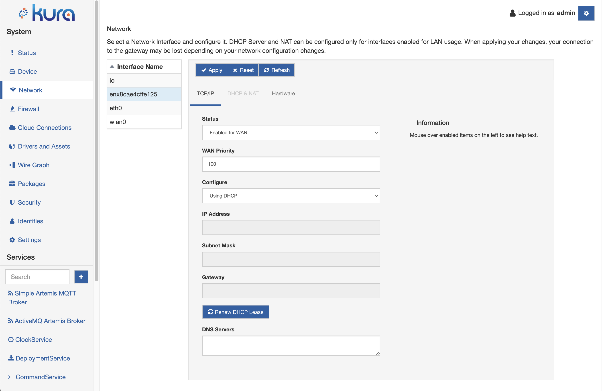

# Network Failover

For devices configured to use NetworkManager, it is possible to configure multiple WAN interfaces and a basic network failover functionality.

As in the picture below, the Kura UI allows for multiple WAN interfaces to be defined. Each WAN interface can be configured with a **WAN Priority**. WAN Priority is used to determine which interface will be selected for primary WAN. In the case where the primary WAN interface loses connection, then the next highest priority interface is assigned.



Kura uses NetworkManager's implementation to achieve network failover (see [NetworkManager](https://www.digi.com/resources/documentation/digidocs/90001548/reference/yocto/r_network_failover.htm?TocPath=Digi%20Embedded%20Yocto%7CSystem%20development%7CSoftware%20extensions%7C_____3)). **Lower values correspond to higher priority**. Allowed values range from -1 to 2147483647. Value -1 means that the metric is chosen automatically based on the device type (see [NetworkManager DBUS properties](https://developer-old.gnome.org/NetworkManager/unstable/nm-settings-dbus.html)).

To observe changes to the applied configuration, use the following command on your device's shell:

```bash
route -n

Kernel IP routing table
Destination     Gateway         Genmask         Flags Metric Ref    Use Iface
0.0.0.0         192.168.2.1     0.0.0.0         UG    100    0        0 eth0
172.16.1.0      0.0.0.0         255.255.255.0   U     600    0        0 wlan0
172.17.0.0      0.0.0.0         255.255.0.0     U     0      0        0 docker0
192.168.2.0     0.0.0.0         255.255.255.0   U     100    0        0 eth0
```

The `metric` flag will correspond to the set **WAN Priority**. *NetworkManager* will always prioritize lower metric routes.


## Work Modalities

The *NetworkManager* failover mechanism can work at two different levels:

- by detecting disruptions at physical level;
- by performing a **connectivity check** to an upstream URI.

*NetworkManager* brings a network interface down when it detects the loss of its physical link. In such case, the next highest priority interface is selected as the main one.

When the connectivity check fails, *NetworkManager* penalizes the metric of that interface in the routing table. *NetworkManager* continues to perform connectivity checks over all the other interfaces. As soon as the connectivity is restored over a previously failing interface, the metric is also restored to the original value and the routing table goes back to the original state.


### Configuring the connectivity check

The **connectivity check** is enabled by default in Kura and is configured to probe the connection to `http://network-test.debian.org/nm` every 60 seconds. To set a specific URI and a different interval edit `/etc/NetworkManager/conf.d/99kura-nm.conf` (reference [NetworkManager](https://www.digi.com/resources/documentation/digidocs/90001548/reference/yocto/r_network_failover.htm?TocPath=Digi%20Embedded%20Yocto%7CSystem%20development%7CSoftware%20extensions%7C_____3)):

```
[connectivity]
uri=http://network-test.debian.org/nm
interval=60
response="NetworkManager is online"
```

The **interval** minimun is 60 seconds, if missing it defaults to 300 seconds.

The **response** should match what the **uri** is returning when probed. Some examples of web pages with *NetworkManager* responses:

| URI | Response |
| - | - |
| `http://network-test.debian.org/nm` | `NetworkManager is online` |
| `https://fedoraproject.org/static/hotspot.txt` | `OK` |
| `http://nmcheck.gnome.org/check_network_status.txt` | `NetworkManager is online` |
| `https://www.pkgbuild.com/check_network_status.txt` | `NetworkManager is online` |

To **disable** the connectivity check feature:

- remove the `[connectivity]` section from the configuration file; or
- set `interval=0`; or
- remove `uri`; or
- set an empty URI, like `uri=`