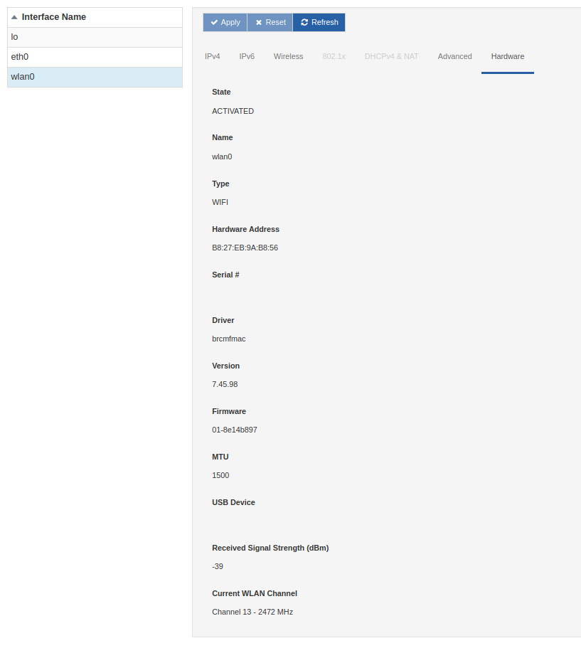

# Hardware Tab

Each interface in the Network page contains inside its specific box the tab `Hardware`: this collects the most significant information about the current state of the interface.

In this way the user can have a quick and complete view of what are the settings and physical specifications of a network interface.

These information are respectively:

- **Status**: the current state of the network interface, from the framework point of view. Some examples of status are `UNMANAGED`, `ACTIVATED`, `FAILED`, `UNKNOWN`.
- **Name**: name of the interface
- **Type**: physical interface type like `WIFI` or `ETHERNET`
- **Hardware Address**: MAC address of the interface
- **Serial #**: serial number of the hardware interface
- **Driver**: Linux driver used for the interface
- **Version**: Linux driver version
- **Firmware**: firmware version of the interface module
- **MTU**: Maximum Transmission Unit, is the measurement in bytes of the largest data packets that the interface can accept
- **USB Device**: path of the usb device
- **Received Signal Strength (dBm)**: power of the received radio signal from a wireless interface
- **Current WLAN Channel**: actual channel used by the wifi connection

These entries are filled only if the associated data is available. This means, for example, that no information will be shown under `Current WLAN Channel` if the interface is of Ethernet type. Conversely, if the interface is Wifi type and no information is shown, it is possible that there has been some problem with the configuration or connection of the interface.

So this tab, could be also an intuitive way to check if the interface is working properly or not.