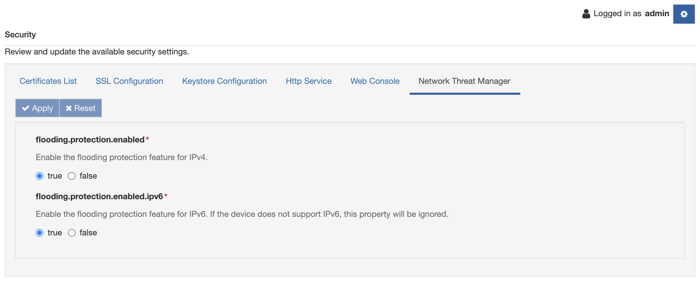

# Network Threat Manager

Eclipse Kura provides a set of features to detect and prevent network attacks. The Security section in the Gateway Administration Console shows the Network Threat Manager tab where is it possible to activate these functions.

!!! Warning
    The Network Threat Manager tab is not available for the [No Network version of Eclipse Kura](../getting-started/install-kura/#installer-types).



## Flooding protection

The flooding protection function is used to prevent DDos (Distributed Denial-of-Service) attacks using the firewall. When enabled, the feature adds a set of firewall rules to the **mangle** table.

### Flooding protection for IPv4

The following rules are added to the **mangle** table and they are implemented to block invalid or malicious network packets:

```
iptables -A prerouting-kura -m conntrack --ctstate INVALID -j DROP
iptables -A prerouting-kura -p tcp ! --syn -m conntrack --ctstate NEW -j DROP
iptables -A prerouting-kura -p tcp -m conntrack --ctstate NEW -m tcpmss ! --mss 536:65535 -j DROP
iptables -A prerouting-kura -p tcp --tcp-flags FIN,SYN FIN,SYN -j DROP
iptables -A prerouting-kura -p tcp --tcp-flags SYN,RST SYN,RST -j DROP
iptables -A prerouting-kura -p tcp --tcp-flags FIN,RST FIN,RST -j DROP
iptables -A prerouting-kura -p tcp --tcp-flags FIN,ACK FIN -j DROP
iptables -A prerouting-kura -p tcp --tcp-flags ACK,URG URG -j DROP
iptables -A prerouting-kura -p tcp --tcp-flags ACK,FIN FIN -j DROP
iptables -A prerouting-kura -p tcp --tcp-flags ACK,PSH PSH -j DROP
iptables -A prerouting-kura -p tcp --tcp-flags ALL ALL -j DROP
iptables -A prerouting-kura -p tcp --tcp-flags ALL NONE -j DROP
iptables -A prerouting-kura -p tcp --tcp-flags ALL FIN,PSH,URG -j DROP
iptables -A prerouting-kura -p tcp --tcp-flags ALL SYN,FIN,PSH,URG -j DROP
iptables -A prerouting-kura -p tcp --tcp-flags ALL SYN,RST,ACK,FIN,URG -j DROP
iptables -A prerouting-kura -p icmp -j DROP
iptables -A prerouting-kura -f -j DROP
```

To further filter the incoming TCP fragmented packets, specific system configuration files are configured.
The **flooding.protection.enabled** property is used to enable the feature.

### Flooding protection for IPv6

The same rules applied to the IPv4 are used for preventing attack on IPv6. In addition, some rules are implemented to drop specific IPv6 headers and limit the incoming ICMPv6 packets. Moreover, the incoming TCP fragmented packets are dropped configuring specific system files.

The following rules are applied to the **mangle** table:

```
ip6tables -A prerouting-kura -m conntrack --ctstate INVALID -j DROP
ip6tables -A prerouting-kura -p tcp ! --syn -m conntrack --ctstate NEW -j DROP
ip6tables -A prerouting-kura -p tcp -m conntrack --ctstate NEW -m tcpmss ! --mss 536:65535 -j DROP
ip6tables -A prerouting-kura -p tcp --tcp-flags FIN,SYN FIN,SYN -j DROP
ip6tables -A prerouting-kura -p tcp --tcp-flags SYN,RST SYN,RST -j DROP
ip6tables -A prerouting-kura -p tcp --tcp-flags FIN,RST FIN,RST -j DROP
ip6tables -A prerouting-kura -p tcp --tcp-flags FIN,ACK FIN -j DROP
ip6tables -A prerouting-kura -p tcp --tcp-flags ACK,URG URG -j DROP
ip6tables -A prerouting-kura -p tcp --tcp-flags ACK,FIN FIN -j DROP
ip6tables -A prerouting-kura -p tcp --tcp-flags ACK,PSH PSH -j DROP
ip6tables -A prerouting-kura -p tcp --tcp-flags ALL ALL -j DROP
ip6tables -A prerouting-kura -p tcp --tcp-flags ALL NONE -j DROP
ip6tables -A prerouting-kura -p tcp --tcp-flags ALL FIN,PSH,URG -j DROP
ip6tables -A prerouting-kura -p tcp --tcp-flags ALL SYN,FIN,PSH,URG -j DROP
ip6tables -A prerouting-kura -p tcp --tcp-flags ALL SYN,RST,ACK,FIN,URG -j DROP
ip6tables -A prerouting-kura -p ipv6-icmp -m ipv6-icmp --icmpv6-type 128 -j DROP
ip6tables -A prerouting-kura -p ipv6-icmp -m ipv6-icmp --icmpv6-type 129 -j DROP
ip6tables -A prerouting-kura -m ipv6header --header dst --soft -j DROP
ip6tables -A prerouting-kura -m ipv6header --header hop --soft -j DROP
ip6tables -A prerouting-kura -m ipv6header --header route --soft -j DROP
ip6tables -A prerouting-kura -m ipv6header --header frag --soft -j DROP
ip6tables -A prerouting-kura -m ipv6header --header auth --soft -j DROP
ip6tables -A prerouting-kura -m ipv6header --header esp --soft -j DROP
ip6tables -A prerouting-kura -m ipv6header --header none --soft -j DROP
ip6tables -A prerouting-kura -m rt --rt-type 0 -j DROP
ip6tables -A output-kura -m rt --rt-type 0 -j DROP
```

Also in this case, to enable the feature and add the rules to the firewall, the **flooding.protection.enabled.ipv6** property has to be set to true. If the device doesn't support IPv6, this property is ignored.
