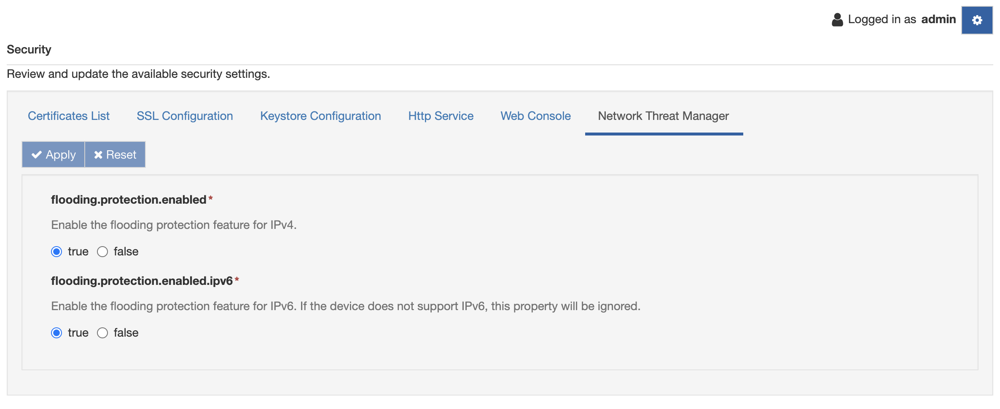

# Network Threat Manager

Eclipse Kura provides a set of features to detect and prevent network attacks. The Network Threat Manager tab in the Security section of the Gateway Administration Console allows the user to activate these functions.

!!! Warning
    The Network Threat Manager feature is provided by the **kura-networking** package.



## Flooding protection

The flooding protection function is used to prevent DDos (Distributed Denial-of-Service) attacks using specific firewall rules. When enabled, the feature modifies the **filter** and **mangle** tables in the _iptables_ firewall to close or limit common attacks.

### Flooding protection for IPv4

The **flooding.protection.enabled** property is used to enable the feature.
The following rules are added to the **mangle** table and they are implemented to block invalid or malicious network packets:

```
-A prerouting-kura -m conntrack --ctstate INVALID -j DROP
-A prerouting-kura -p tcp -m tcp ! --tcp-flags FIN,SYN,RST,ACK SYN -m conntrack --ctstate NEW -j DROP
-A prerouting-kura -p tcp -m conntrack --ctstate NEW -m tcpmss ! --mss 536:65535 -j DROP
-A prerouting-kura -p tcp -m tcp --tcp-flags FIN,SYN FIN,SYN -j DROP
-A prerouting-kura -p tcp -m tcp --tcp-flags SYN,RST SYN,RST -j DROP
-A prerouting-kura -p tcp -m tcp --tcp-flags FIN,RST FIN,RST -j DROP
-A prerouting-kura -p tcp -m tcp --tcp-flags FIN,ACK FIN -j DROP
-A prerouting-kura -p tcp -m tcp --tcp-flags ACK,URG URG -j DROP
-A prerouting-kura -p tcp -m tcp --tcp-flags FIN,ACK FIN -j DROP
-A prerouting-kura -p tcp -m tcp --tcp-flags PSH,ACK PSH -j DROP
-A prerouting-kura -p tcp -m tcp --tcp-flags FIN,SYN,RST,PSH,ACK,URG FIN,SYN,RST,PSH,ACK,URG -j DROP
-A prerouting-kura -p tcp -m tcp --tcp-flags FIN,SYN,RST,PSH,ACK,URG NONE -j DROP
-A prerouting-kura -p tcp -m tcp --tcp-flags FIN,SYN,RST,PSH,ACK,URG FIN,PSH,URG -j DROP
-A prerouting-kura -p tcp -m tcp --tcp-flags FIN,SYN,RST,PSH,ACK,URG FIN,SYN,PSH,URG -j DROP
-A prerouting-kura -p tcp -m tcp --tcp-flags FIN,SYN,RST,PSH,ACK,URG FIN,SYN,RST,ACK,URG -j DROP
-A prerouting-kura -p icmp -m icmp --icmp-type 8 -m state --state NEW,RELATED,ESTABLISHED -j DROP
-A prerouting-kura -f -j DROP
```

To further filter the incoming TCP fragmented packets, specific system configuration files are configured.
When enabled, the device will not respond to ping requests.

### Flooding protection for IPv6

The same rules applied to the IPv4 are used for preventing attack on IPv6. In addition, some of them are implemented to drop specific IPv6 headers and limit the incoming ICMPv6 packets. Moreover, the incoming TCP fragmented packets are dropped configuring specific system files.

The following rules are applied to the **mangle** table:

```
-A prerouting-kura -m conntrack --ctstate INVALID -j DROP
-A prerouting-kura -p tcp -m tcp ! --tcp-flags FIN,SYN,RST,ACK SYN -m conntrack --ctstate NEW -j DROP
-A prerouting-kura -p tcp -m conntrack --ctstate NEW -m tcpmss ! --mss 536:65535 -j DROP
-A prerouting-kura -p tcp -m tcp --tcp-flags FIN,SYN FIN,SYN -j DROP
-A prerouting-kura -p tcp -m tcp --tcp-flags SYN,RST SYN,RST -j DROP
-A prerouting-kura -p tcp -m tcp --tcp-flags FIN,RST FIN,RST -j DROP
-A prerouting-kura -p tcp -m tcp --tcp-flags FIN,ACK FIN -j DROP
-A prerouting-kura -p tcp -m tcp --tcp-flags ACK,URG URG -j DROP
-A prerouting-kura -p tcp -m tcp --tcp-flags FIN,ACK FIN -j DROP
-A prerouting-kura -p tcp -m tcp --tcp-flags PSH,ACK PSH -j DROP
-A prerouting-kura -p tcp -m tcp --tcp-flags FIN,SYN,RST,PSH,ACK,URG FIN,SYN,RST,PSH,ACK,URG -j DROP
-A prerouting-kura -p tcp -m tcp --tcp-flags FIN,SYN,RST,PSH,ACK,URG NONE -j DROP
-A prerouting-kura -p tcp -m tcp --tcp-flags FIN,SYN,RST,PSH,ACK,URG FIN,PSH,URG -j DROP
-A prerouting-kura -p tcp -m tcp --tcp-flags FIN,SYN,RST,PSH,ACK,URG FIN,SYN,PSH,URG -j DROP
-A prerouting-kura -p tcp -m tcp --tcp-flags FIN,SYN,RST,PSH,ACK,URG FIN,SYN,RST,ACK,URG -j DROP
-A prerouting-kura -p ipv6-icmp -m icmp6 --icmpv6-type 128 -j DROP
-A prerouting-kura -m ipv6header --header ipv6-opts --soft -j DROP
-A prerouting-kura -m ipv6header --header hop-by-hop --soft -j DROP
-A prerouting-kura -m ipv6header --header ipv6-route --soft -j DROP
-A prerouting-kura -m ipv6header --header ipv6-frag --soft -j DROP
-A prerouting-kura -m ipv6header --header ah --soft -j DROP
-A prerouting-kura -m ipv6header --header esp --soft -j DROP
-A prerouting-kura -m ipv6header --header ipv6-nonxt --soft -j DROP
-A prerouting-kura -m rt --rt-type 0 -j DROP
```

Also in this case, to enable the feature and add the rules to the firewall, the **flooding.protection.enabled.ipv6** property has to be set to true. If the device doesn't support IPv6, this property is ignored.
When enabled, the device will not respond to ping requests.

!!! Warning
    To recover the device state when the IPv6 flooding protection feature is disabled, a reboot is required. So, to disable the feature, set the **flooding.protection.enabled.ipv6** property to false tha reboot the device.
