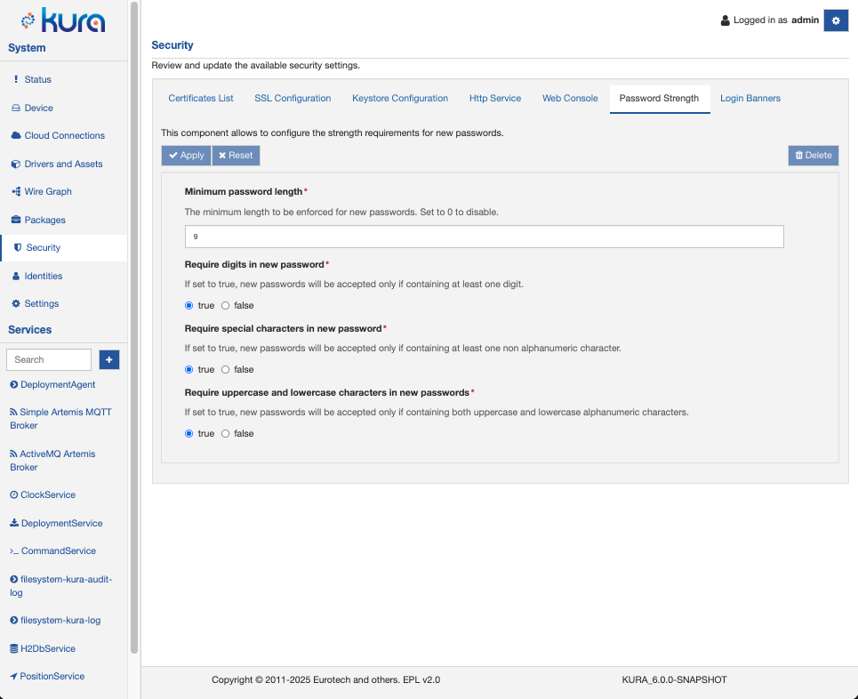

# Password Strength Configuration

Kura allows to configure and enforce password strength requirements that are applied to new passwords, for example when a user changes its password at first access.

The password strength related settings can be configured in the **Security** -> **Password Strength** section of Kura web ui.

### Minimum password length

The minimum length to be enforced for new passwords. Set to 0 to disable.
The default value set is 8 characters

### Require digits in new password

If set to true, new passwords will be accepted only if containing at least one digit.
The default value is false

### Require special characters in new password

If set to true, new passwords will be accepted only if containing at least one non alphanumeric character
The default value is false

### Require uppercase and lowercase characters in new passwords

If set to true, new passwords will be accepted only if containing both uppercase and lowercase alphanumeric characters.
The default value is false