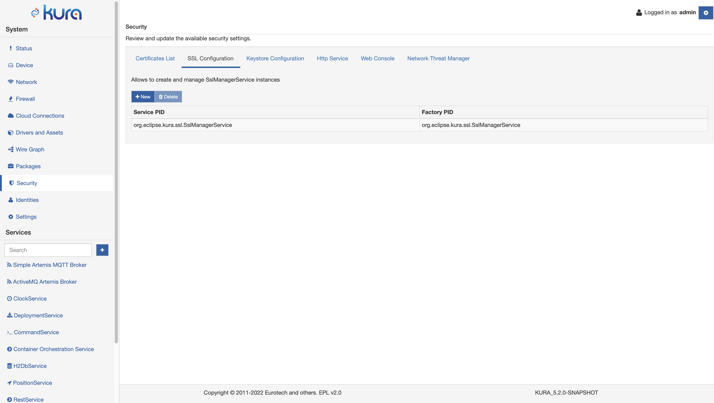
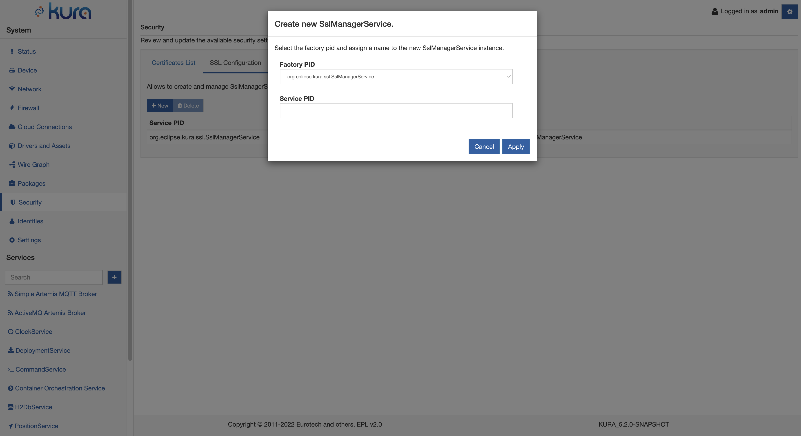
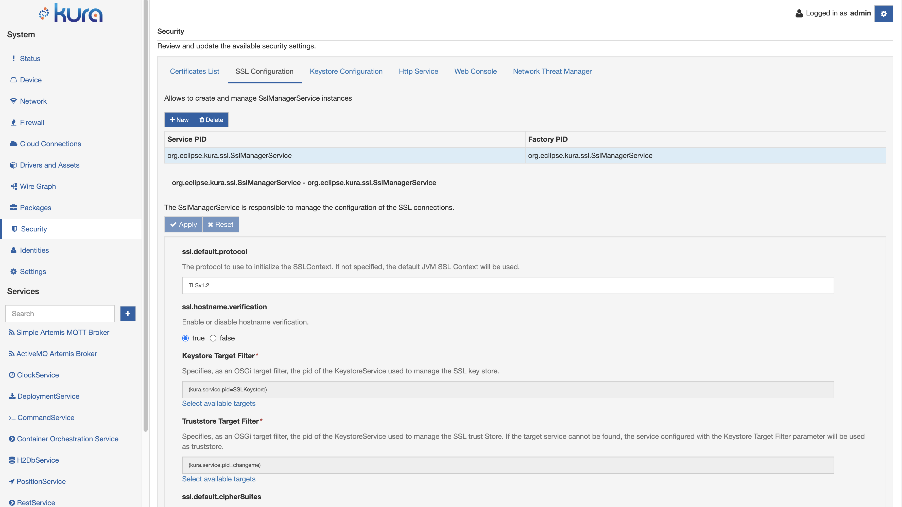
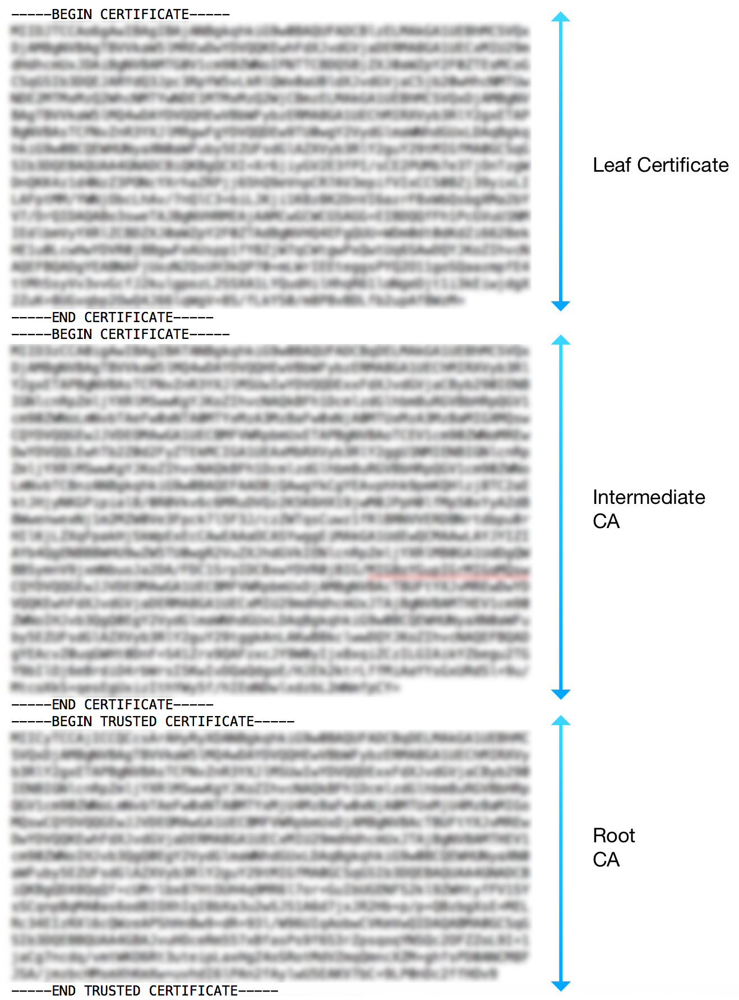

# SSL Configuration

A SSL Service instance manages the configuration of the SSL connections. It uses the associated KeystoreService to access the trust certificates, private keys pairs needed to setup a SSL connection. It also enforces best practices that are not enabled by default in the Java VM, such as, enabling hostname verification, disabling the legacy SSL-2.0-compatible Client Hello, and disabling the Nagle algorithm.

The list of all available SSL Service instances is available in the **SSL Configuration** tab of the **Security** section, accessible only by the users with the corresponding permission.



By default, the framework creates a SSLManagerService instance with the `org.eclipse.kura.ssl.SslManagerService` PID. This instance is generally used by all the core services of the framework.

A new SSL Service instance can be created using the **New** Button, by specifying the desired factory and the Service PID that will be associated with this new instance.



An instance of the default `org.eclipse.kura.ssl.SslManagerService` factory has the following configuration parameters:



- **KeystoreService Target Filter** - specifies, as an OSGi target filter, the pid of the KeystoreService used to manage the SSL key store (Required field).

- **Truststore Target Filter** - specifies, as an OSGi target filter, the pid of the KeystoreService used to manage the SSL trust store. If the target service cannot be found, the service configured with the Keystore Target Filter parameter will be used as truststore.

- **ssl.default.protocol** - defines the allowed SSL protocol.

- **ssl.hostname.verification** - indicates whether hostname verification is enabled or disabled.

- **ssl.default.cipherSuites** - defines the allowed cipher suites.

By selecting the **Select available targets** button, the user can associate the SSLManagerService instance with the corresponding KeystoreService instances available in the framework runtime.


## Server SSL Certificate

The device requires a public key in its trust store in order to authenticate the broker and be able to setup an SSL connection. Kura is distributed with a pre-initialized SSL keystore that contains only some of the major Certification Authorities (CA) public keys.

If the broker uses a certificate signed by a different CA, or uses an auto-signed certificate, the system administrator must setup Kura with the correct certificates used to trust the remote cloud broker.

The inclusion of public certificates is accomplished with the **Server SSL Certificate** feature. To do so, the SSL Certificates form must be completed by providing a certificate or a certificates chain to be trusted and defining the alias used to register this new data in the device's trust store.

With this feature, when the device tries to instantiate an SSL connection with the broker, it receives the broker's public key chain. The SSL connection is secured only if the received chain is trusted. This connection can only happen if one of the certificates that compose the broker chain are available in the device's trust store.

When instantiating the device's trust store, the user decides whether to add a single certificate (leaf or CA certificate) or the full chain.

In the latter case, the chain should be provided by specifying the leaf certificate, followed by the CA certificate that is signing it, and so on, until the root CA is reached. An example of this scenario is depicted in the following image:




## Device SSL Certificate & Mutual Authentication

Mutual authentication is a technique that allows authentication of the device that is connecting to the broker. The form available in _Certificates List_ may be used to specify the keys needed to enable mutual authentication.

This authentication may be accomplished by specifying a couple of certificates (private and public keys) to be used by the client device to authenticate itself to the broker. This authentication is possible because the broker has the root CA certificate that has been used to sign the couple held by the device. In this way, the authenticity of the couple of certificates held by the device may be verified, and therefore, enable the two communicating parts (the broker and the device) to trust each other.

To enable mutual authentication, the user must complete the form with a well-formed key pair (public and private), and with an alias value that corresponds with the account name used to connect to the broker.


## Key Pair Generation

The keys may be generated using specific software, such as <a href="https://www.openssl.org" target="_blank">OpenSSL</a> or <a href="http://docs.oracle.com/javase/6/docs/technotes/tools/solaris/keytool.html" target="_blank">Keytool</a>. This section describes how to use OpenSSL to generate a couple of private and public keys.

The private key may be created using the following command:

```shell
openssl genrsa -out certsDirectory/certs/certificate.key 1024
```

This command creates a new, 1024-bit private key in the specified path. This key is used to generate a Certificate Signing Request (CSR) file, which is used by a CA to authenticate the certificate's creator. A CSR file is created with OpenSSL using the following command:

```shell
openssl req -new -key certsDirectory/certs/certificate.key -out certsDirectory/crl/certificate.csr
```

If the user is creating their own certificate chain, the CSR file may be signed using a personal CA. This process may be accomplished using OpenSSL with the following command:

```shell
openssl ca -config certsDirectory/openssl.cnf -days 3650 -keyfile certsDirectory/ca/ca.key -cert certsDirectory/ca/ca.pem -out certsDirectory/certs/certificate.pem -infiles certsDirectory/crl/certificate.csr
```

The parameters are defined as follows:

- **-config**: specifies the OpenSSL configuration file that must be used to sign the certificate.

- **-days**: specifies how long the certificate is valid.

- **-keyfile** and **-cert**: allow the specification of the CA that will sign the CSR file.

- **-out**: identifies the location and the name of the signed certificate that will be created.

- **-infiles**: identifies the location of the CSR file that has to be signed.

!!! tip
    The private key may not be placed into the Kura Gateway Administration Console without a format conversion.

OpenSSL offers the following command to convert the input private key to a non-encrypted PKCS#8 format that may be processed by the Kura code:

```shell
openssl pkcs8 -topk8 -inform PEM -outform PEM -in inPrivateKey.key -out outKey.pem -nocrypt
```