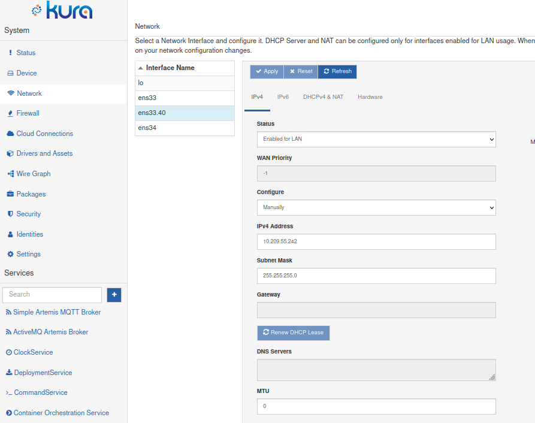

# VLAN Configuration

A VLAN, or Virtual Local Area Network, is a network segmentation technology that allows a single physical network to be logically divided into multiple isolated networks. These virtual networks operate as if they are independent, even though they share the same physical infrastructure.
This is achieved via a VLAN ID, or VLAN tag, a numerical label added to network frames to identify the specific Virtual Local Area Network (VLAN) to which they belong. It's a critical component in VLAN technology, allowing network switches and routers to differentiate and route traffic within a VLAN. VLAN tags are added to the Ethernet frame's header, indicating which virtual network a data packet should be directed to when it traverses the physical network infrastructure. Therefore, VLANs must also be supported and configured on the network equipment a device is connected to.

A VLAN can be named freely, as long as it's 15 or less characters. A typical VLAN naming format is `physicalInterfaceName`.`vlanId` (eg. a vlan with id 100 on the interface eth0 would be named eth0.100).

This is achieved by NetworkManager by creating a virtual device bound to the underlying physical interface when Kura sets up a new VLAN connection.

## VLAN Configuration via Kura Snapshot upload
Currently, VLAN configuration is supported via uploading snapshot.xml fragments.

!!! warning
    When creating a new VLAN be sure to include the `net.interfaces` parameter, containing both the previously existing network interfaces, either virtual or physical, and the name of the new VLAN to be created.

### Basic VLAN configuration example

The following example creates a VLAN with ID 40 over the ethernet interface ens33, naming it `ens33.40`, using a predefined IP address, enabled for LAN.

```xml
<?xml version="1.0" encoding="UTF-8"?>
<esf:configurations xmlns:esf="http://eurotech.com/esf/2.0" xmlns:ocd="http://www.osgi.org/xmlns/metatype/v1.2.0">
    <esf:configuration pid="org.eclipse.kura.net.admin.NetworkConfigurationService">
        <esf:properties>
            <esf:property array="false" encrypted="false" name="net.interfaces" type="String">
                <esf:value>lo,ens33,ens34,ens33.40</esf:value>
            </esf:property>
            <esf:property array="false" encrypted="false" name="net.interface.ens33.40.config.dhcpServer4.enabled" type="Boolean">
                <esf:value>false</esf:value>
            </esf:property>
            <esf:property array="false" encrypted="false" name="net.interface.ens33.40.config.nat.enabled" type="Boolean">
                <esf:value>false</esf:value>
            </esf:property>
            <esf:property array="false" encrypted="false" name="net.interface.ens33.40.config.dhcpClient4.enabled" type="Boolean">
                <esf:value>false</esf:value>
            </esf:property>
            <esf:property array="false" encrypted="false" name="net.interface.ens33.40.type" type="String">
                <esf:value>VLAN</esf:value>
            </esf:property>
            <esf:property array="false" encrypted="false" name="net.interface.ens33.40.config.ip4.status" type="String">
                <esf:value>netIPv4StatusEnabledLAN</esf:value>
            </esf:property>
            <esf:property array="false" encrypted="false" name="net.interface.ens33.40.config.vlan.parent" type="String">
                <esf:value>ens33</esf:value>
            </esf:property>
            <esf:property array="false" encrypted="false" name="net.interface.ens33.40.config.vlan.id" type="Integer">
                <esf:value>40</esf:value>
            </esf:property>
            <esf:property array="false" encrypted="false" name="net.interface.ens33.40.config.ip4.address" type="String">
                <esf:value>10.0.55.37</esf:value>
            </esf:property>
            <esf:property array="false" encrypted="false" name="net.interface.ens33.40.config.ip4.prefix" type="Short">
                <esf:value>24</esf:value>
            </esf:property>
        </esf:properties>
    </esf:configuration>
</esf:configurations>
```

### Complete VLAN configuration example

The following example creates a VLAN with ID 41 over the ethernet interface ens33, naming it `ens33.41`, using a predefined IP address, enabled for WAN.
This example also sets the 'flags' and 'traffic priority' optional parameters as described in [Network Manager API documentation](https://networkmanager.dev/docs/api/latest/settings-vlan.html).

```xml
<?xml version="1.0" encoding="UTF-8"?>
<esf:configurations xmlns:esf="http://eurotech.com/esf/2.0" xmlns:ocd="http://www.osgi.org/xmlns/metatype/v1.2.0">
    <esf:configuration pid="org.eclipse.kura.net.admin.NetworkConfigurationService">
        <esf:properties>
            <esf:property array="false" encrypted="false" name="net.interfaces" type="String">
                <esf:value>lo,ens33,ens34,ens33.41</esf:value>
            </esf:property>
            <esf:property array="false" encrypted="false" name="net.interface.ens33.41.config.dhcpServer4.enabled" type="Boolean">
                <esf:value>false</esf:value>
            </esf:property>
            <esf:property array="false" encrypted="false" name="net.interface.ens33.41.config.nat.enabled" type="Boolean">
                <esf:value>false</esf:value>
            </esf:property>
            <esf:property array="false" encrypted="false" name="net.interface.ens33.41.config.dhcpClient4.enabled" type="Boolean">
                <esf:value>false</esf:value>
            </esf:property>
            <esf:property array="false" encrypted="false" name="net.interface.ens33.41.type" type="String">
                <esf:value>VLAN</esf:value>
            </esf:property>
            <esf:property array="false" encrypted="false" name="net.interface.ens33.41.config.ip4.gateway" type="String">
                <esf:value>192.168.41.254</esf:value>
            </esf:property>
            <esf:property array="false" encrypted="false" name="net.interface.ens33.41.config.ip4.status" type="String">
                <esf:value>netIPv4StatusEnabledWAN</esf:value>
            </esf:property>
            <esf:property array="false" encrypted="false" name="net.interface.vlanFull.config.ip4.dnsServers" type="String">
                <esf:value>8.8.8.8</esf:value>
            </esf:property>
            <esf:property array="false" encrypted="false" name="net.interface.ens33.41.config.vlan.parent" type="String">
                <esf:value>ens33</esf:value>
            </esf:property>
            <esf:property array="false" encrypted="false" name="net.interface.ens33.41.config.vlan.id" type="Integer">
                <esf:value>41</esf:value>
            </esf:property>
            <esf:property array="false" encrypted="false" name="net.interface.ens33.41.config.ip4.address" type="String">
                <esf:value>192.168.41.1</esf:value>
            </esf:property>
            <esf:property array="false" encrypted="false" name="net.interface.ens33.41.config.ip4.prefix" type="Short">
                <esf:value>24</esf:value>
            </esf:property>
            <esf:property array="false" encrypted="false" name="net.interface.ens33.41.config.vlan.flags" type="Integer">
                <esf:value>1</esf:value>
            </esf:property>
            <esf:property array="false" encrypted="false" name="net.interface.ens33.41.config.vlan.ingress" type="String">
                <esf:value>1:2,3:4</esf:value>
            </esf:property>
            <esf:property array="false" encrypted="false" name="net.interface.ens33.41.config.vlan.egress" type="String">
                <esf:value>5:6</esf:value>
            </esf:property>
        </esf:properties>
    </esf:configuration>
</esf:configurations>
```


## VLAN Management
Once a VLAN is created it can be managed via the Kura UI just like any other Ethernet interface.



!!! warning
    Setting a VLAN status to "_Disabled_" deletes its configuration in NetworkManager and the related virtual interface from the system. Although it will is no longer be visible on the UI, all the configurations are left in Kura. Therefore the VLAN can be restored by setting the `net.interface.<interface>.config.ip4.status` to `netIPv4StatusEnabledLAN` or `netIPv4StatusEnabledWAN` via snapshot upload, then resume configuration via UI.
    
As an example, the configuration to reactivate a disabled VLAN named ens33.40 would be as follows:
 
```xml
<?xml version="1.0" encoding="UTF-8"?>
<esf:configurations xmlns:esf="http://eurotech.com/esf/2.0" xmlns:ocd="http://www.osgi.org/xmlns/metatype/v1.2.0">
    <esf:configuration pid="org.eclipse.kura.net.admin.NetworkConfigurationService">
        <esf:properties>
            <esf:property array="false" encrypted="false" name="net.interface.ens33.40.config.ip4.status" type="String">
                <esf:value>netIPv4StatusEnabledLAN</esf:value>
            </esf:property>
        </esf:properties>
    </esf:configuration>
</esf:configurations>
```
