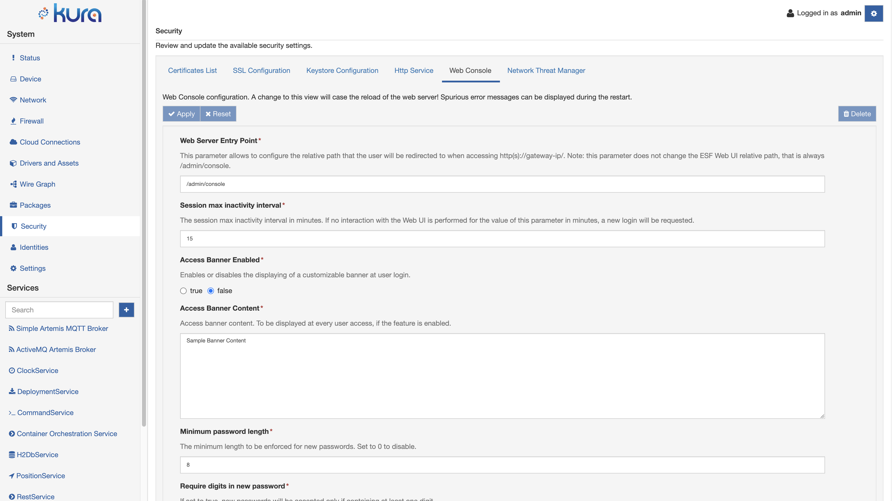
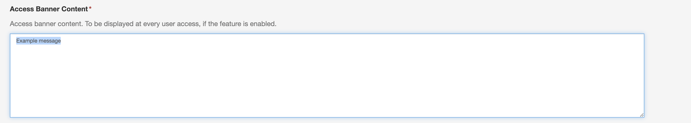
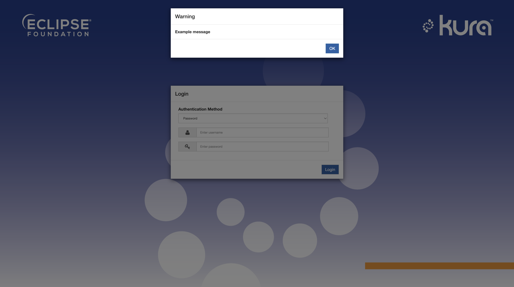

# Web Console Configuration

The Web Console exposes a set of configuration parameters that can be used to increase the overall UI security. The Web Console configuration can be accessed in the **Security** section.

## Web Server Entry Point

This parameter allows to configure the relative path that the user will be redirected to when accessing http(s)://gateway-ip/. Note: this parameter does not change the Kura Web UI relative path, that is always /admin/console.
The default value set is /admin/console

## Session max inactivity interval

The session max inactivity interval in minutes. If no interaction with the Web UI is performed for the value of this parameter in minutes, a new login will be requested.
The default value set is 15 minutes

## Access Banner Enabled

For security reasons, it may be needed to display to the user a banner that describes the intended system use before authenticating.

Once enabled and configured, the Kura Web UI will display a banner before every access attempt, as depicted in the image below.

## Password Management

This section is related to the definition of required parameters that must be respected when defining a new password, for example when a user changes its password at first access.

### Minimum password length

The minimum length to be enforced for new passwords. Set to 0 to disable.
The default value set is 8 characters

### Require digits in new password

If set to true, new passwords will be accepted only if containing at least one digit.
The default value is false

### Require special characters in new password

If set to true, new passwords will be accepted only if containing at least one non alphanumeric character
The default value is false

### Require uppercase and lowercase characters in new passwords

If set to true, new passwords will be accepted only if containing both uppercase and lowercase alphanumeric characters.
The default value is false

## Allowed ports

If set to a non empty list, Web Console access will be allowed only on the specified ports. If set to an empty list, access will be allowed on all ports. It is needed for the end user to make sure that the allowed ports are open in HttpService and Firewall configuration.

## Authentication Method "Password" Enabled

Defines whether the "Password" authentication method is enabled or not.
The default value is true

## Authentication Method "Certificate" Enabled

Defines whether the "Certificate" authentication method is enabled or not
The default value is true

## SslManagerService Target Filter

It is possible to specify the SslManagerService containing the certificates truststore required to establish a new **https** connection, this is needed, for example, for fetching package descriptions from Eclipse Marketplace.
The default target is the default **org.eclipse.kura.ssl.SslManagerService**

