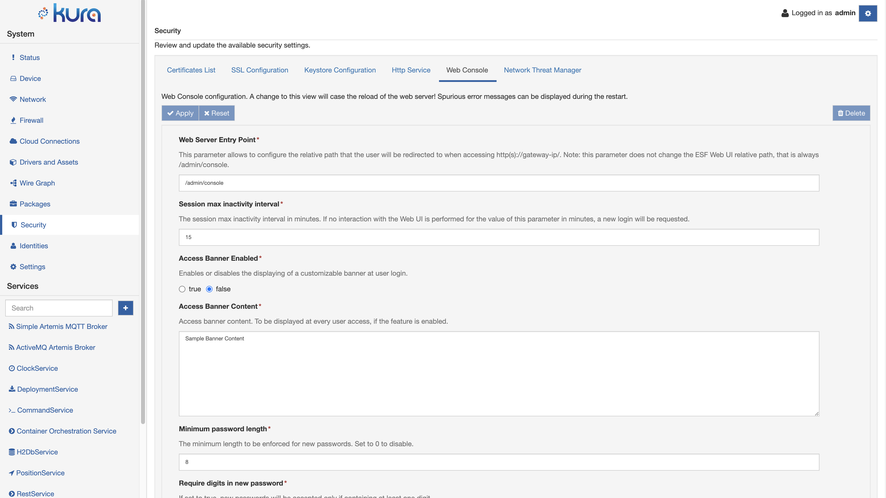

# Web Console Configuration

The Web Console exposes a set of configuration parameters that can be used to increase the overall UI security. The Web Console configuration can be accessed in the **Security** section.

## Web Server Entry Point

This parameter allows to configure the relative path that the user will be redirected to when accessing http(s)://gateway-ip/. Note: this parameter does not change the Kura Web UI relative path, that is always /admin/console.
The default value set is /admin/console

## Session max inactivity interval

The session max inactivity interval in minutes. If no interaction with the Web UI is performed for the value of this parameter in minutes, a new login will be requested.
The default value set is 15 minutes

## Access Banner Enabled

The web console support showing configurable access banners, see the [Login Banners](access-banner.md) section for more details.

!!! note

    In Kura 5.X, the access banner related settings were available in the **Security** -> **Web Console** section of Kura Web Console, starting from Kura 6 they have been moved to the **Security** -> **Login Banners** section.

## Password Management

Kura allows to configure and enforce password strenght requirements that are applied to new passwords, for example when a user changes its password at first access.

See the [Password Strenght Configuration](password-strength.md) section for more details.

!!! note

    In Kura 5.X, the password strength related settings were available in the **Security** -> **Web Console** section of Kura Web Console, starting from Kura 6 they have been moved to the **Security** -> **Password Strength** section.

## Allowed ports

By default, the Web Console access will only be allowed on ports 443 and 4443 (default https and certificate-based authentication ports). If set to an empty list, access will be allowed on all ports. It is needed for the end user to make sure that the allowed ports are open in HttpService and Firewall configuration.

## Authentication Method "Password" Enabled

Defines whether the "Password" authentication method is enabled or not.
The default value is true

## Authentication Method "Certificate" Enabled

Defines whether the "Certificate" authentication method is enabled or not
The default value is true

## SslManagerService Target Filter

It is possible to specify the SslManagerService containing the certificates truststore required to establish a new **https** connection, this is needed, for example, for fetching package descriptions from Eclipse Marketplace.
The default target is the **org.eclipse.kura.ssl.SslManagerService**

