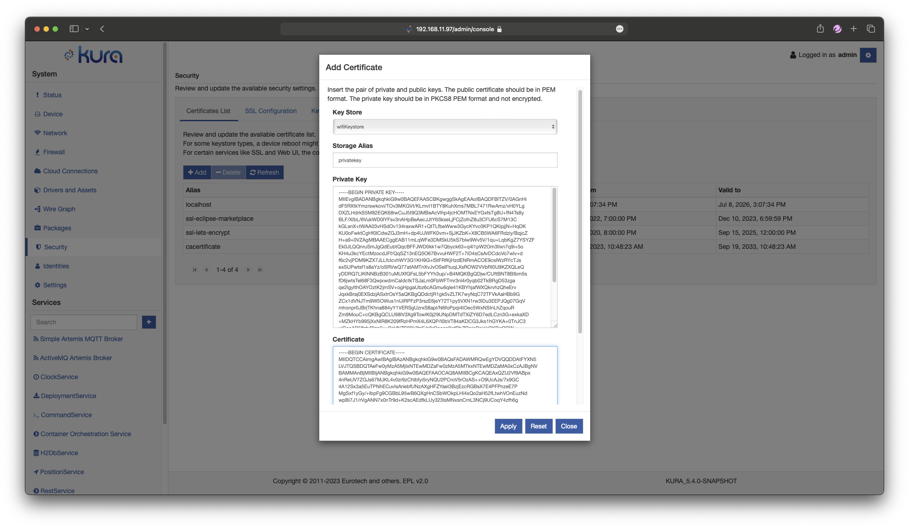

# Wi-Fi 802.1x Configuration

Enteprise Wifi is currently only supported on gatways running our [generic profiles](/getting-started/install-kura/#installer-types). The following is a list of currently supported 802.1x configurations.

 - TTLS-MSCHAPv2
 - PEAP-MSCHAPv2
 - TLS-EAP

# Setup TTLS/PEAP-MSCHAPv2
 1. Set up gateway WiFi as described in the [wifi configuration guide](/gateway-configuration/wifi-configuration/#wireless-configuration).
 2. Ensure Wireless Security is set to `WPA2/WPA3-Enterprise`
    
 3. select the 802.1x tab
 4. Set Enteprise EAP -> `TTLS/PEAP`
 5. Set Inner Authentication -> `MSCHAPV2`
 6. Set `Identity (Username)` 
 7. Set `Password`
 6. Press 'Apply'

The configuration should look like the following:

# Setup TLS-EAP
To connect via TLS-EAP you will need the following items in unencrypted PEM format:
    - Certificate Authority (CA) Certificate
    - Client Certificate + Private Key (PKCS8)

Enrolling secrets in the Keystore service

 1. Navigate to `Security` under the `System` tab.
 2. Under the `Keystore Configuration` add a new keystore, keep note of the name. 
 3. After the keystore is created, be sure to change the path to a persistant directory. 
 4. Navigate to the `Certificate List` and create a new Certificate. Insert the PEM and Apply, keep note of the name. 
 5. Now press `add` and create a new Private Key. Insert both the certificate in the PEM in the dilogue and press apply. keep note of the name. 

Wifi Setup

 1. Set up gateway WiFi as described in the [wifi configuration guide](/gateway-configuration/wifi-configuration/#wireless-configuration).
 2. Ensure Wireless Security is set to `WPA2/WPA3-Enterprise`. 
 3. Select the 802.1x tab.
 4. Set Enteprise EAP -> `TLS`.
 5. Set Inner Authentication -> `MSCHAPV2`.
 6. Set `Identity (Username)`.
 7. Set `Keystore Pid` to the name of the keystore created above.
 8. Set `Certificate Authority Certificate (CA-Cert)` to the name of the certificate created above.
 9. Set `Client Private Key` to the name of the Private Key created above.

