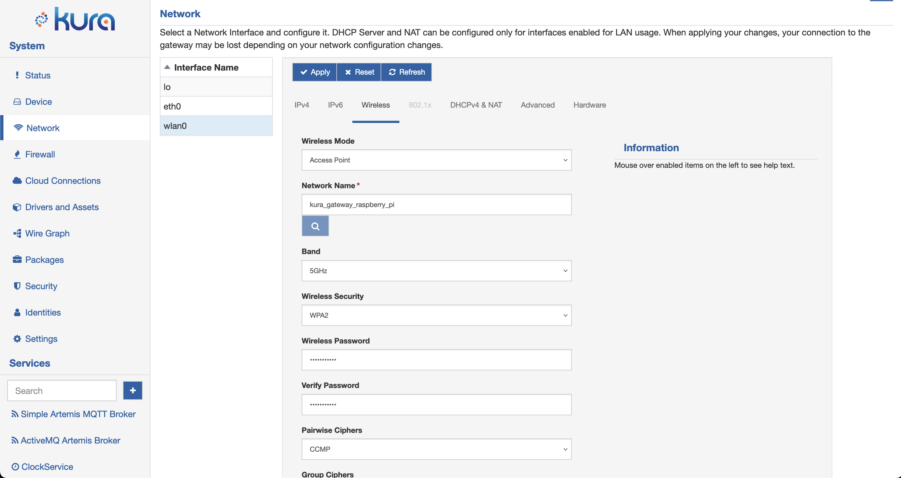

# Wi-Fi Configuration

From a configuration standpoint, the Wi-Fi interface (e.g., wlan0) may be viewed as an extension of Ethernet. In addition to the **IPv4**, **IPv6** and **DHCPv4 & NAT** configuration tabs, it has the **Wireless** tab that allows for the configuration of wireless settings. These configuration options are described below.

!!! warning
    Before using wifi make sure that you have correctly set the Regulatory Domain on the gateway. You can check the current configuration using the `iw reg get` command. To set the Regulatory Domain please refer to the specific section in the Gateway Configurations.

## Wireless Configuration

The **Wireless** tab contains the following configuration parameters:

- **Wireless Mode**: defines the mode of operation.
    - Access Point: creates a wireless access point.
    - Station Mode: connects to a wireless access point.

- **Network Name**: specifies the Service Set Identifier (SSID).
    - In _Access Point_ mode, this is the SSID that identifies this wireless network.
    - In _Station_ mode, this is the SSID of a wireless network to connect to.

- **Band**: defines the frequency band to use
    - 2.4GHz: use 2.4GHz band
    - 5GHz: use 5GHz band
    - 2.4GHz/5GHz: use either in 2.4Ghz or 5Ghz depending on the choosen channel

- **Wireless Security**: sets the security protocol for the wireless network.
    - None: No Wi-Fi security
    - WEP: Wired Equivalent Privacy
    - WPA: Wi-Fi Protected Access
    - WPA2: Wi-Fi Protected Access II
    - WPA2/WPA3-Enterprise: Wi-Fi Protected Access II & III with 802.1x. Please see [here](./wifi-configuration-8021x.md) for further details. This fearture is available only in station mode

- **Wireless Password**: sets the password for the wireless network.
    - WEP: 64-bit or 128-bit encryption key
    - WPA/WPA2: pre-shared key

- **Verify Password**: sets the password verification field.
    - In _Access Point_ mode, allows the wireless password to be retyped for verification.
    - In _Station_ mode, this field is disabled.

- **Pairwise Ciphers**: lists accepted pairwise (unicast) ciphers for WPA/WPA2.
    - In _Access Point_ mode, this option is disabled.
    - In _Station_ mode,
        - CCMP (AES-based encryption mode with strong security)
        - TKIP (Temporal Key Integrity Protocol)
        - CCMP and TKIP

- **Group Ciphers**: lists accepted group (broadcast/multicast) ciphers for WPA/WPA2.
    - In _Access Point_ mode, this option is disabled.
    - In _Station_ mode,
        - CCMP (AES-based encryption mode with strong security)
        - TKIP (Temporal Key Integrity Protocol)
        - CCMP and TKIP

- **Bgscan Module**: requests background scans for the purpose of roaming within an ESS (i.e., within a single network block with all the APs using the same SSID).
    - None: background scan is disabled
    - Simple: periodic background scans based on signal strength
    - Learn: learn channels used by the network and try to avoid bgscans on other channels

- **Bgscan Signal Strength Threshold**: defines a threshold (in dBm) that determines which one of the following two parameters (i.e., _Short Interval_ or _Long Interval_) will be effective.

- **Bgscan Short Interval**: defines the interval between background scans (in seconds) if the actual signal level of the currently connected access point is worse than signal_strength.

- **Bgscan Long Interval**: defines the interval  between background scans (in seconds) if the actual signal level of the currently connected access point is better than signal_strength.

- **Ping Access Point & renew DHCP lease if not reachable**: enables pinging the access point after connection is established.
    - In _Access Point_ mode, this option is disabled.
    - In _Station_ mode, if set to _true_, the unit will ping the access point and attempt to renew the DHCP lease if the access point is not reachable.

- **Ignore Broadcast SSID**: operates as follows if set to _true_:
    - In _Access Point_ mode, sends an empty SSID in beacons and ignores probe request frames that do not specify full SSID.
    - In _Station_ mode, does not scan for the SSID before attempting to associate.

- **Channels list**: allows the selection of desired channel frequencies. The availability of the desired frequency is subject to the Regdom set on the device. For a list of limitations in different countries you can consult the following page: [List of WLAN channels](https://en.wikipedia.org/wiki/List_of_WLAN_channels). Channels marked as No Irradiation and Radar Detection can be used only if DFS (Dynamic Frequency Selection) is supported by the Wi-Fi chip. 
    - In _Access Point_ mode, only one channel may be selected.
    - In _Station_ mode, the list of available channels depends on the selected Radio Mode. The selected radio mode also affects the ability to select a network in the scan window (if the channel associated with the network is not enabled in the regulatory domain an error message will be shown).

## Wi-Fi Station Mode Configuration

In addition to the options described above, the **Wireless** configuration display the **Access Point Scan** button that help to configure Wi-Fi in the _Station_ mode.

- **Access Point Scan**: clicking this button triggers access point scan operations. Upon a successful scan, a table containing access points within range is presented. This table contains the following information:
    - SSID
    - MAC Address
    - Signal Strength (in dBm)
    - Channel
    - Frequency
    - Security

    If you select one of these access points, respective wireless controls (i.e., _Network Name_, _Wireless Security_, and _Channel_) are filled with information obtained during the scan operation. The _Force Wireless Network Scan_ button triggers a manual scan for available access points.
