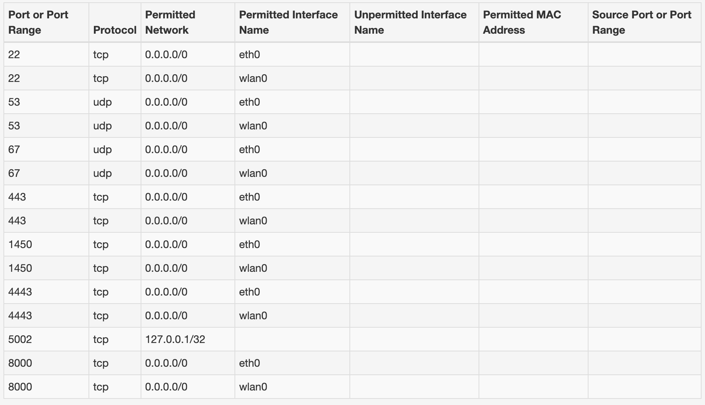

# Install Kura

Eclipse Kura&trade; is provided using a Debian Linux package. There's two ways you can install Kura on your target system:

1. Use the Eclipse Kura&trade; APT repository (recommended). Follow the instructions below to set up the repository and install Kura using `apt-get` or `apt`.
2. Alternatively, visit the [Kura download page](https://github.com/eclipse-kura/kura/releases) to find the correct installation file for your target system.

## Kura installation using the APT repository (recommended)

To install Eclipse Kura&trade; using the APT repository, perform the following steps:

1. Install the required packages:

    ```bash
    apt install -y curl gpg
    ```

2. Download the GPG key and add it to the list of trusted keys:

    ```bash
    curl -L "https://keyserver.ubuntu.com/pks/lookup?op=get&search=0xba7e3df5edc3fc36" | gpg --dearmor | tee /etc/apt/trusted.gpg.d/kura.gpg > /dev/null
    ```

3. Add the Kura APT repository to your system's software sources list:

    ```bash
    echo "deb https://repo3.eclipse.org/repository/kura-apt/ stable main" | tee /etc/apt/sources.list.d/kura.list
    ```

4. Update the package list:

    ```bash
    apt update
    ```

5. Install Kura package:

    ```bash
    apt install kura
    ```

!!! note
    The above instructions might require `sudo` privileges depending on your system configuration.

## Kura packages

Since version 6.0.0 Eclipse Kura&trade; has been split into multiple packages to allow the user to install only the required features. The main package `kura` is a meta-package which depends on all the other packages listed below and provides the same installation experience as the old installers. Alternatively, the user can choose to install only the required packages instead of the full Kura framework. The available packages are:

- [kura-core](https://github.com/eclipse-kura/kura): Eclipse Kura™ framework core (mandatory)
- [kura-apps](https://github.com/eclipse-kura/kura-apps): Applications and examples for Eclipse Kura™ framework
- [kura-artemis](https://github.com/eclipse-kura/kura-artemis): Eclipse Kura™ Artemis MQTT server addon
- [kura-bluetooth](https://github.com/eclipse-kura/kura-bluetooth): Eclipse Kura™ Bluetooth addon
- [kura-command](https://github.com/eclipse-kura/kura-command): Eclipse Kura™ Command addon
- [kura-gpio](https://github.com/eclipse-kura/kura-gpio): Eclipse Kura™ GPIO handling addon
- [kura-management-ui](https://github.com/eclipse-kura/kura-management-ui): Eclipse Kura™ Web UI addon
- [kura-metapackage](https://github.com/eclipse-kura/kura-metapackage): Eclipse Kura™ Metapackage
- [kura-networking](https://github.com/eclipse-kura/kura-networking): Eclipse Kura™ Networking addon
- [kura-position](https://github.com/eclipse-kura/kura-position): Eclipse Kura™ Position addon
- [kura-wires](https://github.com/eclipse-kura/kura-wires): Eclipse Kura™ Wires and Assets addon

### Java Heap Memory Assignment

The Eclipse Kura&trade;'s installer incorporates an adaptive Heap Memory allocation system during installation. The allocation follows a formula based on your gateway's available memory. If your gateway has less than 1024MB of RAM, Kura will set -Xms and -Xmx to 256MB. For gateways with more than 1024MB, one quarter of the total RAM will be assigned to -Xms and -Xmx.

### Initial network configuration

During the installation of Eclipse Kura with network management package (i.e. `kura-networking`), the initial network configuration will be generated dynamically. The existing wired and wireless network interface names are detected and sorted in ascending lexicographic order at the installation.

If only one ethernet interface is detected (e.g. `eth0`), it will be configured as follows:

| Interface | Configuration |
|-----------|---------------|
| Ethernet interface (e.g. `eth0`) | - **Status**: `Enabled for WAN`<br>- **Configure**: `Using DHCP`|

If multiple ethernet interfaces are detected, instead, the first two interfaces will be configured as presented in the table below. The other ethernet interfaces will be disabled.

| Interface | Configuration |
|-----------|---------------|
| First Ethernet interface (e.g. `eth0`) | - **Status**: `Enabled for LAN`<br>- **Configure**: `Manually`<br>- **IP address**: `172.16.0.1`<br>- **Router Mode**: `DHCP and NAT`|
| Second Ethernet interface (e.g. `eth1`) | - **Status**: `Enabled for WAN`<br>- **Configure**: `Using DHCP`|

Finally, if a wireless interface (e.g. `wlan0`) is detected, it will configured as shown below. The other wireless interfaces will be disabled.

| Interface | Configuration |
|-----------|---------------|
| Wireless interface (e.g. `wlan0`) | - **Status**: `Enabled for LAN`<br>- **Configure**: `Manually`<br>- **IP address**: `172.16.1.1`<br>- **Passphrase**: `testKEYS`<br>- **Router Mode**: `DHCP and NAT` |

For example, if the system contains the following interfaces: `wlp2s0`, `wlp3s0`, `enp3s0`, `eno1`, `ens2`; then `eno1` will be
enabled for LAN with a DHCP server, `enp3s0` will be enabled for WAN in DHCP client mode, `wlp2s0` will be configured as an AP, and all other network interfaces will be disabled.

!!! warning
    On systems that do not use systemd's predictable interface naming scheme (see [Freedesktop reference](https://www.freedesktop.org/wiki/Software/systemd/PredictableNetworkInterfaceNames/)) the primary network interface name might change whenever a re-enumeration is triggered (for example, after a reboot or after plugging in an external network adapter).

    The advice is to install Kura on systems that use a reliable naming convention for network interfaces.

    Systemd consistent network interface naming assigns the name prefix based on the physical location of the device, see [Understanding the Predictable Network Interface Device Names](https://access.redhat.com/documentation/en-us/red_hat_enterprise_linux/7/html/networking_guide/sec-understanding_the_predictable_network_interface_device_names) for further reference.

### Initial firewall configuration

Similarly to the initial network configuration, the initial firewall setup is adapted based on the network interface detected on the system. In case of multiple ethernet and wireless interfaces, the configuration will be as shown in the screenshot below.



If the wireless interface is not present, the firewall entries for the `wlan0` are dropped.

Please note that installing Eclipse Kura with network configuration support will replace the current network and firewall configuration with the one shown above.

### Other Kura services

Eclipse Kura&trade; do not contain gateway specific customizations, this implies that the values of some configuration parameters may be incorrect and/or missing and must be manually filled after installation. For example the user might want to:

- Configure the other network interfaces, if any.
- Setup additional firewall rules.
- Edit the `/opt/eclipse/kura/framework/jdk.dio.properties` with the correct GPIO mappings. By default this file is empty.

### Kura dependencies

The following dependencies are required by each of the Kura modules.

#### Kura core

- General: `setserial`, `zip`, `gzip`, `unzip`, `procps`, `usbutils`, `socat`, `gawk`, `sed`, `inetutils-telnet`, `dos2unix`, `libtirpc3`
- Security: `polkit` or `policykit-1` or `polkitd`, `ssh` or `openssh`, `openssl`, `busybox`, `libpam-modules`
- Python: `python3`
- Gps: `gpsd`
- Time: `chrony`, `chronyc`
- Java: `openjdk-17-jre-headless` or `temurin-17-jdk` or a JRE installation that provides `java-runtime-headless (= 17)` or `java-runtime-headless (= 21)`

#### Kura bluetooth

- `bluez` or `bluez5`, `bluez-hcidump` or `bluez5-noinst-tools`

#### Kura networking

- Networking: `network-manager` or `networkmanager`, `modemmanager`
- DNS resolving: `bind9` or `bind`
- DHCP server: `dnsmasq` or `isc-dhcp-server`, `isc-dhcp-client` or `dhcpcd`
- Wireless: `iw`
- Firewall: `iptables`, `python3-fail2ban` or `python-fail2ban` or `fail2ban`

### Reference devices

Eclipse Kura&trade; has been tested on the following devices and provides full configuration of all the available interfaces and GPIO mappings.

| Device | Architecture | OS |
| - | - | - |
| **Raspberry Pi 3/4** | *arm64* | Raspberry Pi OS "Bookworm" |
| **Raspberry Pi 3/4** | *arm64* | Ubuntu 20.04 |
| **ZimaBoard/Blade** | *amd64* | TBD |
| **NVIDIA Jetson AGX Orin&trade;** | *arm64* | TBD |

Check out the quick start guides for the detailed installation steps and set-up procedures:

- [Raspberry Pi - Raspberry Pi OS Quick Start](./raspberry-pi-raspberryos-quick-start.md)
- [Raspberry Pi - Ubuntu 20 Quick Start](./raspberry-pi-ubuntu-20-quick-start.md)
- [Docker Quick Start](./docker-quick-start.md)
- [Nvidia Jetson AGX Orin Quick Start](./nvidia-jetson-orin-quick-start.md)
- [ZimaBoard/Blade Quick Start](./zima-board-quick-start.md)
