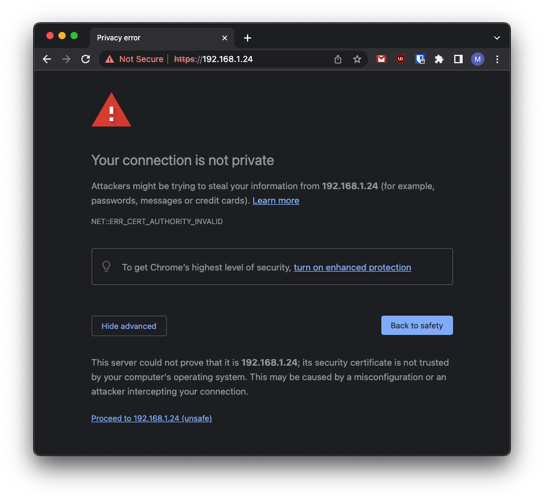

# NVIDIA Jetson Nano&trade; - Quick Start

## Overview

This section provides Eclipse Kura&trade; quick installation procedures for the NVIDIA Jetson Nano&trade;.

!!! warning
    This quickstart will install the version of Kura with the administrative web UI and network  configuration support but not [CAN bus](https://en.wikipedia.org/wiki/CAN_bus) support. For more information on this please visit the [Eclipse Kura download page](https://websites.eclipseprojects.io/kura/downloads.php)

This quickstart has been tested using the latest Ubuntu 18.04 LTS image provided by NVIDIA [here](https://developer.nvidia.com/jetson-nano-sd-card-image) and burned on a SD card with [Etcher](https://www.balena.io/etcher/).

The official images can be found on the [Jetson Nano Developer Kit Getting Starteg Guide](https://developer.nvidia.com/embedded/learn/get-started-jetson-nano-devkit#write). Further information on the Ubuntu installation for the NVIDIA Jetson Nano&trade; can be found [here](https://developer.nvidia.com/embedded/learn/get-started-jetson-nano-devkit#intro).

## Eclipse Kura&trade; Installation

To install Eclipse Kura with its dependencies on the NVIDIA Jetson Nano&trade;, perform the
following steps:

1. Boot the NVIDIA Jetson Nano&trade; with the latest Jetson Nano Developer Kit SD Card image.

2. Make sure your device is connected to internet. By default, `eth0` lan network interface is configured in DHCP mode.

3. Upgrade the system:

    ```bash
    sudo apt update
    ```
    ```bash
    sudo apt upgrade
    ```

    !!! tip
        **Optional**: Since version 5.3.0 Kura also supports [Eclipse Temurin&trade;](https://adoptium.net/en-GB/) as an alternative JVM. To install it you need to perform these additional steps:

        ```bash
        sudo apt-get install -y wget apt-transport-https gnupg
        ```
        ```bash
        sudo wget -O - https://packages.adoptium.net/artifactory/api/gpg/key/public | sudo apt-key add -
        ```
        ```bash
        sudo echo "deb https://packages.adoptium.net/artifactory/deb $(awk -F= '/^VERSION_CODENAME/{print$2}' /etc/os-release) main" | sudo tee /etc/apt/sources.list.d/adoptium.list
        ```
        ```bash
        sudo apt-get update
        ```
        ```bash
        sudo apt-get install temurin-8-jdk
        ```

4. Download the Kura package with:

    ```
    wget http://download.eclipse.org/kura/releases/<version>/kura_<version>_nvidia-jetson-nano_installer.deb
    ```

    Note: replace `<version>` in the URL above with the version number of the latest release (e.g. 5.2.0).

5. Install Kura with:

    ```
    sudo apt install ./kura_<version>_nvidia-jetson-nano_installer.deb
    ```

    All the required dependencies will be downloaded and installed.

6. Reboot the NVIDIA Jetson Nano&trade; with:

    ```
    sudo reboot
    ```

    Kura starts on the target platform after reboot.

7. Kura setups a local web ui that is available using a browser via:

    ```
    https://<device-ip>
    ```

    The browser will prompt the user to accept the connection to an endpoint with an untrusted certificate:

    

    Once trusted the source, the user will be redirected to a login page where the default **username** is:

    ```
    admin
    ```

    and the default **password** is:

    ```
    admin
    ```

## Required Dependencies

In addition to those required by generic profiles, listed in the [dedicated section](install-kura.md#kura-dependencies), additional NVIDIA Jetson Nano&trade;-specific dependencies are needed, listed below:

- hostapd
- ethtool
- ifupdown
- net-tools
- dmidecode