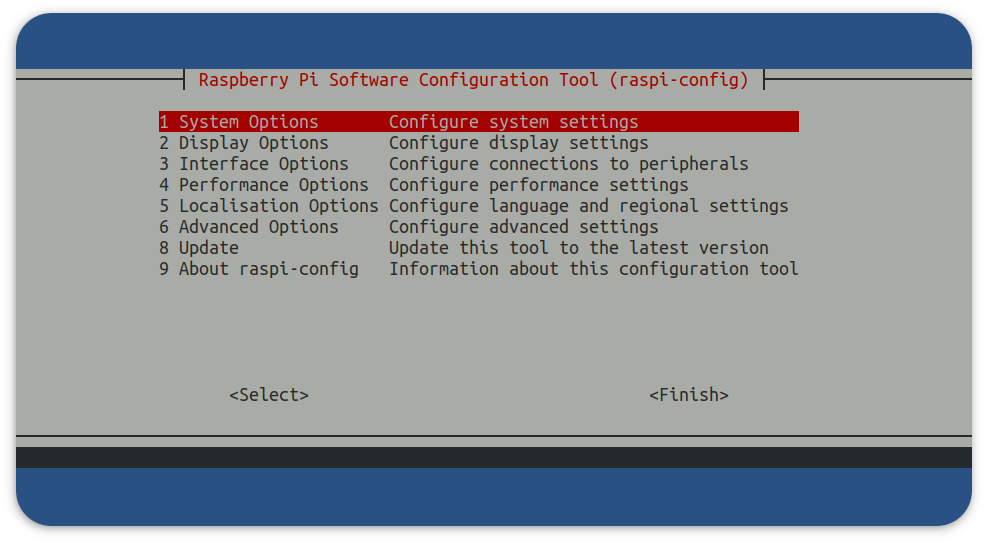
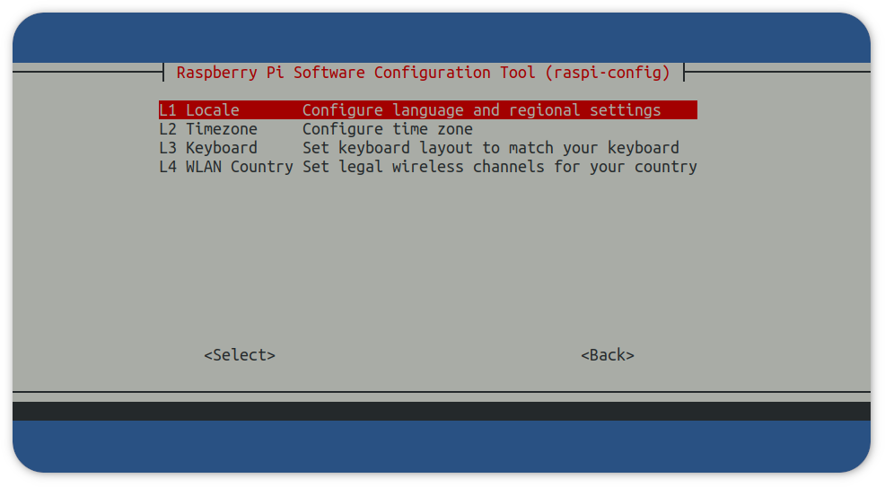
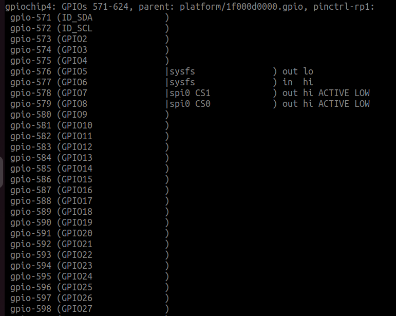

# Raspberry Pi - Raspberry Pi OS Quick Start

## Overview

This section provides Eclipse Kura&trade; quick installation procedures for the Raspberry Pi and the Kura development environment.

!!! warning
    This quickstart will install the version of Kura with the administrative web UI and network  configuration support but not [CAN bus](https://en.wikipedia.org/wiki/CAN_bus) support. For more information on this please visit the [Eclipse Kura download page](https://websites.eclipseprojects.io/kura/downloads.php)

This quickstart has been tested using the latest Raspberry Pi OS 32 and 64 bits images which are available for download through [the official Raspberry Pi foundation site](https://www.raspberrypi.com/software/operating-systems/) and the Raspberry Pi Imager.

!!! warning
    Recent versions of Raspberry Pi OS 32 bit on Raspberry PI 4 will use by default a 64 bit kernel with a 32 bit userspace. This can cause issues to applications that use the result of `uname -m` to decide which native libraries to load (see https://github.com/raspberrypi/firmware/issues/1795). This currently affects for example the Kura SQLite database connector. It should be possible to solve by switching to the 32 bit kernel setting `arm_64bit=0` in `/boot/config.txt` and restarting the device.

For additional details on OS compatibility refer to the [Kura&trade; release notes](https://websites.eclipseprojects.io/kura/downloads.php).

## Enable SSH Access

The ssh server is disabled by default on Raspbian images released after November 2016,
in order to enable it follow the instructions available [here](https://www.raspberrypi.org/documentation/remote-access/ssh/).

If you're using the [Raspberry Pi Imager](https://github.com/raspberrypi/rpi-imager) you can directly enable SSH before writing the operating system into the SD card by clicking on the "setting" icon.


## Eclipse Kura&trade; Installation

To install Eclipse Kura with its dependencies on the Raspberry Pi, perform the
following steps:

1. Boot the Raspberry Pi with the latest Raspberry Pi OS image.

2. Make sure your device is connected to the Internet. The best installation experience can be obtained when the device is cabled to the local network and the Internet. By default, the Raspberry Pi OS configures the ethernet interface `eth0` in DHCP mode.

3. Upgrade the system:
   
    ```bash
    sudo apt update
    ```
    ```bash
    sudo apt upgrade
    ```

    !!! tip
        **Optional**: Since version 5.3.0 Kura also supports [Eclipse Temurin&trade;](https://adoptium.net/en-GB/) as an alternative JVM. To install it you need to perform these additional steps:

        ```bash
        sudo apt-get install -y wget apt-transport-https gnupg
        ```
        ```bash
        sudo wget -O - https://packages.adoptium.net/artifactory/api/gpg/key/public | sudo apt-key add -
        ```
        ```bash
        sudo echo "deb https://packages.adoptium.net/artifactory/deb $(awk -F= '/^VERSION_CODENAME/{print$2}' /etc/os-release) main" | sudo tee /etc/apt/sources.list.d/adoptium.list
        ```
        ```bash
        sudo apt-get update
        ```
        ```bash
        sudo apt-get install temurin-17-jdk
        ```

4. Download the Kura package with:

    ```
    wget http://download.eclipse.org/kura/releases/<version>/kura-<kura-version>_generic-<arch>_installer.deb
    ```

    Note: replace `<version>` in the URL above with the version number of the latest release (e.g. 5.5.0) and `<arch>` with your device architecture 

5. Install Kura with: 

    ```
    sudo apt-get install ./kura-<kura-version>_generic-<arch>_installer.deb
    ```

6. For a correct configuration of the Wlan interface, it is necessary to set the **Locale** and the **WLAN Country** through the `raspi-config` command:

    ```
    sudo raspi-config
    ```

    

    From the raspi-config main menu select `Localisation Options`:

    

    Then modify the **Locale** and **WLAN Country** with with the proper settings for your location. For example, an user located in Italy could set the values as the ones in the table:

    | Setting         	| Value             	|
    |-----------------	|-------------------	|
    | L1 Locale       	| it_IT.UTF-8 UTF-8 	|
    | L4 WLAN Country 	| IT Italy          	|

7. (Optional) To correctly use the GPIO pins, the user is asked to update the `jdk.dio.properties` file with the proper configuration, based on its own device.

    This is required since the `sysfs` interface has been deprecated, and some OS distribution may have already suppressed it. Moreover, the kernel complains if a static base number is assigned to a GPIO controller: indeed, when it assigns the numbers automatically, it usually starts from 511. More information can be found [here](https://forums.raspberrypi.com/viewtopic.php?t=359302).
    
    In order to set the correct configuration the user can perform the following steps:
    
    - Execute on the device the command `cat /sys/kernel/debug/gpio`, looking for entries similar to `gpio-ABC (GPIxx)`: from this information it is possible to retrieve which number the GPIO controller was assigned to by the OS (in this case the GPIO controller number `xx` is assigned with the number `ABC`). The image below represent an example of this file

    

    - Modify the `/opt/eclipse/kura/framework/jdk.dio.properties` with the number and controllers found in the previous step:

    ```
    573 = deviceType: gpio.GPIOPin, pinNumber:573, name:GPI02
    574 = deviceType: gpio.GPIOPin, pinNumber:574, name:GPIO3
    575 = deviceType: gpio.GPIOPin, pinNumber:575, name:GPIO4
    576 = deviceType: gpio.GPIOPin, pinNumber:576, name:GPIO5
    577 = deviceType: gpio.GPIOPin, pinNumber:577, name:GPIO6
    578 = deviceType: gpio.GPIOPin, pinNumber:578, name:GPIO7
    579 = deviceType: gpio.GPIOPin, pinNumber:579, name:GPIO8
    580 = deviceType: gpio.GPIOPin, pinNumber:580, name:GPIO9
    581 = deviceType: gpio.GPIOPin, pinNumber:581, name:GPIO10
    582 = deviceType: gpio.GPIOPin, pinNumber:582, name:GPIO11
    583 = deviceType: gpio.GPIOPin, pinNumber:583, name:GPIO12
    584 = deviceType: gpio.GPIOPin, pinNumber:584, name:GPIO13
    585 = deviceType: gpio.GPIOPin, pinNumber:585, name:GPIO14
    586 = deviceType: gpio.GPIOPin, pinNumber:586, name:GPIO15
    587 = deviceType: gpio.GPIOPin, pinNumber:587, name:GPIO16
    588 = deviceType: gpio.GPIOPin, pinNumber:588, name:GPIO17
    589 = deviceType: gpio.GPIOPin, pinNumber:589, name:GPIO18
    590 = deviceType: gpio.GPIOPin, pinNumber:590, name:GPIO19
    591 = deviceType: gpio.GPIOPin, pinNumber:591, name:GPIO20
    592 = deviceType: gpio.GPIOPin, pinNumber:592, name:GPIO21
    593 = deviceType: gpio.GPIOPin, pinNumber:593, name:GPIO22
    594 = deviceType: gpio.GPIOPin, pinNumber:594, name:GPIO23
    595 = deviceType: gpio.GPIOPin, pinNumber:595, name:GPIO24
    596 = deviceType: gpio.GPIOPin, pinNumber:596, name:GPIO25
    597 = deviceType: gpio.GPIOPin, pinNumber:597, name:GPIO26
    598 = deviceType: gpio.GPIOPin, pinNumber:598, name:GPIO27

    gpio.GPIOPin = initValue:0, deviceNumber:0, direction:3, mode:-1, trigger:3
    uart.UART = baudRate:19200, parity:0, dataBits:8, stopBits:1, flowControl:0
    ```

    You can also check your GPIO device configuration executing the command `pinout`


8. Reboot the Raspberry Pi with:

    ```
    sudo reboot
    ```

    Kura starts on the target platform after reboot.

9. Kura setups a local web ui that is available using a browser via:

    ```
    https://<device-ip>
    ```

    The browser will prompt the user to accept the connection to an endpoint with an untrusted certificate:

    

    Once trusted the source, the user will be redirected to a login page where the following credentials:
    **username**: `admin`
    **password**: `admin`
