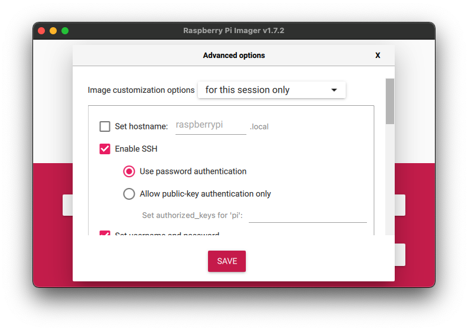
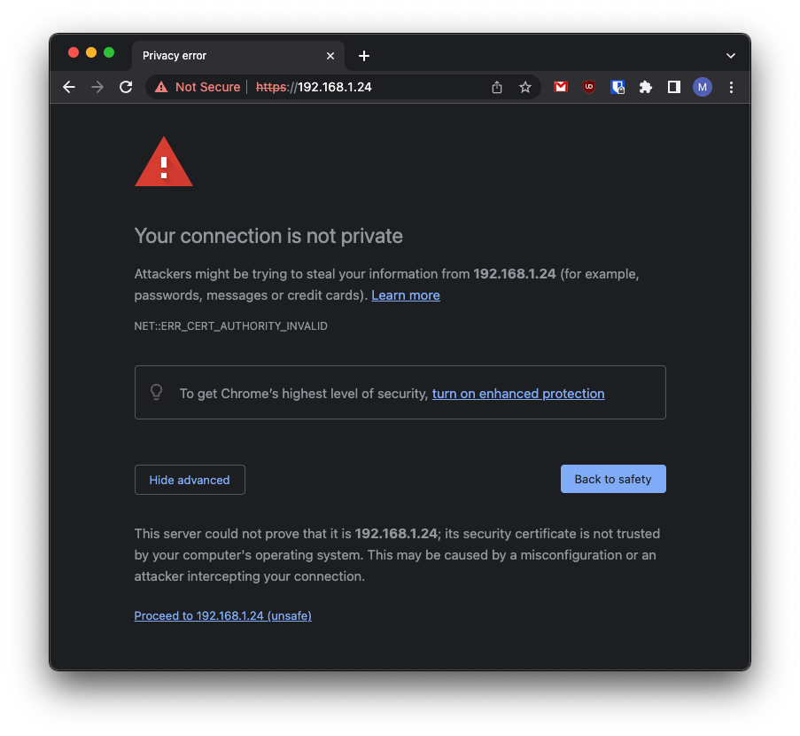

# Raspberry Pi - Raspberry Pi OS Quick Start

## Overview

This section provides Eclipse Kura&trade; quick installation procedures for the Raspberry Pi and the Kura development environment.

!!! warning
    This quickstart will install the version of Kura with the administrative web UI and network  configuration support but not [CAN bus](https://en.wikipedia.org/wiki/CAN_bus) support. For more information on this please visit the [Eclipse Kura download page](https://websites.eclipseprojects.io/kura/downloads.php)

This quickstart has been tested using the latest Raspberry Pi OS 32 and 64 bits images which are available for download through [the official Raspberry Pi foundation site](https://www.raspberrypi.com/software/operating-systems/) and the Raspberry Pi Imager.

!!! warning
    Recent versions of Raspberry Pi OS 32 bit on Raspberry PI 4 will use by default a 64 bit kernel with a 32 bit userspace. This can cause issues to applications that use the result of `uname -m` to decide which native libraries to load (see https://github.com/raspberrypi/firmware/issues/1795). This currently affects for example the Kura SQLite database connector. It should be possible to solve by switching to the 32 bit kernel setting `arm_64bit=0` in `/boot/config.txt` and restarting the device.

For additional details on OS compatibility refer to the [Kura&trade; release notes](https://websites.eclipseprojects.io/kura/downloads.php).

## Enable SSH Access

The ssh server is disabled by default on Raspbian images released after November 2016,
in order to enable it follow the instructions available [here](https://www.raspberrypi.org/documentation/remote-access/ssh/).

If you're using the [Raspberry Pi Imager](https://github.com/raspberrypi/rpi-imager) you can directly enable SSH before writing the operating system into the SD card by clicking on the "setting" icon.



## Eclipse Kura&trade; Installation

To install Eclipse Kura with its dependencies on the Raspberry Pi, perform the
following steps:

1. Boot the Raspberry Pi with the latest Raspbian image (starting from release 5.1.0 Kura is tested with Raspbian 11).

2. Make sure your device is connected to the internet. The best installation experience can be obtained when the device is cabled to the local network and the Internet. By default, the Raspberry Pi OS configures the ethernet interface `eth0` in DHCP mode.

3. Upgrade the system:
   
    ```bash
    sudo apt update
    ```
    ```bash
    sudo apt upgrade
    ```

    !!! tip
        **Optional**: Since version 5.3.0 Kura also supports [Eclipse Temurin&trade;](https://adoptium.net/en-GB/) as an alternative JVM. To install it you need to perform these additional steps:

        ```bash
        sudo apt-get install -y wget apt-transport-https gnupg
        ```
        ```bash
        sudo wget -O - https://packages.adoptium.net/artifactory/api/gpg/key/public | sudo apt-key add -
        ```
        ```bash
        sudo echo "deb https://packages.adoptium.net/artifactory/deb $(awk -F= '/^VERSION_CODENAME/{print$2}' /etc/os-release) main" | sudo tee /etc/apt/sources.list.d/adoptium.list
        ```
        ```bash
        sudo apt-get update
        ```
        ```bash
        sudo apt-get install temurin-8-jdk
        ```

4. Download the Kura package with:

    ```
    wget http://download.eclipse.org/kura/releases/<version>/kura_<version>_raspberry-pi_installer.deb
    ```

    Note: replace `<version>` in the URL above with the version number of the latest release (e.g. 5.1.0).

5. Install Kura with: 

    ```
    sudo apt-get install ./kura_<version>_raspberry-pi_installer.deb
    ```

6. It could happen that `wlan` interface is "soft blocked" by default and needs to be enabled. To see if it is blocked run:

    ```
    rfkill list
    ```

    and unblock it with:

    ```
    sudo rfkill unblock wlan
    ```

7. Set the right Wi-Fi regulatory domain based on your current world region following the instructions [here](https://www.raspberrypi.org/documentation/computers/configuration.html#using-the-desktop). In case of problems, you could try to edit the `/etc/default/crda` adding the [ISO 3166-1 alpha-2](https://it.wikipedia.org/wiki/ISO_3166-1_alpha-2) code of your region

8. Reboot the Raspberry Pi with:

    ```
    sudo reboot
    ```

    Kura starts on the target platform after reboot.

9. Kura setups a local web ui that is available using a browser via:

    ```
    https://<device-ip>
    ```

    The browser will prompt the user to accept the connection to an endpoint with an untrusted certificate:

    

    Once trusted the source, the user will be redirected to a login page where the default **username** is:

    ```
    admin
    ```

    and the default **password** is:

    ```
    admin
    ```

## Required Dependencies

In addition to those required by generic profiles, listed in the [dedicated section](install-kura.md#kura-dependencies), additional Raspberry-specific dependencies are needed, listed below:

### Raspberry Pi - ARM64 - NN
- pi-bluetooth
- rpi.gpio-common

### Raspberry Pi - ARM64
- hostapd
- ethtool
- wireless-tools
- net-tools
- ifupdown
- pi-bluetooth
- rpi.gpio-common
- dmidecode

### Raspberry Pi - ARMHF - NN
- hostapd
- ethtool
- pi-bluetooth
- rpi.gpio-common

### Raspberry Pi - ARMHF
- hostapd
- ethtool
- wireless-tools
- net-tools
- ifupdown
- pi-bluetooth
- rpi.gpio-common
